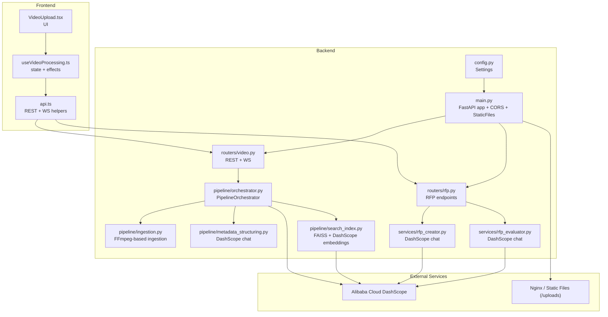
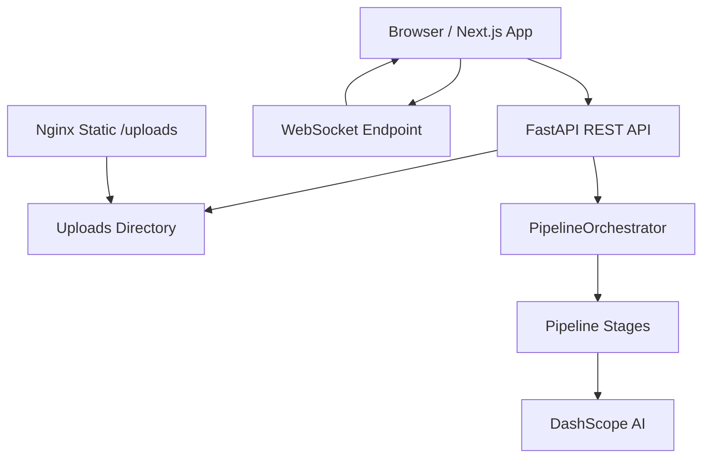
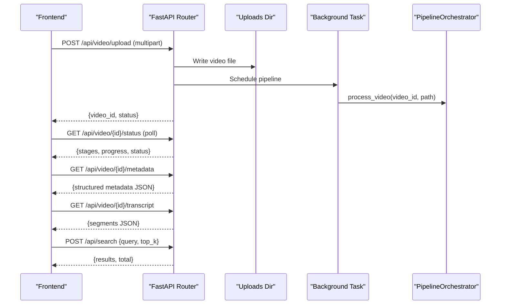
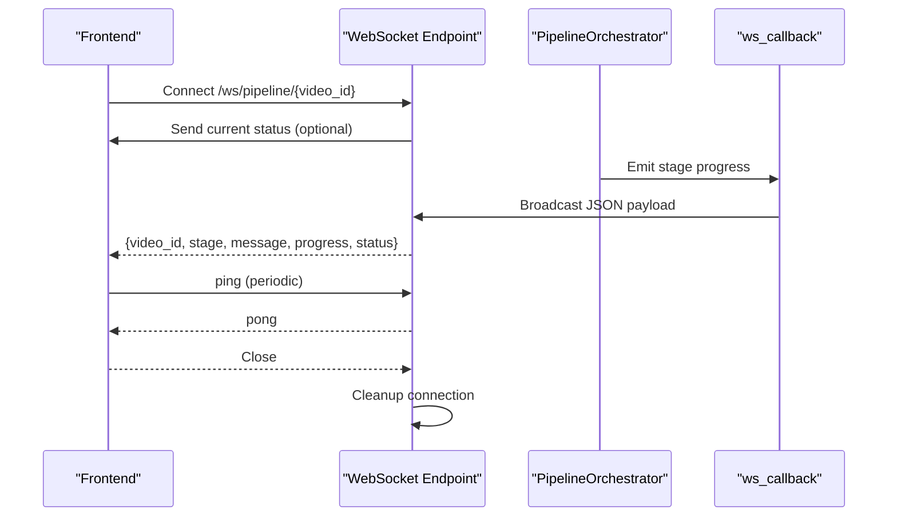
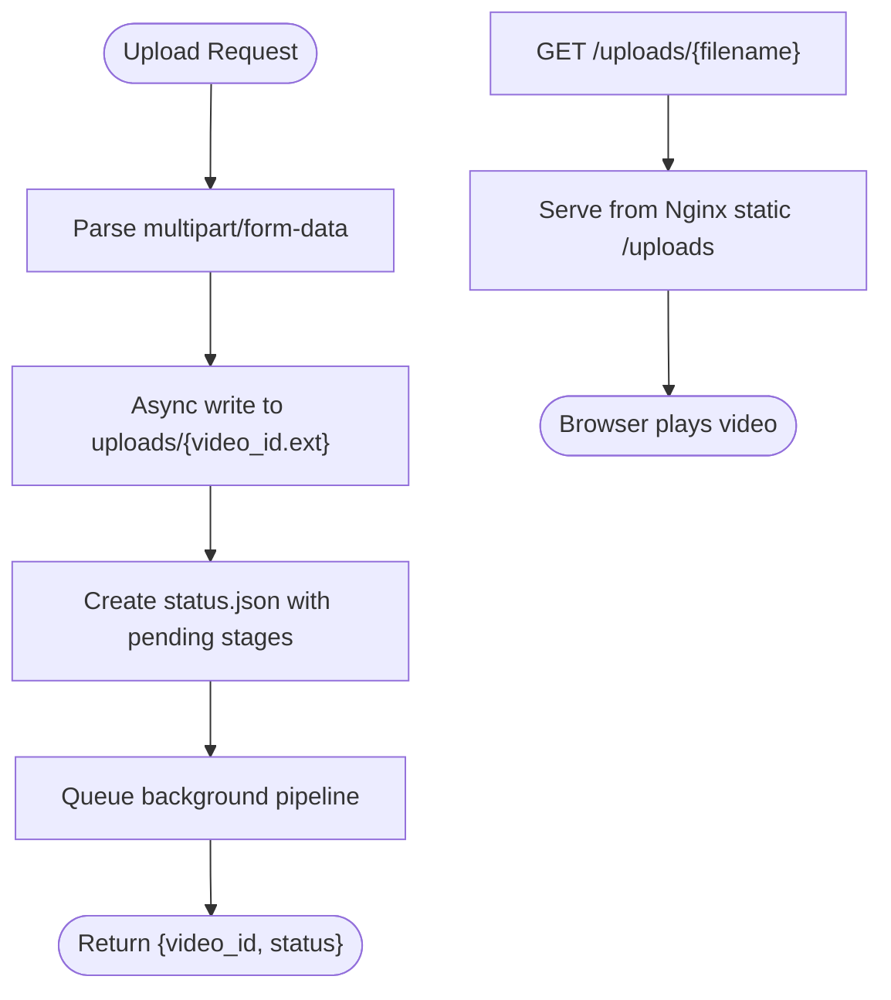
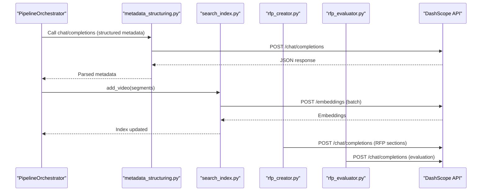
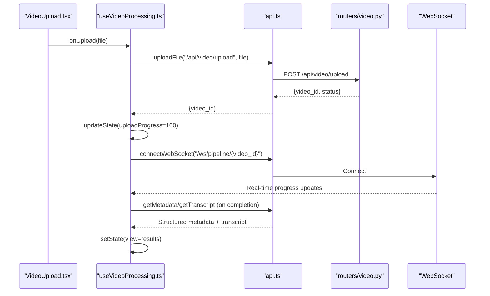
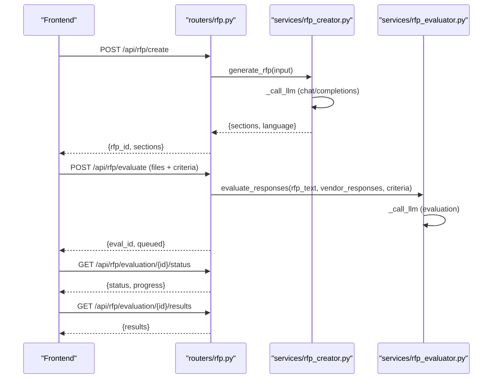
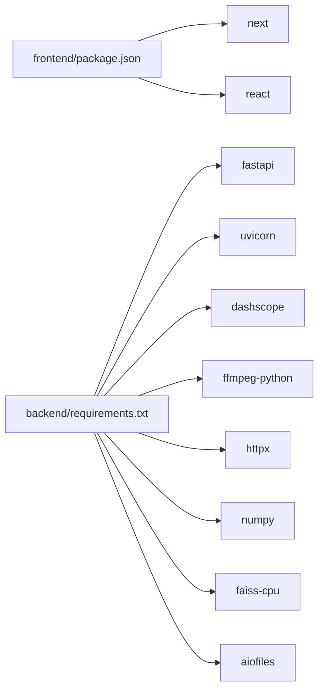

# Component Interactions

<cite>
**Referenced Files in This Document**
- [backend/main.py](file://backend/main.py)
- [backend/config.py](file://backend/config.py)
- [backend/routers/video.py](file://backend/routers/video.py)
- [backend/routers/rfp.py](file://backend/routers/rfp.py)
- [backend/pipeline/orchestrator.py](file://backend/pipeline/orchestrator.py)
- [backend/pipeline/ingestion.py](file://backend/pipeline/ingestion.py)
- [backend/pipeline/metadata_structuring.py](file://backend/pipeline/metadata_structuring.py)
- [backend/pipeline/search_index.py](file://backend/pipeline/search_index.py)
- [backend/services/rfp_creator.py](file://backend/services/rfp_creator.py)
- [backend/services/rfp_evaluator.py](file://backend/services/rfp_evaluator.py)
- [frontend/src/lib/api.ts](file://frontend/src/lib/api.ts)
- [frontend/src/lib/useVideoProcessing.ts](file://frontend/src/lib/useVideoProcessing.ts)
- [frontend/src/components/archive/VideoUpload.tsx](file://frontend/src/components/archive/VideoUpload.tsx)
- [frontend/package.json](file://frontend/package.json)
- [backend/requirements.txt](file://backend/requirements.txt)
- [nginx.conf](file://nginx.conf)
</cite>

## Table of Contents
1. [Introduction](#introduction)
2. [Project Structure](#project-structure)
3. [Core Components](#core-components)
4. [Architecture Overview](#architecture-overview)
5. [Detailed Component Analysis](#detailed-component-analysis)
6. [Dependency Analysis](#dependency-analysis)
7. [Performance Considerations](#performance-considerations)
8. [Troubleshooting Guide](#troubleshooting-guide)
9. [Conclusion](#conclusion)
10. [Appendices](#appendices)

## Introduction
This document explains the component interactions within the Dubai Media system, focusing on how the frontend and backend communicate, how files are uploaded and served, how real-time progress is streamed via WebSockets, and how Alibaba Cloud DashScope AI services are integrated. It also covers CORS configuration, security considerations, and typical user workflows from upload through processing completion.

## Project Structure
The system comprises:
- Backend: FastAPI application exposing REST endpoints and WebSocket streams, orchestrating a multi-stage video processing pipeline, and integrating with DashScope AI.
- Frontend: Next.js application that uploads videos, polls/follows progress via REST/WebSocket, and displays metadata, transcripts, and search results.
- Static file serving: Nginx serves uploaded files mounted under /uploads.
- Pipelines: Ingestion, visual/audio analysis, face recognition, metadata structuring, and FAISS-based search indexing.

**Diagram sources**
- [backend/main.py:1-44](file://backend/main.py#L1-L44)
- [backend/config.py:1-21](file://backend/config.py#L1-L21)
- [backend/routers/video.py:1-267](file://backend/routers/video.py#L1-L267)
- [backend/routers/rfp.py:1-385](file://backend/routers/rfp.py#L1-L385)
- [backend/pipeline/orchestrator.py:1-329](file://backend/pipeline/orchestrator.py#L1-L329)
- [backend/pipeline/ingestion.py:1-146](file://backend/pipeline/ingestion.py#L1-L146)
- [backend/pipeline/metadata_structuring.py:1-252](file://backend/pipeline/metadata_structuring.py#L1-L252)
- [backend/pipeline/search_index.py:1-245](file://backend/pipeline/search_index.py#L1-L245)
- [backend/services/rfp_creator.py:1-639](file://backend/services/rfp_creator.py#L1-L639)
- [backend/services/rfp_evaluator.py:1-622](file://backend/services/rfp_evaluator.py#L1-L622)
- [frontend/src/lib/api.ts:1-245](file://frontend/src/lib/api.ts#L1-L245)
- [frontend/src/lib/useVideoProcessing.ts:1-421](file://frontend/src/lib/useVideoProcessing.ts#L1-L421)
- [frontend/src/components/archive/VideoUpload.tsx:1-221](file://frontend/src/components/archive/VideoUpload.tsx#L1-L221)

**Section sources**
- [backend/main.py:1-44](file://backend/main.py#L1-L44)
- [backend/config.py:1-21](file://backend/config.py#L1-L21)
- [frontend/src/lib/api.ts:1-245](file://frontend/src/lib/api.ts#L1-L245)
- [frontend/src/lib/useVideoProcessing.ts:1-421](file://frontend/src/lib/useVideoProcessing.ts#L1-L421)
- [frontend/src/components/archive/VideoUpload.tsx:1-221](file://frontend/src/components/archive/VideoUpload.tsx#L1-L221)

## Core Components
- FastAPI application with CORS enabled and static file mounting for uploads.
- REST endpoints for video upload, status, metadata, transcript, and search.
- WebSocket endpoint for real-time progress streaming during pipeline execution.
- Pipeline orchestrator coordinating ingestion, visual/audio analysis, face recognition, metadata structuring, and search index building.
- DashScope integrations for embeddings, chat completions, and text generation.
- Frontend API helpers and React hook for upload, progress tracking, and results retrieval.
- Nginx static file serving for uploaded media.

**Section sources**
- [backend/main.py:20-44](file://backend/main.py#L20-L44)
- [backend/routers/video.py:39-267](file://backend/routers/video.py#L39-L267)
- [backend/pipeline/orchestrator.py:34-207](file://backend/pipeline/orchestrator.py#L34-L207)
- [backend/pipeline/search_index.py:22-196](file://backend/pipeline/search_index.py#L22-L196)
- [backend/pipeline/metadata_structuring.py:81-164](file://backend/pipeline/metadata_structuring.py#L81-L164)
- [frontend/src/lib/api.ts:164-244](file://frontend/src/lib/api.ts#L164-L244)
- [frontend/src/lib/useVideoProcessing.ts:122-420](file://frontend/src/lib/useVideoProcessing.ts#L122-L420)

## Architecture Overview
The system follows a client-server pattern:
- The frontend communicates with backend REST endpoints and WebSocket streams.
- Backend persists uploaded files and intermediate artifacts under a configurable upload directory.
- Nginx serves static files from the upload directory at /uploads.
- The backend orchestrates asynchronous pipeline stages, emitting progress updates via WebSocket and saving status to disk.
- DashScope is used for embeddings and chat-based metadata structuring.

**Diagram sources**
- [backend/main.py:27-39](file://backend/main.py#L27-L39)
- [backend/routers/video.py:220-267](file://backend/routers/video.py#L220-L267)
- [backend/pipeline/orchestrator.py:44-207](file://backend/pipeline/orchestrator.py#L44-L207)
- [backend/pipeline/search_index.py:198-244](file://backend/pipeline/search_index.py#L198-L244)
- [backend/pipeline/metadata_structuring.py:114-163](file://backend/pipeline/metadata_structuring.py#L114-L163)
- [nginx.conf](file://nginx.conf)

## Detailed Component Analysis

### REST API Endpoints and Communication Patterns
- Video upload: multipart/form-data upload handled by the backend; saves file to uploads directory and starts background pipeline.
- Status polling: GET endpoints read status.json for current stage statuses.
- Metadata retrieval: GET endpoints read structured JSON outputs from pipeline stages.
- Transcript retrieval: GET endpoint reads transcript.json.
- Semantic search: POST endpoint queries FAISS index built with DashScope embeddings.
- CORS: Enabled broadly for development; consider tightening in production.

**Diagram sources**
- [backend/routers/video.py:39-216](file://backend/routers/video.py#L39-L216)
- [backend/pipeline/orchestrator.py:44-207](file://backend/pipeline/orchestrator.py#L44-L207)
- [frontend/src/lib/api.ts:164-183](file://frontend/src/lib/api.ts#L164-L183)

**Section sources**
- [backend/routers/video.py:39-216](file://backend/routers/video.py#L39-L216)
- [frontend/src/lib/api.ts:164-183](file://frontend/src/lib/api.ts#L164-L183)

### WebSocket Progress Streaming
- Clients connect to /ws/pipeline/{video_id} to receive real-time progress updates.
- Backend forwards progress from the orchestrator to connected clients.
- On disconnect, clients are removed from the registry.

**Diagram sources**
- [backend/routers/video.py:220-267](file://backend/routers/video.py#L220-L267)
- [backend/pipeline/orchestrator.py:95-120](file://backend/pipeline/orchestrator.py#L95-L120)

**Section sources**
- [backend/routers/video.py:220-267](file://backend/routers/video.py#L220-L267)
- [backend/pipeline/orchestrator.py:95-120](file://backend/pipeline/orchestrator.py#L95-L120)

### File Upload and Download Mechanisms
- Upload: multipart/form-data sent to backend; file written asynchronously to uploads directory.
- Static serving: Nginx mounts uploads directory at /uploads for direct browser access.
- Download: Frontend constructs URLs using BASE_URL and /uploads/{filename}.

**Diagram sources**
- [backend/routers/video.py:39-92](file://backend/routers/video.py#L39-L92)
- [backend/main.py:35-35](file://backend/main.py#L35-L35)
- [nginx.conf](file://nginx.conf)

**Section sources**
- [backend/routers/video.py:39-92](file://backend/routers/video.py#L39-L92)
- [backend/main.py:35-35](file://backend/main.py#L35-L35)

### Temporary File Management
- Intermediate artifacts (audio.wav, thumbnail.jpg, stage outputs) are written under uploads/{video_id}.
- Status and results are persisted as JSON files; FAISS index and metadata are persisted separately for search.

**Section sources**
- [backend/pipeline/orchestrator.py:59-195](file://backend/pipeline/orchestrator.py#L59-L195)
- [backend/pipeline/ingestion.py:16-51](file://backend/pipeline/ingestion.py#L16-L51)
- [backend/pipeline/search_index.py:42-87](file://backend/pipeline/search_index.py#L42-L87)

### Alibaba Cloud DashScope Integration
- Authentication: API key configured via settings; passed in Authorization header.
- Embeddings: Used to index searchable segments; supports batching and retries.
- Chat completions: Used for metadata structuring and RFP generation/evaluation.
- Error handling: Retries with exponential backoff; graceful degradation when disabled.

**Diagram sources**
- [backend/pipeline/metadata_structuring.py:114-163](file://backend/pipeline/metadata_structuring.py#L114-L163)
- [backend/pipeline/search_index.py:198-244](file://backend/pipeline/search_index.py#L198-L244)
- [backend/services/rfp_creator.py:76-123](file://backend/services/rfp_creator.py#L76-L123)
- [backend/services/rfp_evaluator.py:48-104](file://backend/services/rfp_evaluator.py#L48-L104)

**Section sources**
- [backend/config.py:4-12](file://backend/config.py#L4-L12)
- [backend/pipeline/metadata_structuring.py:114-163](file://backend/pipeline/metadata_structuring.py#L114-L163)
- [backend/pipeline/search_index.py:198-244](file://backend/pipeline/search_index.py#L198-L244)
- [backend/services/rfp_creator.py:70-123](file://backend/services/rfp_creator.py#L70-L123)
- [backend/services/rfp_evaluator.py:39-104](file://backend/services/rfp_evaluator.py#L39-L104)

### Frontend Interaction Patterns
- API helpers encapsulate REST calls and WebSocket connections.
- React hook manages upload state, progress simulation, WebSocket lifecycle, and result fetching.
- UI component handles drag-and-drop selection and displays upload progress.

**Diagram sources**
- [frontend/src/components/archive/VideoUpload.tsx:63-211](file://frontend/src/components/archive/VideoUpload.tsx#L63-L211)
- [frontend/src/lib/useVideoProcessing.ts:162-276](file://frontend/src/lib/useVideoProcessing.ts#L162-L276)
- [frontend/src/lib/api.ts:164-183](file://frontend/src/lib/api.ts#L164-L183)
- [backend/routers/video.py:220-267](file://backend/routers/video.py#L220-L267)

**Section sources**
- [frontend/src/lib/api.ts:1-245](file://frontend/src/lib/api.ts#L1-L245)
- [frontend/src/lib/useVideoProcessing.ts:122-420](file://frontend/src/lib/useVideoProcessing.ts#L122-L420)
- [frontend/src/components/archive/VideoUpload.tsx:1-221](file://frontend/src/components/archive/VideoUpload.tsx#L1-L221)

### RFP Creation and Evaluation Endpoints
- Creation: Generates RFP sections via DashScope chat, supports bilingual outputs, exports DOCX/PDF.
- Evaluation: Extracts text from vendor submissions, evaluates against criteria, produces Excel/PDF reports.

**Diagram sources**
- [backend/routers/rfp.py:97-385](file://backend/routers/rfp.py#L97-L385)
- [backend/services/rfp_creator.py:124-151](file://backend/services/rfp_creator.py#L124-L151)
- [backend/services/rfp_evaluator.py:230-295](file://backend/services/rfp_evaluator.py#L230-L295)

**Section sources**
- [backend/routers/rfp.py:97-385](file://backend/routers/rfp.py#L97-L385)
- [backend/services/rfp_creator.py:67-151](file://backend/services/rfp_creator.py#L67-L151)
- [backend/services/rfp_evaluator.py:39-295](file://backend/services/rfp_evaluator.py#L39-L295)

## Dependency Analysis
- Backend depends on FastAPI, websockets, ffmpeg-python, httpx, numpy, faiss-cpu, dashscope, aiofiles.
- Frontend depends on Next.js, React, Tailwind, and Recharts.
- CORS middleware allows all origins/methods/headers for development convenience.

**Diagram sources**
- [frontend/package.json:11-28](file://frontend/package.json#L11-L28)
- [backend/requirements.txt:1-16](file://backend/requirements.txt#L1-L16)

**Section sources**
- [frontend/package.json:1-29](file://frontend/package.json#L1-L29)
- [backend/requirements.txt:1-16](file://backend/requirements.txt#L1-L16)

## Performance Considerations
- Asynchronous I/O: aiofiles and httpx enable non-blocking file writes and external API calls.
- Chunked uploads: Backend reads file in 1MB chunks to reduce memory pressure.
- FAISS indexing: Batch embedding requests and normalization improve throughput.
- WebSocket fan-out: Minimal overhead broadcasting to registered clients.
- Recommendations:
  - Limit concurrent uploads and pipeline runs based on CPU/IO capacity.
  - Tune FAISS index persistence and batch sizes.
  - Consider rate limiting and circuit breakers for DashScope.

[No sources needed since this section provides general guidance]

## Troubleshooting Guide
- CORS issues: Verify allow_origins and credentials settings; tighten for production.
- Upload failures: Check filesystem permissions and disk space; confirm uploads directory exists.
- WebSocket disconnects: Frontend falls back to REST polling; ensure endpoint availability.
- DashScope errors: Inspect API key, quotas, and retry logs; implement backoff.
- Search returns empty: Confirm FAISS index initialization and embedding availability.

**Section sources**
- [backend/main.py:27-33](file://backend/main.py#L27-L33)
- [backend/routers/video.py:57-59](file://backend/routers/video.py#L57-L59)
- [backend/pipeline/search_index.py:61-70](file://backend/pipeline/search_index.py#L61-L70)
- [backend/pipeline/metadata_structuring.py:139-163](file://backend/pipeline/metadata_structuring.py#L139-L163)

## Conclusion
The Dubai Media system integrates a robust FastAPI backend with a reactive frontend to deliver end-to-end video processing powered by DashScope AI. REST and WebSocket endpoints provide responsive user experiences, while static file serving and FAISS-based search enable scalable media discovery. Security and performance can be strengthened through tighter CORS, rate limiting, and optimized pipeline scheduling.

[No sources needed since this section summarizes without analyzing specific files]

## Appendices

### CORS and Security Considerations
- CORS: Broadly permissive in development; restrict origins and headers in production.
- API keys: Stored in environment via pydantic-settings; avoid logging secrets.
- Static serving: Nginx serves uploads; ensure appropriate access controls and caching headers.
- Rate limits: Consider implementing at gateway or router level for DashScope calls.

**Section sources**
- [backend/main.py:27-33](file://backend/main.py#L27-L33)
- [backend/config.py:4-17](file://backend/config.py#L4-L17)
- [nginx.conf](file://nginx.conf)