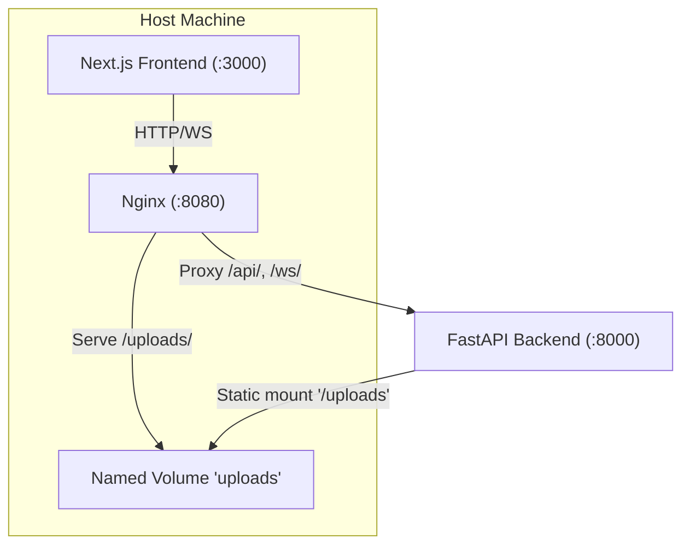
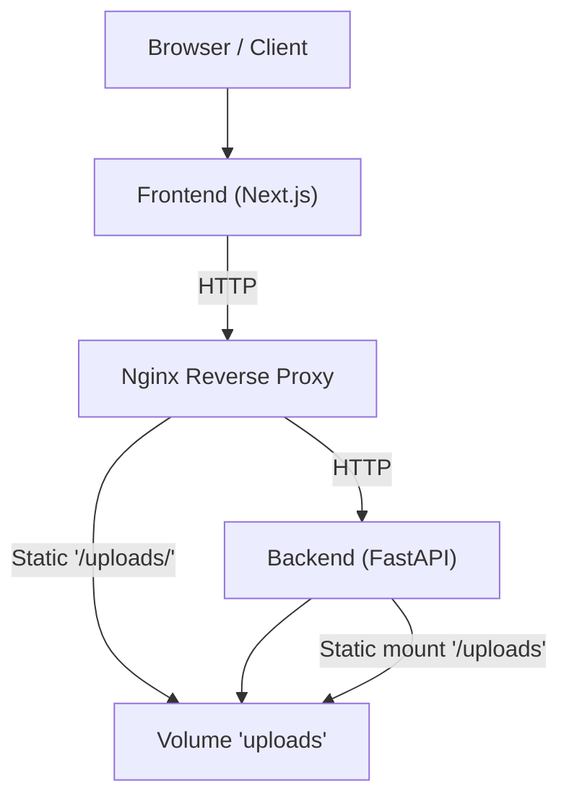
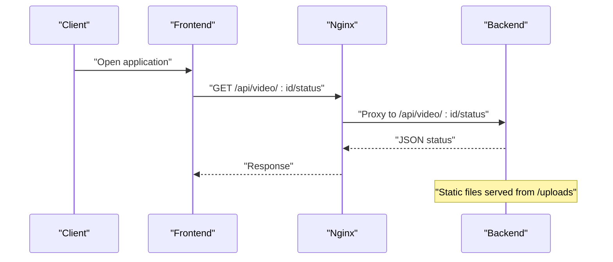
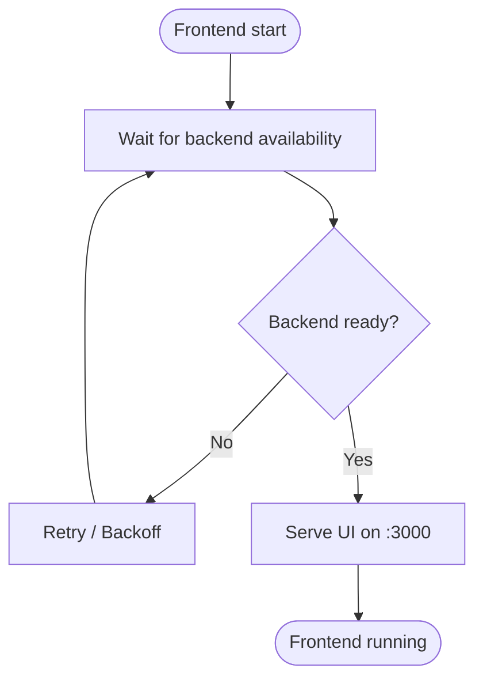
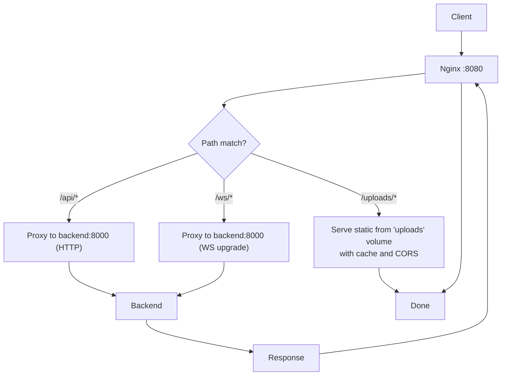
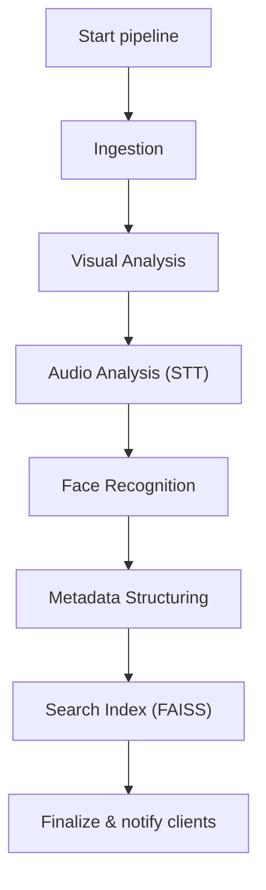
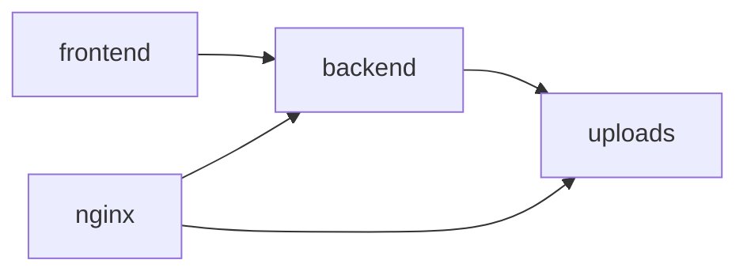
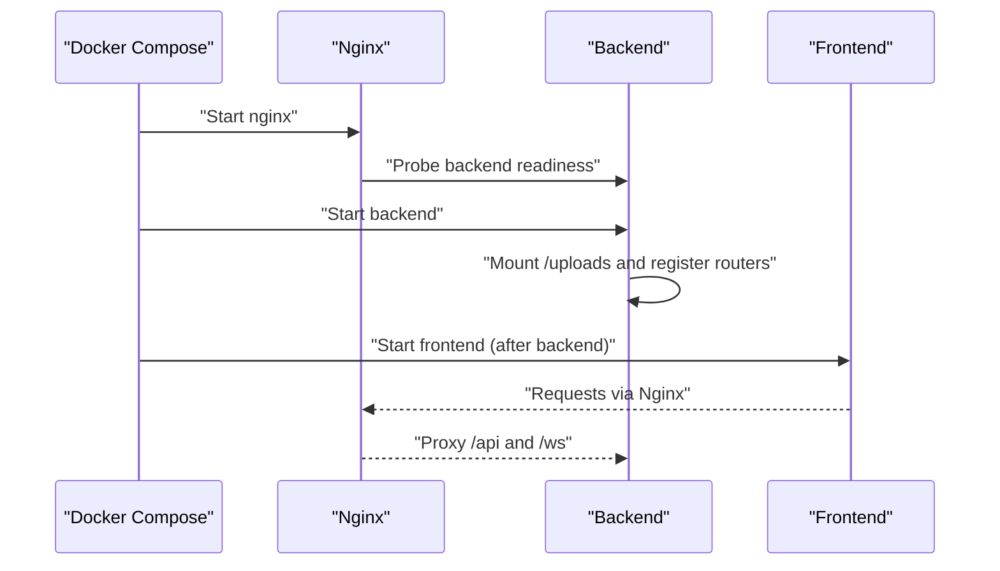

# Deployment Topology

<cite>
**Referenced Files in This Document**
- [docker-compose.yml](file://docker-compose.yml)
- [nginx.conf](file://nginx.conf)
- [backend/main.py](file://backend/main.py)
- [backend/config.py](file://backend/config.py)
- [backend/routers/video.py](file://backend/routers/video.py)
- [backend/pipeline/orchestrator.py](file://backend/pipeline/orchestrator.py)
- [backend/requirements.txt](file://backend/requirements.txt)
- [frontend/package.json](file://frontend/package.json)
- [README.md](file://README.md)
</cite>

## Table of Contents
1. [Introduction](#introduction)
2. [Project Structure](#project-structure)
3. [Core Components](#core-components)
4. [Architecture Overview](#architecture-overview)
5. [Detailed Component Analysis](#detailed-component-analysis)
6. [Dependency Analysis](#dependency-analysis)
7. [Performance Considerations](#performance-considerations)
8. [Troubleshooting Guide](#troubleshooting-guide)
9. [Conclusion](#conclusion)
10. [Appendices](#appendices)

## Introduction
This document describes the deployment topology and container orchestration of the Dubai Media system. It explains the Docker Compose configuration for the web application, AI processing pipeline, and supporting infrastructure, along with the Nginx reverse proxy setup for static file serving and load distribution. It also details container networking, persistent storage via named volumes, environment variable management, and production-grade considerations such as scaling, health checks, logging, monitoring, and secrets management. Finally, it outlines the startup sequence and dependency management between services.

## Project Structure
The deployment is orchestrated by a single Docker Compose file that defines three primary services:
- backend: Python FastAPI application exposing REST and WebSocket endpoints for video processing and AI pipeline orchestration.
- frontend: Next.js application serving the React-based user interface.
- nginx: Reverse proxy and static file server for uploaded media and API routing.

**Diagram sources**
- [docker-compose.yml:1-43](file://docker-compose.yml#L1-L43)
- [nginx.conf:1-51](file://nginx.conf#L1-L51)
- [backend/main.py:35-35](file://backend/main.py#L35-L35)

**Section sources**
- [docker-compose.yml:1-43](file://docker-compose.yml#L1-L43)
- [README.md:72-91](file://README.md#L72-L91)

## Core Components
- Backend service
  - Built from the backend directory with a dedicated Dockerfile.
  - Exposes port 8000 internally and mounts local backend code and uploads directory for development.
  - Loads environment variables from a .env file and starts the ASGI server with hot reload enabled.
  - Provides REST endpoints for video upload, status, metadata, transcript, search, and WebSocket progress streaming.
- Frontend service
  - Built from the frontend directory with a dedicated Dockerfile.
  - Exposes port 3000 internally and mounts the frontend source code for live development.
  - Sets NEXT_PUBLIC_API_URL to point to the backend service for API calls.
  - Depends on backend being healthy before starting.
- Nginx service
  - Uses the official Nginx Alpine image.
  - Exposes port 8080 externally and forwards to Nginx’s internal port 80.
  - Mounts a custom nginx.conf for routing and static file serving.
  - Mounts the named volume “uploads” as read-only for static media delivery.
  - Depends on backend for readiness.
- Named volume “uploads”
  - Ensures uploaded media and pipeline outputs persist across container restarts.

Key runtime behaviors:
- The backend serves uploaded files under /uploads via a static files mount configured at application startup.
- The frontend communicates with the backend via the backend service name inside the Docker network.
- Nginx proxies API requests to the backend and serves static media directly from the mounted volume.

**Section sources**
- [docker-compose.yml:2-28](file://docker-compose.yml#L2-L28)
- [docker-compose.yml:30-39](file://docker-compose.yml#L30-L39)
- [docker-compose.yml:41-43](file://docker-compose.yml#L41-L43)
- [backend/main.py:35-35](file://backend/main.py#L35-L35)
- [backend/routers/video.py:39-92](file://backend/routers/video.py#L39-L92)
- [nginx.conf:6-22](file://nginx.conf#L6-L22)
- [nginx.conf:24-38](file://nginx.conf#L24-L38)
- [nginx.conf:40-49](file://nginx.conf#L40-L49)

## Architecture Overview
The system uses a reverse proxy layer (Nginx) to route traffic to the backend and serve static media. The frontend communicates with the backend through Nginx, which also handles CORS and caching for uploaded assets.

**Diagram sources**
- [nginx.conf:1-51](file://nginx.conf#L1-L51)
- [backend/main.py:35-35](file://backend/main.py#L35-L35)
- [docker-compose.yml:30-39](file://docker-compose.yml#L30-L39)

## Detailed Component Analysis

### Backend Service
Responsibilities:
- Exposes REST endpoints for video processing and RFP tools.
- Streams pipeline progress via WebSocket.
- Serves uploaded media statically from the configured upload directory.
- Reads AI model settings and base URLs from environment variables.

Environment and configuration:
- Loads environment variables from a .env file located at the repository root.
- Uses Pydantic Settings to manage typed configuration with defaults and environment binding.

Networking and storage:
- Listens on port 8000 inside the container.
- Mounts the uploads directory into the container for persistent storage.
- Serves static files from the upload directory under /uploads.

Health endpoint:
- Provides a simple health check endpoint returning service identity and status.

**Diagram sources**
- [backend/routers/video.py:124-139](file://backend/routers/video.py#L124-L139)
- [nginx.conf:24-38](file://nginx.conf#L24-L38)
- [backend/main.py:35-35](file://backend/main.py#L35-L35)

**Section sources**
- [backend/main.py:1-44](file://backend/main.py#L1-L44)
- [backend/config.py:1-21](file://backend/config.py#L1-L21)
- [backend/routers/video.py:1-267](file://backend/routers/video.py#L1-L267)

### Frontend Service
Responsibilities:
- Provides the user interface for archive, RFP creator, and RFP evaluator.
- Communicates with the backend using NEXT_PUBLIC_API_URL.

Networking:
- Runs on port 3000 inside the container.
- Depends on the backend service for readiness before starting.

**Diagram sources**
- [docker-compose.yml:26-27](file://docker-compose.yml#L26-L27)

**Section sources**
- [docker-compose.yml:16-28](file://docker-compose.yml#L16-L28)
- [frontend/package.json:1-29](file://frontend/package.json#L1-L29)

### Nginx Reverse Proxy
Responsibilities:
- Serves uploaded media from the shared volume with appropriate caching and CORS headers.
- Proxies API requests to the backend service.
- Supports WebSocket upgrades for real-time progress streaming.
- Configures timeouts suitable for long-running AI operations and large file uploads.

Routing highlights:
- /uploads/ serves static media from the mounted volume with caching and CORS.
- /api/ proxies to backend:8000.
- /ws/ proxies WebSocket connections to backend:8000 with upgrade headers.

**Diagram sources**
- [nginx.conf:1-51](file://nginx.conf#L1-L51)

**Section sources**
- [nginx.conf:1-51](file://nginx.conf#L1-L51)
- [docker-compose.yml:30-39](file://docker-compose.yml#L30-L39)

### AI Pipeline Orchestration
The backend orchestrates a six-stage pipeline for video processing:
1. Ingestion: Extract audio, generate thumbnail, and probe metadata.
2. Visual analysis: Scene detection and understanding using Qwen-VL.
3. Audio analysis: Speech-to-text using Paraformer.
4. Face recognition: Person identification using Qwen-Max.
5. Metadata structuring: Produce EBUCore/IPTC-compliant metadata.
6. Search index: Build FAISS embeddings for semantic search.

**Diagram sources**
- [backend/pipeline/orchestrator.py:24-31](file://backend/pipeline/orchestrator.py#L24-L31)
- [backend/pipeline/orchestrator.py:44-206](file://backend/pipeline/orchestrator.py#L44-L206)

**Section sources**
- [backend/pipeline/orchestrator.py:1-329](file://backend/pipeline/orchestrator.py#L1-L329)
- [backend/pipeline/ingestion.py:1-146](file://backend/pipeline/ingestion.py#L1-L146)

## Dependency Analysis
- Service dependencies:
  - frontend depends_on backend.
  - nginx depends_on backend.
- Network dependencies:
  - Nginx proxies to backend using the service name “backend”.
  - Frontend uses NEXT_PUBLIC_API_URL to reach the backend service.
- Data dependencies:
  - The “uploads” named volume persists media and pipeline outputs.
  - Backend serves /uploads via a static files mount pointing to the upload directory.

**Diagram sources**
- [docker-compose.yml:26-27](file://docker-compose.yml#L26-L27)
- [docker-compose.yml:37-38](file://docker-compose.yml#L37-L38)
- [docker-compose.yml:41-43](file://docker-compose.yml#L41-L43)
- [backend/main.py:35-35](file://backend/main.py#L35-L35)

**Section sources**
- [docker-compose.yml:1-43](file://docker-compose.yml#L1-L43)
- [backend/main.py:35-35](file://backend/main.py#L35-L35)

## Performance Considerations
- Timeouts and throughput:
  - Nginx sets extended proxy_read_timeout and proxy_connect_timeout for long-running AI tasks and large uploads.
  - WebSocket proxy_read_timeout is increased to support long-lived connections.
- Static asset delivery:
  - Nginx caches uploaded media and adds CORS headers to reduce cross-origin friction.
- Resource sizing:
  - The backend leverages asynchronous I/O and background tasks for pipeline execution.
  - Consider CPU and memory allocation for AI model inference and FAISS indexing.
- Scaling:
  - Horizontal scaling of the backend service is supported; ensure a shared persistent storage backend (object storage or NFS) for production deployments.
  - Use a load balancer in front of multiple backend replicas if needed.

[No sources needed since this section provides general guidance]

## Troubleshooting Guide
Common issues and remedies:
- CORS errors for uploaded media:
  - Verify Nginx CORS headers for /uploads/ and ensure the frontend origin matches expectations.
- Large file upload failures:
  - Confirm client_max_body_size is sufficient and that the backend and Nginx timeouts accommodate the upload duration.
- WebSocket progress not received:
  - Ensure the frontend connects to the correct WebSocket endpoint and that Nginx supports WebSocket upgrades.
- Health check failures:
  - Call the /api/health endpoint to confirm backend availability.
- Missing static files:
  - Confirm the uploads volume is mounted and the backend static mount is configured to serve /uploads.

**Section sources**
- [nginx.conf:10-17](file://nginx.conf#L10-L17)
- [nginx.conf:37-37](file://nginx.conf#L37-L37)
- [backend/main.py:41-43](file://backend/main.py#L41-L43)
- [backend/routers/video.py:220-267](file://backend/routers/video.py#L220-L267)

## Conclusion
The Dubai Media deployment uses a straightforward, containerized architecture with Nginx as the reverse proxy and static file server. The backend exposes a robust API and WebSocket interface for real-time pipeline progress, while the frontend provides a modern UI. For production, focus on persistent storage, secrets management, health checks, logging, monitoring, and scaling strategies outlined below.

[No sources needed since this section summarizes without analyzing specific files]

## Appendices

### Startup Sequence and Dependency Management
- Nginx starts and waits for backend readiness.
- Frontend starts after backend becomes available.
- Backend initializes static file serving for uploads and registers API routers.

**Diagram sources**
- [docker-compose.yml:37-38](file://docker-compose.yml#L37-L38)
- [docker-compose.yml:26-27](file://docker-compose.yml#L26-L27)
- [backend/main.py:35-35](file://backend/main.py#L35-L35)

**Section sources**
- [docker-compose.yml:1-43](file://docker-compose.yml#L1-L43)
- [backend/main.py:1-44](file://backend/main.py#L1-L44)

### Port Mappings and Networking
- backend: 8000/tcp (internal)
- frontend: 3000/tcp (internal)
- nginx: 8080/tcp (external mapped to Nginx port 80)
- Internal Docker network:
  - Services communicate by service name.
  - Nginx proxies to backend using the “backend” hostname.

**Section sources**
- [docker-compose.yml:6-7](file://docker-compose.yml#L6-L7)
- [docker-compose.yml:20-21](file://docker-compose.yml#L20-L21)
- [docker-compose.yml:32-33](file://docker-compose.yml#L32-L33)
- [nginx.conf:25-26](file://nginx.conf#L25-L26)

### Volume Mounts and Data Persistence
- Local bind mounts for development:
  - backend: binds ./backend to /app and mounts uploads to /app/uploads.
  - frontend: binds ./frontend/src to /app/src.
- Named volume for production:
  - uploads volume persists pipeline outputs and uploaded media.

**Section sources**
- [docker-compose.yml:8-10](file://docker-compose.yml#L8-L10)
- [docker-compose.yml:22-23](file://docker-compose.yml#L22-L23)
- [docker-compose.yml:41-43](file://docker-compose.yml#L41-L43)

### Environment Variable Management
- Backend loads environment variables from a .env file at the repository root.
- Variables include AI model identifiers, base URLs, and upload directory configuration.
- Frontend sets NEXT_PUBLIC_API_URL to the backend service URL.

**Section sources**
- [docker-compose.yml:11-12](file://docker-compose.yml#L11-L12)
- [backend/config.py:4-17](file://backend/config.py#L4-L17)
- [docker-compose.yml:24-25](file://docker-compose.yml#L24-L25)

### Production Deployment Considerations
- Scaling strategies:
  - Scale backend replicas behind a load balancer.
  - Replace the named volume with a shared storage solution (object storage or persistent disks).
- Health checks:
  - Use the existing /api/health endpoint for readiness probes.
- Logging and monitoring:
  - Enable structured logging in the backend and collect logs centrally.
  - Instrument Nginx access/error logs and backend metrics.
- Security and secrets:
  - Store sensitive environment variables (e.g., DASHSCOPE_API_KEY) in a secrets manager or encrypted secret volumes.
  - Enforce authentication and rate limiting at the ingress layer.
- Observability:
  - Add tracing and metrics collection for AI model calls and pipeline stages.

**Section sources**
- [backend/config.py:4-17](file://backend/config.py#L4-L17)
- [backend/main.py:41-43](file://backend/main.py#L41-L43)
- [README.md:182-189](file://README.md#L182-L189)