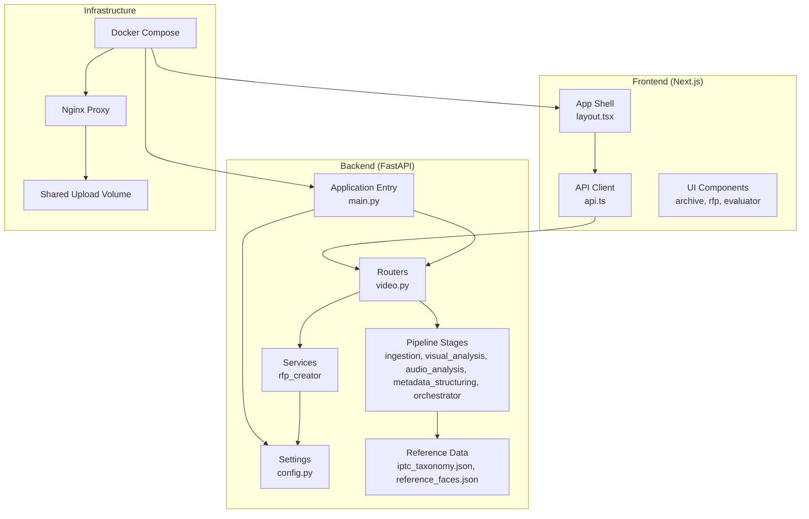
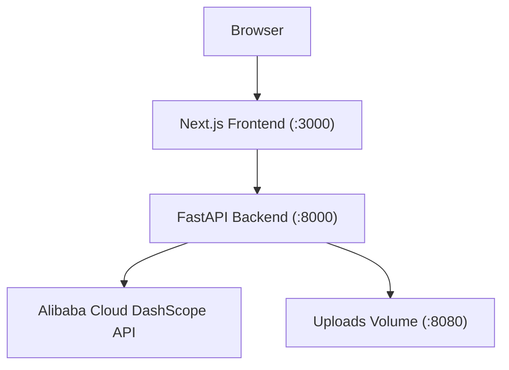
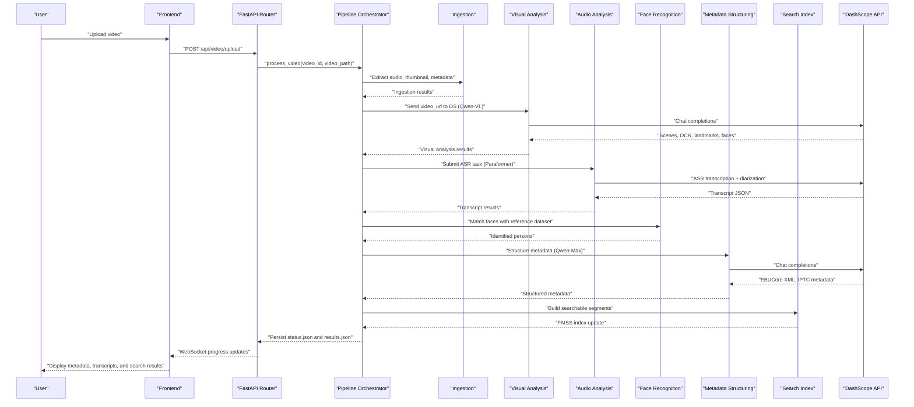
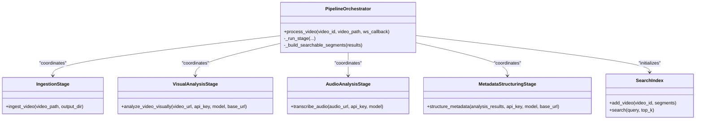
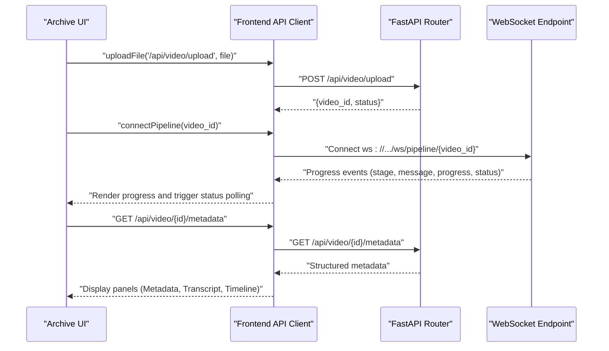
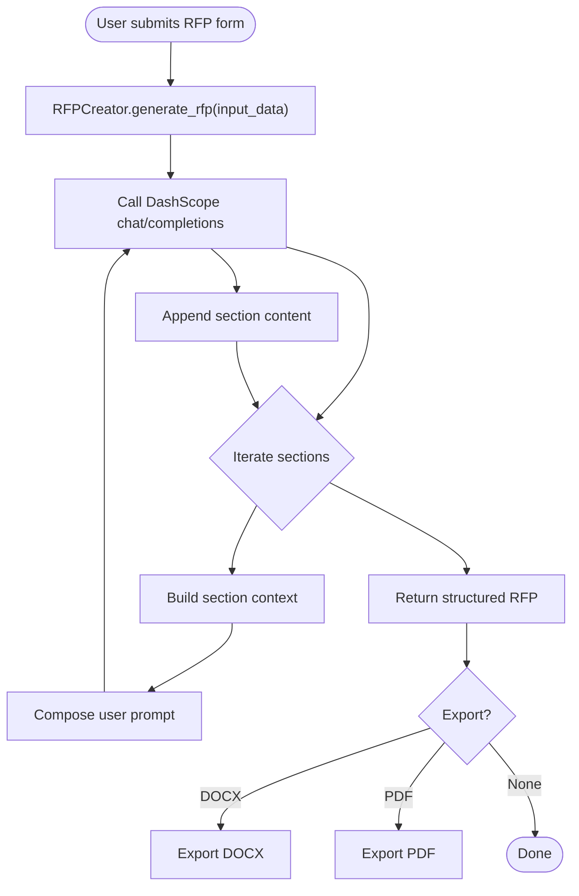
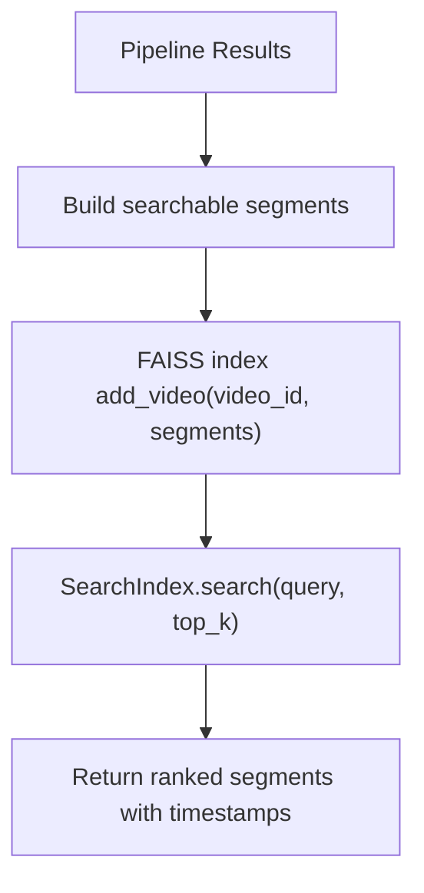
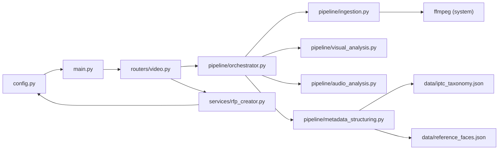

# Overall System Design

<cite>
**Referenced Files in This Document**
- [README.md](file://README.md)
- [backend/main.py](file://backend/main.py)
- [backend/config.py](file://backend/config.py)
- [backend/pipeline/orchestrator.py](file://backend/pipeline/orchestrator.py)
- [backend/pipeline/ingestion.py](file://backend/pipeline/ingestion.py)
- [backend/pipeline/visual_analysis.py](file://backend/pipeline/visual_analysis.py)
- [backend/pipeline/audio_analysis.py](file://backend/pipeline/audio_analysis.py)
- [backend/pipeline/metadata_structuring.py](file://backend/pipeline/metadata_structuring.py)
- [backend/routers/video.py](file://backend/routers/video.py)
- [backend/services/rfp_creator.py](file://backend/services/rfp_creator.py)
- [backend/data/reference_faces.json](file://backend/data/reference_faces.json)
- [frontend/src/lib/api.ts](file://frontend/src/lib/api.ts)
- [frontend/src/app/layout.tsx](file://frontend/src/app/layout.tsx)
- [docker-compose.yml](file://docker-compose.yml)
</cite>

## Table of Contents
1. [Introduction](#introduction)
2. [Project Structure](#project-structure)
3. [Core Components](#core-components)
4. [Architecture Overview](#architecture-overview)
5. [Detailed Component Analysis](#detailed-component-analysis)
6. [Dependency Analysis](#dependency-analysis)
7. [Performance Considerations](#performance-considerations)
8. [Troubleshooting Guide](#troubleshooting-guide)
9. [Conclusion](#conclusion)
10. [Appendices](#appendices)

## Introduction
This document describes the overall system design of the Dubai Media platform, an AI-powered media archive solution for Dubai’s media industry. The platform consists of:
- A Next.js frontend serving interactive tools for video archive exploration, RFP creation, and vendor evaluation.
- A FastAPI backend implementing a six-stage AI pipeline for video processing, intelligent metadata structuring, and semantic search indexing.
- Integration with Alibaba Cloud DashScope models for vision-language, automatic speech recognition, text generation, and embeddings.
- A modular architecture enabling clear separation of concerns across media processing, intelligent search, document generation, and vendor evaluation.

The system supports:
- End-to-end video ingestion and metadata extraction.
- Real-time pipeline progress via WebSocket.
- Semantic search across processed video archives.
- Bilingual (English/Arabic) RFP generation and export.
- Vendor proposal evaluation with scoring and recommendations.

## Project Structure
The repository is organized into two primary layers:
- frontend: Next.js application with typed APIs, routing, and reusable UI components.
- backend: FastAPI application with routers, pipeline stages, services, and shared data assets.

**Diagram sources**
- [backend/main.py:1-44](file://backend/main.py#L1-L44)
- [backend/config.py:1-21](file://backend/config.py#L1-L21)
- [backend/routers/video.py:1-267](file://backend/routers/video.py#L1-L267)
- [backend/pipeline/orchestrator.py:1-329](file://backend/pipeline/orchestrator.py#L1-L329)
- [backend/services/rfp_creator.py:1-639](file://backend/services/rfp_creator.py#L1-L639)
- [frontend/src/lib/api.ts:1-245](file://frontend/src/lib/api.ts#L1-L245)
- [frontend/src/app/layout.tsx:1-41](file://frontend/src/app/layout.tsx#L1-L41)
- [docker-compose.yml:1-43](file://docker-compose.yml#L1-L43)

**Section sources**
- [README.md:193-233](file://README.md#L193-L233)
- [docker-compose.yml:1-43](file://docker-compose.yml#L1-L43)

## Core Components
- Application entry and lifecycle:
  - FastAPI app initialization, CORS, static file mounting, and health endpoint.
- Configuration:
  - Centralized settings via Pydantic Settings for API keys, model identifiers, upload paths, and base URLs.
- Routers:
  - Video API endpoints for upload, status, metadata, transcript, search, and WebSocket progress streaming.
  - Routers are included in the application and mounted under a common prefix.
- Pipeline orchestrator:
  - Coordinates six sequential stages, tracks progress, persists status, and emits real-time updates via WebSocket.
- Pipeline stages:
  - Ingestion: audio extraction, thumbnail generation, and metadata probing.
  - Visual analysis: scene segmentation, OCR, landmarks, faces, and sensitive content detection.
  - Audio analysis: asynchronous ASR with diarization and polling.
  - Metadata structuring: broadcast metadata generation (EBUCore XML, IPTC) using Qwen-Max and IPTC taxonomy.
  - Search index: builds searchable segments and integrates with vector search.
- Services:
  - RFP creator: AI-driven bilingual document generation, regeneration, and exports to DOCX/PDF.
- Frontend:
  - Typed API client, WebSocket helpers, and modular UI components for archive, RFP creation, and evaluation.

**Section sources**
- [backend/main.py:1-44](file://backend/main.py#L1-L44)
- [backend/config.py:1-21](file://backend/config.py#L1-L21)
- [backend/routers/video.py:1-267](file://backend/routers/video.py#L1-L267)
- [backend/pipeline/orchestrator.py:1-329](file://backend/pipeline/orchestrator.py#L1-L329)
- [backend/pipeline/ingestion.py:1-146](file://backend/pipeline/ingestion.py#L1-L146)
- [backend/pipeline/visual_analysis.py:1-176](file://backend/pipeline/visual_analysis.py#L1-L176)
- [backend/pipeline/audio_analysis.py:1-241](file://backend/pipeline/audio_analysis.py#L1-L241)
- [backend/pipeline/metadata_structuring.py:1-252](file://backend/pipeline/metadata_structuring.py#L1-L252)
- [backend/services/rfp_creator.py:1-639](file://backend/services/rfp_creator.py#L1-L639)
- [frontend/src/lib/api.ts:1-245](file://frontend/src/lib/api.ts#L1-L245)

## Architecture Overview
The system follows a layered architecture with clear separation between frontend and backend, and a microservice-like decomposition within the backend:
- Frontend layer (Next.js): UI, routing, and typed API interactions.
- Backend layer (FastAPI): REST and WebSocket endpoints, orchestration, pipeline stages, and services.
- Infrastructure: Docker Compose for local development and Nginx proxy exposing a unified entrypoint.

**Diagram sources**
- [README.md:17-40](file://README.md#L17-L40)
- [docker-compose.yml:1-43](file://docker-compose.yml#L1-L43)
- [frontend/src/lib/api.ts:1-245](file://frontend/src/lib/api.ts#L1-L245)
- [backend/main.py:1-44](file://backend/main.py#L1-L44)

## Detailed Component Analysis

### AI-Powered Media Processing Workflow
The backend implements a six-stage pipeline orchestrated by a central coordinator. The workflow transforms raw video uploads into a searchable archive with rich metadata.

**Diagram sources**
- [backend/routers/video.py:39-120](file://backend/routers/video.py#L39-L120)
- [backend/pipeline/orchestrator.py:44-207](file://backend/pipeline/orchestrator.py#L44-L207)
- [backend/pipeline/ingestion.py:16-51](file://backend/pipeline/ingestion.py#L16-L51)
- [backend/pipeline/visual_analysis.py:43-131](file://backend/pipeline/visual_analysis.py#L43-L131)
- [backend/pipeline/audio_analysis.py:22-59](file://backend/pipeline/audio_analysis.py#L22-L59)
- [backend/pipeline/metadata_structuring.py:81-163](file://backend/pipeline/metadata_structuring.py#L81-L163)

**Section sources**
- [README.md:10-13](file://README.md#L10-L13)
- [backend/routers/video.py:39-216](file://backend/routers/video.py#L39-L216)
- [backend/pipeline/orchestrator.py:44-329](file://backend/pipeline/orchestrator.py#L44-L329)

### Architectural Patterns
- Pipeline Pattern:
  - The orchestrator coordinates sequential stages with progress tracking and persistence, ensuring reliable execution and observability.
- Factory Pattern (Model Instantiation):
  - The orchestrator initializes the search index with model parameters, encapsulating configuration and instantiation logic.
- Microservice Architecture Principles:
  - Clear separation of concerns across routers, pipeline stages, and services; each module has a focused responsibility and communicates via well-defined interfaces.

**Diagram sources**
- [backend/pipeline/orchestrator.py:34-329](file://backend/pipeline/orchestrator.py#L34-L329)
- [backend/pipeline/ingestion.py:16-146](file://backend/pipeline/ingestion.py#L16-L146)
- [backend/pipeline/visual_analysis.py:43-176](file://backend/pipeline/visual_analysis.py#L43-L176)
- [backend/pipeline/audio_analysis.py:22-241](file://backend/pipeline/audio_analysis.py#L22-L241)
- [backend/pipeline/metadata_structuring.py:81-252](file://backend/pipeline/metadata_structuring.py#L81-L252)

**Section sources**
- [backend/pipeline/orchestrator.py:34-43](file://backend/pipeline/orchestrator.py#L34-L43)

### Frontend–Backend Interaction
The frontend consumes typed API endpoints and WebSocket streams to deliver a responsive user experience.

**Diagram sources**
- [frontend/src/lib/api.ts:164-183](file://frontend/src/lib/api.ts#L164-L183)
- [backend/routers/video.py:39-120](file://backend/routers/video.py#L39-L120)
- [backend/routers/video.py:220-267](file://backend/routers/video.py#L220-L267)

**Section sources**
- [frontend/src/lib/api.ts:1-245](file://frontend/src/lib/api.ts#L1-L245)
- [backend/routers/video.py:1-267](file://backend/routers/video.py#L1-L267)

### RFP Creation and Export
The RFP creator service leverages Qwen via DashScope to generate bilingual RFP content and export to DOCX/PDF.

**Diagram sources**
- [backend/services/rfp_creator.py:124-151](file://backend/services/rfp_creator.py#L124-L151)
- [backend/services/rfp_creator.py:153-295](file://backend/services/rfp_creator.py#L153-L295)
- [backend/services/rfp_creator.py:297-639](file://backend/services/rfp_creator.py#L297-L639)

**Section sources**
- [backend/services/rfp_creator.py:1-639](file://backend/services/rfp_creator.py#L1-L639)
- [frontend/src/lib/api.ts:186-240](file://frontend/src/lib/api.ts#L186-L240)

### Intelligent Search and Metadata Structuring
Semantic search relies on building searchable segments from scenes and transcripts, then indexing them for vector similarity.

**Diagram sources**
- [backend/pipeline/orchestrator.py:283-314](file://backend/pipeline/orchestrator.py#L283-L314)
- [backend/routers/video.py:200-216](file://backend/routers/video.py#L200-L216)

**Section sources**
- [backend/pipeline/orchestrator.py:283-329](file://backend/pipeline/orchestrator.py#L283-L329)
- [backend/routers/video.py:198-216](file://backend/routers/video.py#L198-L216)

## Dependency Analysis
- Internal dependencies:
  - Routers depend on the orchestrator and search index.
  - Pipeline stages are imported by the orchestrator and invoked asynchronously.
  - Services depend on configuration for model selection and API base URLs.
- External dependencies:
  - DashScope API for vision-language, ASR, text generation, and embeddings.
  - FFmpeg for ingestion tasks.
  - FAISS for vector search indexing.
  - Python libraries for document generation and PDF rendering.

**Diagram sources**
- [backend/config.py:1-21](file://backend/config.py#L1-L21)
- [backend/main.py:1-44](file://backend/main.py#L1-L44)
- [backend/routers/video.py:1-267](file://backend/routers/video.py#L1-L267)
- [backend/pipeline/orchestrator.py:14-42](file://backend/pipeline/orchestrator.py#L14-L42)
- [backend/pipeline/ingestion.py:11](file://backend/pipeline/ingestion.py#L11)
- [backend/pipeline/metadata_structuring.py:18-29](file://backend/pipeline/metadata_structuring.py#L18-L29)
- [backend/data/reference_faces.json:1-101](file://backend/data/reference_faces.json#L1-L101)

**Section sources**
- [backend/pipeline/orchestrator.py:14-42](file://backend/pipeline/orchestrator.py#L14-L42)
- [backend/pipeline/ingestion.py:11](file://backend/pipeline/ingestion.py#L11)
- [backend/pipeline/metadata_structuring.py:18-29](file://backend/pipeline/metadata_structuring.py#L18-L29)
- [backend/data/reference_faces.json:1-101](file://backend/data/reference_faces.json#L1-101)

## Performance Considerations
- Asynchronous processing:
  - Pipeline stages and API calls use async/await to avoid blocking and improve throughput.
- Retries and timeouts:
  - External API calls implement retries with exponential backoff and explicit timeouts.
- Streaming progress:
  - WebSocket endpoints reduce perceived latency by delivering incremental updates during long-running tasks.
- Resource constraints:
  - Large videos may exceed token/time limits for visual analysis; consider chunking or pre-processing.
  - ASR is asynchronous and may take several minutes for long audio.

[No sources needed since this section provides general guidance]

## Troubleshooting Guide
- Health checks:
  - Use the health endpoint to verify backend availability.
- Upload failures:
  - Verify file permissions and disk space in the uploads volume.
- Missing API keys:
  - Ensure environment variables are set and loaded by the configuration.
- WebSocket disconnections:
  - Clients should handle reconnect logic; server cleans up inactive connections.
- ASR task timeouts:
  - Long audio may exceed maximum poll attempts; consider optimizing audio length or bitrate.

**Section sources**
- [backend/main.py:41-44](file://backend/main.py#L41-L44)
- [backend/routers/video.py:53-60](file://backend/routers/video.py#L53-L60)
- [backend/config.py:4-12](file://backend/config.py#L4-L12)
- [backend/routers/video.py:254-267](file://backend/routers/video.py#L254-L267)
- [backend/pipeline/audio_analysis.py:115-142](file://backend/pipeline/audio_analysis.py#L115-L142)

## Conclusion
The Dubai Media platform demonstrates a cohesive, modular architecture that separates frontend and backend concerns while leveraging AI capabilities for media processing, intelligent metadata structuring, and semantic search. The pipeline pattern ensures robust orchestration, while the factory-style initialization of AI services promotes maintainability. Together, these components deliver a scalable foundation for an AI-powered media archive tailored to Dubai’s media industry needs.

[No sources needed since this section summarizes without analyzing specific files]

## Appendices

### API Endpoints Reference
- Video upload and pipeline:
  - POST /api/video/upload
  - GET /api/video/{id}/status
  - GET /api/video/{id}/metadata
  - GET /api/video/{id}/transcript
  - WS /ws/pipeline/{id}
- Search:
  - POST /api/search
- RFP:
  - POST /api/rfp/create
  - POST /api/rfp/regenerate-section
  - GET /api/rfp/{id}/export/docx
  - GET /api/rfp/{id}/export/pdf
  - POST /api/rfp/evaluate
  - GET /api/rfp/evaluation/{id}/status
  - GET /api/rfp/evaluation/{id}/results
  - GET /api/rfp/evaluation/{id}/export/xlsx
  - GET /api/rfp/evaluation/{id}/export/pdf
- Health:
  - GET /api/health

**Section sources**
- [README.md:148-167](file://README.md#L148-L167)