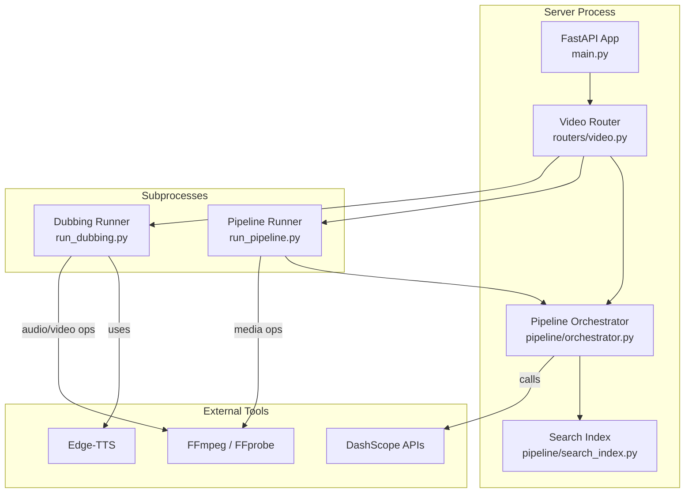
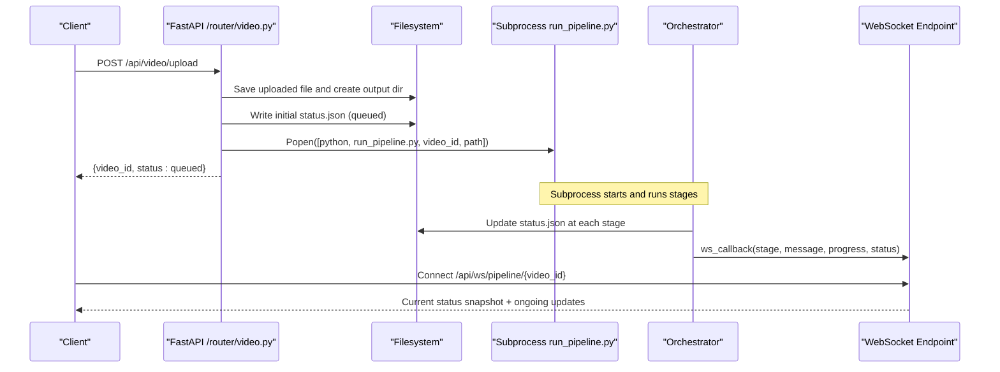
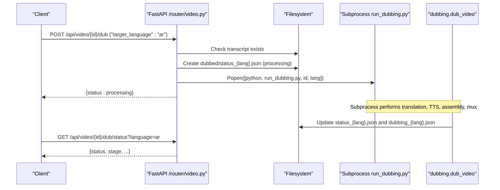
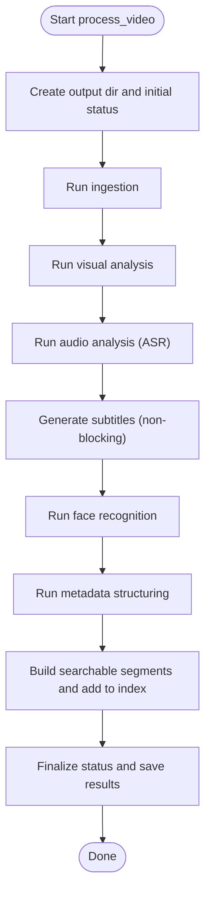
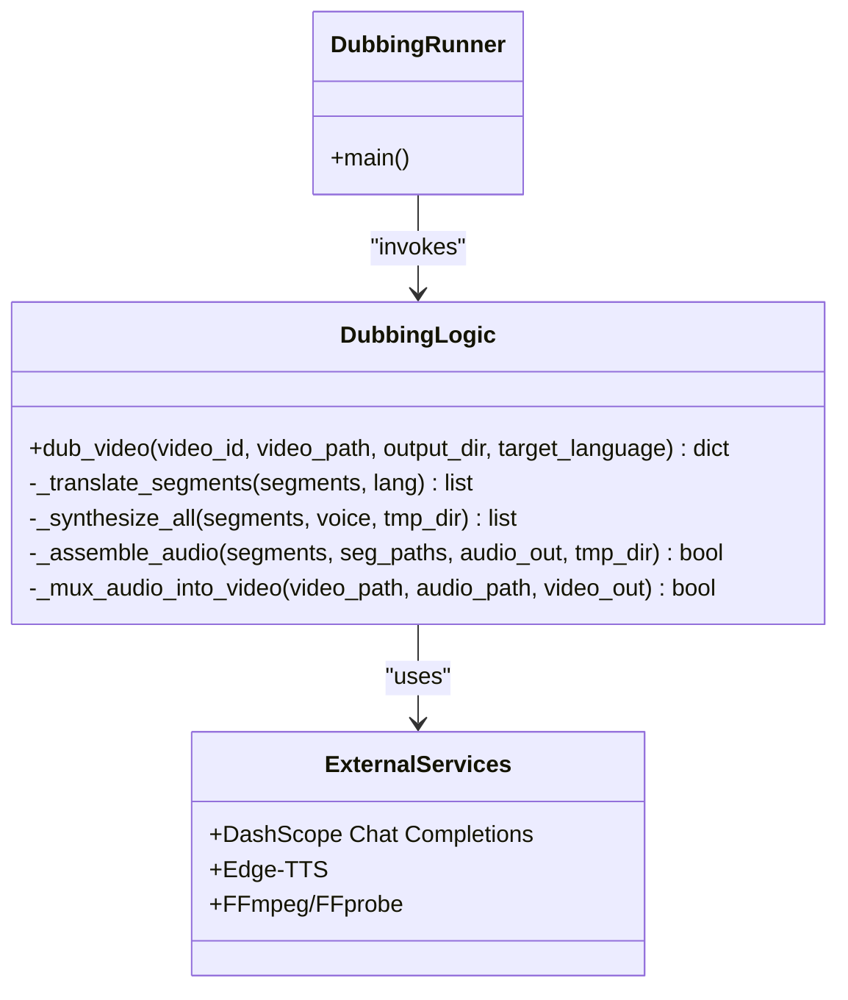
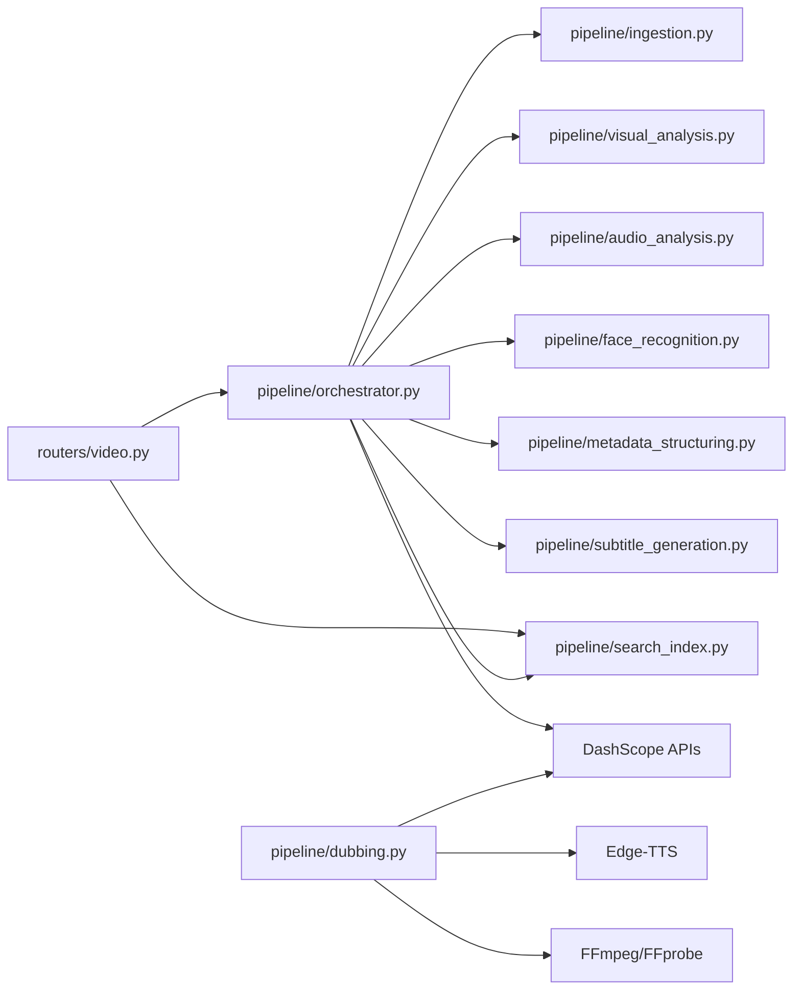

# Subprocess Architecture for Long-Running Operations

<cite>
**Referenced Files in This Document**
- [main.py](file://backend/main.py)
- [video.py](file://backend/routers/video.py)
- [run_pipeline.py](file://backend/run_pipeline.py)
- [run_dubbing.py](file://backend/run_dubbing.py)
- [orchestrator.py](file://backend/pipeline/orchestrator.py)
- [dubbing.py](file://backend/pipeline/dubbing.py)
- [ingestion.py](file://backend/pipeline/ingestion.py)
- [search_index.py](file://backend/pipeline/search_index.py)
- [config.py](file://backend/config.py)
- [api.ts](file://frontend/src/lib/api.ts)
- [useVideoProcessing.ts](file://frontend/src/lib/useVideoProcessing.ts)
</cite>

## Table of Contents
1. [Introduction](#introduction)
2. [Project Structure](#project-structure)
3. [Core Components](#core-components)
4. [Architecture Overview](#architecture-overview)
5. [Detailed Component Analysis](#detailed-component-analysis)
6. [Dependency Analysis](#dependency-analysis)
7. [Performance Considerations](#performance-considerations)
8. [Troubleshooting Guide](#troubleshooting-guide)
9. [Conclusion](#conclusion)

## Introduction
This document explains the subprocess architecture used to run long-running video processing and dubbing operations without blocking the FastAPI server. The system separates the API server from heavy workloads by launching dedicated Python processes for:
- Full pipeline execution (transcription, visual analysis, face recognition, metadata structuring, search indexing)
- On-demand dubbing (translation, speech synthesis, audio assembly, muxing into video)

The design ensures that the API remains responsive while long tasks execute independently, with progress persisted to disk and optionally streamed via WebSocket.

## Project Structure
At a high level:
- The FastAPI application mounts routers and serves HTTP/WebSocket endpoints.
- Upload triggers a background subprocess that runs the full pipeline.
- Dubbing requests trigger another background subprocess per language.
- Progress is persisted as JSON files under each video’s directory and can be polled or observed via WebSocket.

**Diagram sources**
- [main.py:1-43](file://backend/main.py#L1-L43)
- [video.py:67-129](file://backend/routers/video.py#L67-L129)
- [run_pipeline.py:1-36](file://backend/run_pipeline.py#L1-L36)
- [run_dubbing.py:1-49](file://backend/run_dubbing.py#L1-L49)
- [orchestrator.py:35-233](file://backend/pipeline/orchestrator.py#L35-L233)
- [search_index.py:59-142](file://backend/pipeline/search_index.py#L59-L142)
- [dubbing.py:56-161](file://backend/pipeline/dubbing.py#L56-L161)

**Section sources**
- [main.py:1-43](file://backend/main.py#L1-L43)
- [video.py:67-129](file://backend/routers/video.py#L67-L129)

## Core Components
- API Server (FastAPI): Mounts routers, exposes upload/status/metadata/search/dubbing endpoints, and provides a WebSocket endpoint for live progress.
- Pipeline Subprocess: A standalone process that executes the full ingestion-to-index pipeline sequentially, writing status and results to disk.
- Dubbing Subprocess: A standalone process that translates transcript segments, synthesizes speech, assembles an audio track, and muxes it into the original video.
- Orchestrator: Manages stage execution, error handling, progress updates, and persistence of intermediate results.
- Search Index: Embeds searchable segments using DashScope embeddings and stores vectors in FAISS or a NumPy fallback.

Key responsibilities:
- Non-blocking server: All long-running work is delegated to subprocesses.
- Persistent state: Status and results are written to JSON files under uploads/<video_id>.
- Optional real-time updates: WebSocket endpoint reads current status; future enhancements can push events directly.

**Section sources**
- [video.py:67-129](file://backend/routers/video.py#L67-L129)
- [run_pipeline.py:1-36](file://backend/run_pipeline.py#L1-L36)
- [run_dubbing.py:1-49](file://backend/run_dubbing.py#L1-L49)
- [orchestrator.py:35-233](file://backend/pipeline/orchestrator.py#L35-L233)
- [search_index.py:59-142](file://backend/pipeline/search_index.py#L59-L142)

## Architecture Overview
The following sequence diagrams illustrate how the server delegates long-running tasks to subprocesses and how clients observe progress.

### Upload and Pipeline Launch Sequence

**Diagram sources**
- [video.py:67-129](file://backend/routers/video.py#L67-L129)
- [video.py:883-915](file://backend/routers/video.py#L883-L915)
- [run_pipeline.py:22-36](file://backend/run_pipeline.py#L22-L36)
- [orchestrator.py:45-233](file://backend/pipeline/orchestrator.py#L45-L233)

### Dubbing Request and Execution Sequence

**Diagram sources**
- [video.py:448-522](file://backend/routers/video.py#L448-L522)
- [video.py:525-545](file://backend/routers/video.py#L525-L545)
- [run_dubbing.py:18-48](file://backend/run_dubbing.py#L18-L48)
- [dubbing.py:56-161](file://backend/pipeline/dubbing.py#L56-L161)

## Detailed Component Analysis

### API Server and Router
- Upload handler persists the file, creates a per-video output directory, writes an initial status.json, and launches the pipeline subprocess. It returns immediately with a queued status.
- Status and metadata endpoints read JSON artifacts produced by the pipeline.
- Dubbing endpoints validate inputs, guard against duplicate launches, write a per-language status file, and launch the dubbing subprocess.
- WebSocket endpoint accepts connections, sends the latest status snapshot, and maintains the connection for potential future event streaming.

Key behaviors:
- Subprocess isolation: Both pipeline and dubbing use Popen with detached sessions and redirected stdio to avoid blocking the server.
- Idempotency guards: Duplicate dubbing requests are rejected if a process is already running for the same language.
- Resilience: Missing files return clear errors; partial failures do not block subsequent stages.

**Section sources**
- [video.py:67-129](file://backend/routers/video.py#L67-L129)
- [video.py:134-149](file://backend/routers/video.py#L134-L149)
- [video.py:448-522](file://backend/routers/video.py#L448-L522)
- [video.py:525-545](file://backend/routers/video.py#L525-L545)
- [video.py:883-915](file://backend/routers/video.py#L883-L915)

### Pipeline Subprocess Entry Point
- Validates arguments, sets up logging, imports the orchestrator, and runs the async main function.
- Designed to never block the server because it runs in its own process.

**Section sources**
- [run_pipeline.py:1-36](file://backend/run_pipeline.py#L1-L36)

### Pipeline Orchestrator
- Executes stages sequentially: ingestion, visual analysis, audio analysis, face recognition, metadata structuring, search index.
- Emits progress updates via an optional callback and persists status.json after each stage.
- Handles exceptions per stage, records errors, and continues where possible.
- Builds searchable segments combining scenes, transcript, and person appearances.

**Diagram sources**
- [orchestrator.py:45-233](file://backend/pipeline/orchestrator.py#L45-L233)

**Section sources**
- [orchestrator.py:35-233](file://backend/pipeline/orchestrator.py#L35-L233)
- [orchestrator.py:331-395](file://backend/pipeline/orchestrator.py#L331-L395)

### Ingestion Stage
- Probes video metadata, extracts audio (WAV), and generates a thumbnail.
- Uses ffmpeg via an async executor to avoid blocking the event loop.

**Section sources**
- [ingestion.py:16-51](file://backend/pipeline/ingestion.py#L16-L51)
- [ingestion.py:54-97](file://backend/pipeline/ingestion.py#L54-L97)
- [ingestion.py:100-145](file://backend/pipeline/ingestion.py#L100-L145)

### Search Index
- Loads or initializes FAISS or NumPy fallback index.
- Adds segments by embedding texts via DashScope, normalizing vectors, and persisting index and metadata.
- Supports removal of videos and semantic search with optional filters.

**Section sources**
- [search_index.py:59-142](file://backend/pipeline/search_index.py#L59-L142)
- [search_index.py:143-212](file://backend/pipeline/search_index.py#L143-L212)
- [search_index.py:266-336](file://backend/pipeline/search_index.py#L266-L336)

### Dubbing Subprocess and Logic
- Entry point validates arguments and calls the core dubbing function.
- Core logic:
  - Load transcript
  - Translate all segments in one API call using markers
  - Synthesize speech per segment using Edge-TTS
  - Assemble audio with silence gaps to respect timing
  - Mux dubbed audio into the original video
- Writes per-language status and result files for polling.

**Diagram sources**
- [run_dubbing.py:18-48](file://backend/run_dubbing.py#L18-L48)
- [dubbing.py:56-161](file://backend/pipeline/dubbing.py#L56-L161)
- [dubbing.py:166-238](file://backend/pipeline/dubbing.py#L166-L238)
- [dubbing.py:267-378](file://backend/pipeline/dubbing.py#L267-L378)
- [dubbing.py:434-470](file://backend/pipeline/dubbing.py#L434-L470)

**Section sources**
- [run_dubbing.py:1-49](file://backend/run_dubbing.py#L1-L49)
- [dubbing.py:56-161](file://backend/pipeline/dubbing.py#L56-L161)
- [dubbing.py:166-238](file://backend/pipeline/dubbing.py#L166-L238)
- [dubbing.py:267-378](file://backend/pipeline/dubbing.py#L267-L378)
- [dubbing.py:434-470](file://backend/pipeline/dubbing.py#L434-L470)

### Frontend Integration
- Upload uses XHR for real progress and then falls back to polling when WebSocket is unavailable.
- WebSocket client connects to the server’s pipeline endpoint and updates UI state based on messages.
- Dubbing status is polled via REST endpoints.

**Section sources**
- [api.ts:99-132](file://frontend/src/lib/api.ts#L99-L132)
- [useVideoProcessing.ts:239-300](file://frontend/src/lib/useVideoProcessing.ts#L239-L300)
- [useVideoProcessing.ts:494-525](file://frontend/src/lib/useVideoProcessing.ts#L494-L525)

## Dependency Analysis
- Coupling:
  - Router depends on orchestrator and search index for in-process operations but delegates heavy work to subprocesses.
  - Orchestrator depends on multiple pipeline modules and external APIs.
  - Dubbing module depends on translation API, Edge-TTS, and FFmpeg.
- Cohesion:
  - Each subprocess has a single responsibility (full pipeline vs. dubbing).
  - Orchestrator encapsulates stage orchestration and persistence.
- External dependencies:
  - DashScope APIs for vision, ASR, text, and embeddings.
  - FFmpeg/FFprobe for media operations.
  - Edge-TTS for speech synthesis.

**Diagram sources**
- [video.py:23-26](file://backend/routers/video.py#L23-L26)
- [orchestrator.py:14-22](file://backend/pipeline/orchestrator.py#L14-L22)
- [dubbing.py:23-27](file://backend/pipeline/dubbing.py#L23-L27)

**Section sources**
- [video.py:23-26](file://backend/routers/video.py#L23-L26)
- [orchestrator.py:14-22](file://backend/pipeline/orchestrator.py#L14-L22)
- [dubbing.py:23-27](file://backend/pipeline/dubbing.py#L23-L27)

## Performance Considerations
- Subprocess isolation prevents CPU-bound or I/O-bound tasks from blocking the server’s event loop.
- Use of asyncio executors for FFmpeg operations avoids blocking within subprocesses.
- Batched embedding calls reduce API overhead during indexing.
- Per-language status files enable concurrent dubbing without contention.
- Subtitle generation is non-blocking and resilient to failures.

[No sources needed since this section provides general guidance]

## Troubleshooting Guide
Common issues and diagnostics:
- No status updates: Ensure the pipeline subprocess was launched and that status.json is being written under uploads/<video_id>.
- Missing transcript: Dubbing requires transcript.json; verify ingestion completed successfully.
- FFmpeg errors: Check stderr logs in pipeline.log or subprocess outputs; ensure FFmpeg/FFprobe are installed and accessible.
- Translation failures: Verify API key configuration and network connectivity; retry logic is implemented with exponential backoff.
- WebSocket disconnects: The frontend falls back to polling; check server logs and CORS settings.

Operational tips:
- Inspect per-language status files (status_<lang>.json, dubbing_<lang>.json) for detailed dubbing progress.
- Rebuild the search index using the reindex endpoint if metadata changes.

**Section sources**
- [video.py:134-149](file://backend/routers/video.py#L134-L149)
- [video.py:448-522](file://backend/routers/video.py#L448-L522)
- [video.py:883-915](file://backend/routers/video.py#L883-L915)
- [dubbing.py:475-507](file://backend/pipeline/dubbing.py#L475-L507)

## Conclusion
The repository implements a robust subprocess-based architecture to handle long-running video processing and dubbing tasks without impacting API responsiveness. By isolating heavy workloads, persisting state to disk, and providing both polling and WebSocket interfaces, the system balances reliability, scalability, and user experience. Future enhancements could include direct WebSocket event pushing from subprocesses and more granular stage-level progress reporting.