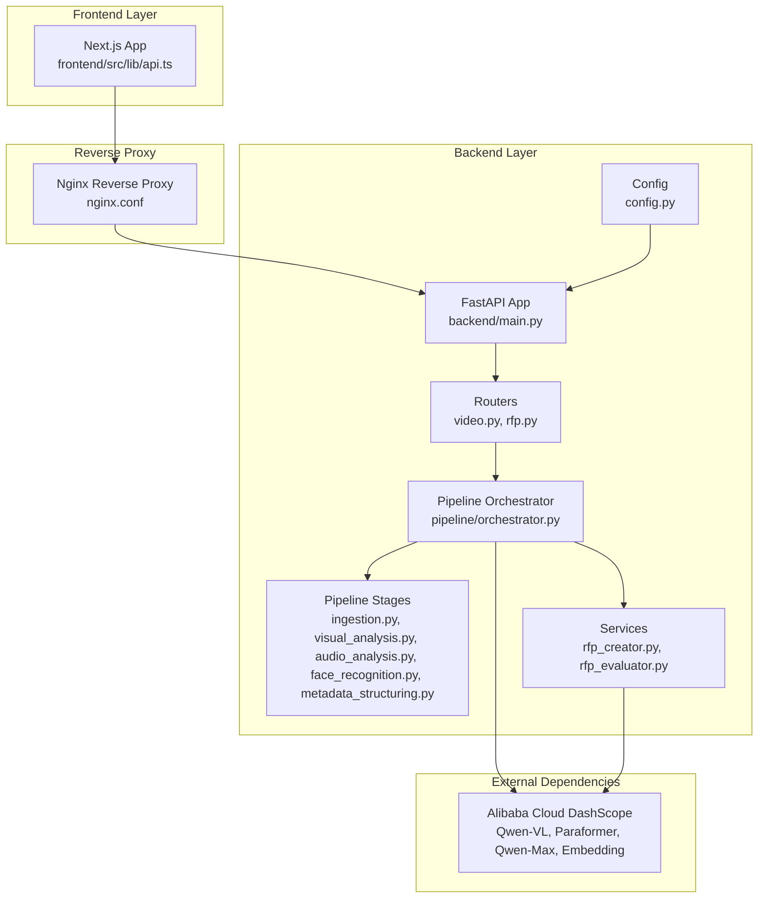
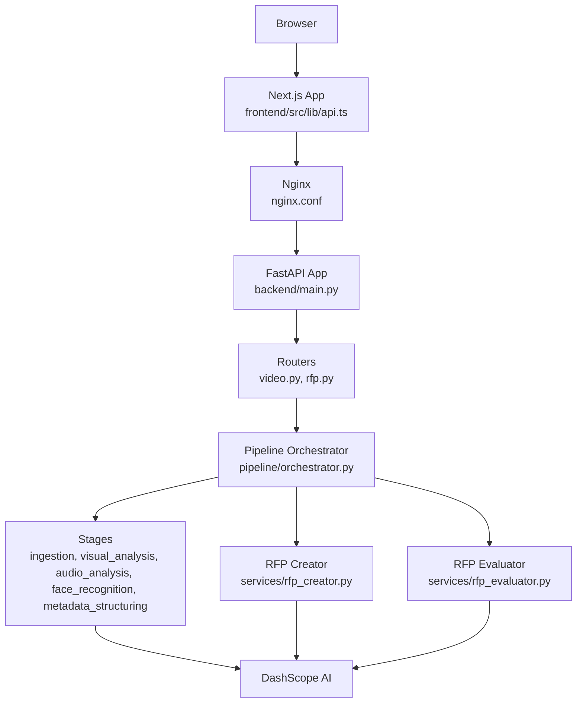
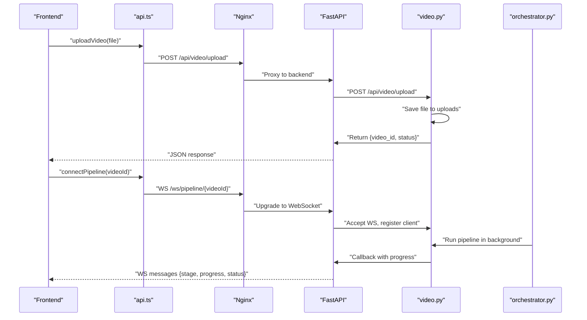
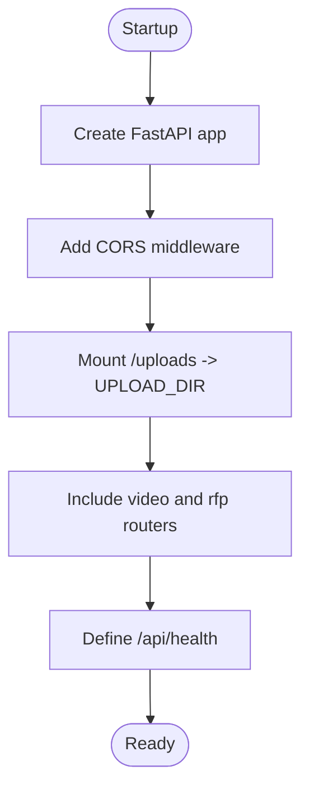
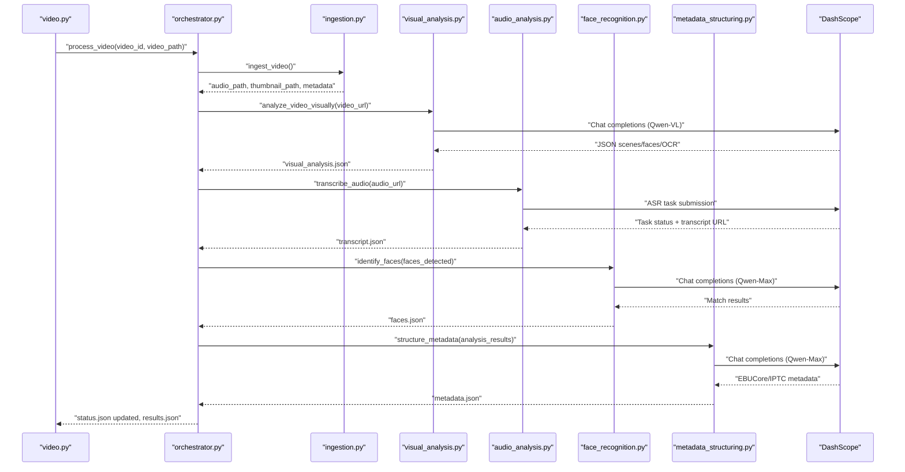
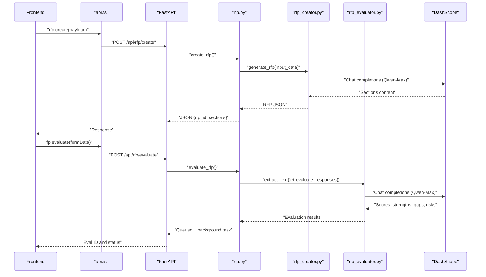
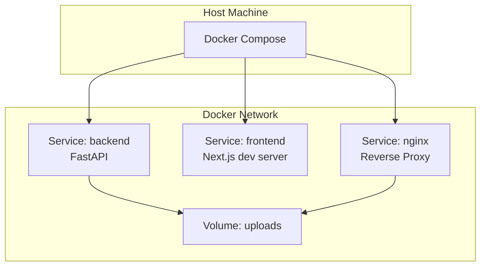
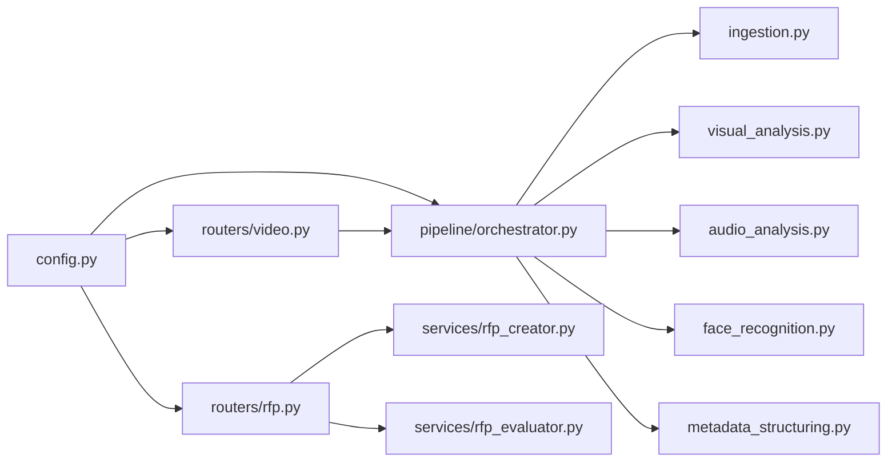

# System Architecture

<cite>
**Referenced Files in This Document**
- [backend/main.py](file://backend/main.py)
- [backend/config.py](file://backend/config.py)
- [backend/routers/video.py](file://backend/routers/video.py)
- [backend/routers/rfp.py](file://backend/routers/rfp.py)
- [backend/pipeline/orchestrator.py](file://backend/pipeline/orchestrator.py)
- [backend/pipeline/ingestion.py](file://backend/pipeline/ingestion.py)
- [backend/pipeline/visual_analysis.py](file://backend/pipeline/visual_analysis.py)
- [backend/pipeline/audio_analysis.py](file://backend/pipeline/audio_analysis.py)
- [backend/pipeline/face_recognition.py](file://backend/pipeline/face_recognition.py)
- [backend/pipeline/metadata_structuring.py](file://backend/pipeline/metadata_structuring.py)
- [backend/services/rfp_creator.py](file://backend/services/rfp_creator.py)
- [backend/services/rfp_evaluator.py](file://backend/services/rfp_evaluator.py)
- [frontend/src/lib/api.ts](file://frontend/src/lib/api.ts)
- [docker-compose.yml](file://docker-compose.yml)
- [nginx.conf](file://nginx.conf)
</cite>

## Table of Contents
1. [Introduction](#introduction)
2. [Project Structure](#project-structure)
3. [Core Components](#core-components)
4. [Architecture Overview](#architecture-overview)
5. [Detailed Component Analysis](#detailed-component-analysis)
6. [Dependency Analysis](#dependency-analysis)
7. [Performance Considerations](#performance-considerations)
8. [Troubleshooting Guide](#troubleshooting-guide)
9. [Conclusion](#conclusion)
10. [Appendices](#appendices)

## Introduction
This document describes the system architecture of the Dubai Media AI-powered media processing platform. The system integrates a browser-based frontend, a Next.js application layer, a FastAPI backend, and Alibaba Cloud DashScope AI services. It supports video ingestion, AI-driven metadata extraction, semantic search, RFP creation and evaluation, and real-time progress tracking via WebSockets. The platform is containerized using Docker Compose with Nginx as a reverse proxy and static file server for uploaded assets.

## Project Structure
The repository is organized into three primary layers:
- Frontend: Next.js application with TypeScript and React components, including API helpers and UI for video upload, pipeline monitoring, and RFP workflows.
- Backend: FastAPI application exposing REST endpoints and WebSocket streams, orchestrating a multi-stage video processing pipeline, and integrating with DashScope AI services.
- Infrastructure: Docker Compose for local development and deployment orchestration, and Nginx configuration for reverse proxying, CORS, and serving static media.

**Diagram sources**
- [backend/main.py:1-44](file://backend/main.py#L1-L44)
- [backend/routers/video.py:1-267](file://backend/routers/video.py#L1-L267)
- [backend/routers/rfp.py:1-385](file://backend/routers/rfp.py#L1-L385)
- [backend/pipeline/orchestrator.py:1-329](file://backend/pipeline/orchestrator.py#L1-L329)
- [backend/pipeline/ingestion.py:1-146](file://backend/pipeline/ingestion.py#L1-L146)
- [backend/pipeline/visual_analysis.py:1-176](file://backend/pipeline/visual_analysis.py#L1-L176)
- [backend/pipeline/audio_analysis.py:1-241](file://backend/pipeline/audio_analysis.py#L1-L241)
- [backend/pipeline/face_recognition.py:1-215](file://backend/pipeline/face_recognition.py#L1-L215)
- [backend/pipeline/metadata_structuring.py:1-252](file://backend/pipeline/metadata_structuring.py#L1-L252)
- [backend/services/rfp_creator.py:1-639](file://backend/services/rfp_creator.py#L1-L639)
- [backend/services/rfp_evaluator.py:1-622](file://backend/services/rfp_evaluator.py#L1-L622)
- [backend/config.py:1-21](file://backend/config.py#L1-L21)
- [frontend/src/lib/api.ts:1-245](file://frontend/src/lib/api.ts#L1-L245)
- [nginx.conf:1-51](file://nginx.conf#L1-L51)

**Section sources**
- [backend/main.py:1-44](file://backend/main.py#L1-L44)
- [frontend/src/lib/api.ts:1-245](file://frontend/src/lib/api.ts#L1-L245)
- [docker-compose.yml:1-43](file://docker-compose.yml#L1-L43)
- [nginx.conf:1-51](file://nginx.conf#L1-L51)

## Core Components
- Frontend API Client: Provides typed fetch wrappers, file upload helpers, and WebSocket connection utilities for the Next.js app. It constructs API URLs from environment variables and exposes convenience methods for video and RFP operations.
- FastAPI Backend: Defines CORS middleware, static file mounting for uploads, and includes routers for video processing and RFP workflows. It exposes health checks and integrates with the pipeline orchestrator and RFP services.
- Pipeline Orchestrator: Coordinates six stages of video processing: ingestion, visual analysis, audio transcription, face recognition, metadata structuring, and search index building. It emits progress via callbacks and persists status to disk.
- AI Services Integration: Uses DashScope APIs for Qwen-VL (visual analysis), Paraformer (speech-to-text), Qwen-Max (text tasks), and embedding-based search index construction.
- RFP Services: AI-powered RFP creation and vendor evaluation, including document export to DOCX/PDF and evaluation result exports to XLSX/PDF.
- Infrastructure: Docker Compose builds and runs backend, frontend, and Nginx; Nginx proxies API and WebSocket traffic, serves uploaded files with appropriate CORS and caching.

**Section sources**
- [frontend/src/lib/api.ts:1-245](file://frontend/src/lib/api.ts#L1-L245)
- [backend/main.py:1-44](file://backend/main.py#L1-L44)
- [backend/pipeline/orchestrator.py:1-329](file://backend/pipeline/orchestrator.py#L1-L329)
- [backend/config.py:1-21](file://backend/config.py#L1-L21)
- [backend/services/rfp_creator.py:1-639](file://backend/services/rfp_creator.py#L1-L639)
- [backend/services/rfp_evaluator.py:1-622](file://backend/services/rfp_evaluator.py#L1-L622)
- [docker-compose.yml:1-43](file://docker-compose.yml#L1-L43)
- [nginx.conf:1-51](file://nginx.conf#L1-L51)

## Architecture Overview
The system follows a layered architecture:
- Presentation: Next.js app communicates with the backend via REST and WebSockets.
- Application: FastAPI routes handle requests, manage background tasks, and coordinate pipeline execution.
- Data and AI: Local file storage for uploads and intermediate artifacts; DashScope APIs for AI inference and embeddings.
- Infrastructure: Nginx acts as a reverse proxy and static file server for uploaded content.

**Diagram sources**
- [frontend/src/lib/api.ts:1-245](file://frontend/src/lib/api.ts#L1-L245)
- [nginx.conf:1-51](file://nginx.conf#L1-L51)
- [backend/main.py:1-44](file://backend/main.py#L1-L44)
- [backend/routers/video.py:1-267](file://backend/routers/video.py#L1-L267)
- [backend/routers/rfp.py:1-385](file://backend/routers/rfp.py#L1-L385)
- [backend/pipeline/orchestrator.py:1-329](file://backend/pipeline/orchestrator.py#L1-L329)
- [backend/services/rfp_creator.py:1-639](file://backend/services/rfp_creator.py#L1-L639)
- [backend/services/rfp_evaluator.py:1-622](file://backend/services/rfp_evaluator.py#L1-L622)

## Detailed Component Analysis

### Frontend API Client
- Responsibilities:
  - Construct API base URL from environment variables.
  - Provide typed fetch wrapper for REST endpoints.
  - Support multipart/form-data uploads for video files.
  - Manage WebSocket connections for real-time pipeline progress.
  - Define typed interfaces for RFP and evaluation results.
- Key endpoints exposed:
  - Video: upload, status, metadata, transcript, search.
  - RFP: create, regenerate section, export DOCX/PDF, evaluate, evaluation status/results, export evaluation XLSX/PDF.
- Real-time updates:
  - Connects to WebSocket endpoint to receive progress events during pipeline execution.

**Diagram sources**
- [frontend/src/lib/api.ts:164-183](file://frontend/src/lib/api.ts#L164-L183)
- [backend/routers/video.py:39-92](file://backend/routers/video.py#L39-L92)
- [backend/routers/video.py:220-267](file://backend/routers/video.py#L220-L267)
- [backend/pipeline/orchestrator.py:95-120](file://backend/pipeline/orchestrator.py#L95-L120)

**Section sources**
- [frontend/src/lib/api.ts:1-245](file://frontend/src/lib/api.ts#L1-L245)
- [backend/routers/video.py:39-92](file://backend/routers/video.py#L39-L92)
- [backend/routers/video.py:220-267](file://backend/routers/video.py#L220-L267)

### Backend FastAPI Application
- Responsibilities:
  - Configure CORS, static file serving for uploads, and include routers.
  - Provide health check endpoint.
- Middleware and mounts:
  - CORS enabled for development.
  - Static files mounted at /uploads pointing to the shared volume.

**Diagram sources**
- [backend/main.py:1-44](file://backend/main.py#L1-L44)

**Section sources**
- [backend/main.py:1-44](file://backend/main.py#L1-L44)

### Pipeline Orchestrator and Stages
- Orchestrator:
  - Initializes a shared search index with DashScope credentials.
  - Executes stages sequentially, updating status.json and saving per-stage results.
  - Emits progress via WebSocket callback to connected clients.
- Stages:
  - Ingestion: extracts audio, generates thumbnail, probes metadata.
  - Visual Analysis: sends video URL to Qwen-VL for scene/object/OCR detection.
  - Audio Analysis: submits audio to Paraformer for transcription with diarization.
  - Face Recognition: matches detected faces against a reference database using Qwen-Max.
  - Metadata Structuring: produces EBUCore XML and IPTC metadata using Qwen-Max.
  - Search Index: builds searchable segments and adds to DashScope embedding index.

**Diagram sources**
- [backend/pipeline/orchestrator.py:44-206](file://backend/pipeline/orchestrator.py#L44-L206)
- [backend/pipeline/ingestion.py:16-51](file://backend/pipeline/ingestion.py#L16-L51)
- [backend/pipeline/visual_analysis.py:43-130](file://backend/pipeline/visual_analysis.py#L43-L130)
- [backend/pipeline/audio_analysis.py:22-59](file://backend/pipeline/audio_analysis.py#L22-L59)
- [backend/pipeline/face_recognition.py:54-107](file://backend/pipeline/face_recognition.py#L54-L107)
- [backend/pipeline/metadata_structuring.py:81-163](file://backend/pipeline/metadata_structuring.py#L81-L163)

**Section sources**
- [backend/pipeline/orchestrator.py:1-329](file://backend/pipeline/orchestrator.py#L1-L329)
- [backend/pipeline/ingestion.py:1-146](file://backend/pipeline/ingestion.py#L1-L146)
- [backend/pipeline/visual_analysis.py:1-176](file://backend/pipeline/visual_analysis.py#L1-L176)
- [backend/pipeline/audio_analysis.py:1-241](file://backend/pipeline/audio_analysis.py#L1-L241)
- [backend/pipeline/face_recognition.py:1-215](file://backend/pipeline/face_recognition.py#L1-L215)
- [backend/pipeline/metadata_structuring.py:1-252](file://backend/pipeline/metadata_structuring.py#L1-L252)

### RFP Creation and Evaluation Services
- RFP Creator:
  - Generates comprehensive RFP sections using Qwen-Max via DashScope.
  - Supports bilingual outputs and exports to DOCX/PDF.
- RFP Evaluator:
  - Evaluates vendor proposals against criteria using Qwen-Max.
  - Produces comparative matrices, weighted totals, strengths/gaps/risks, and exportable reports (XLSX/PDF).

**Diagram sources**
- [frontend/src/lib/api.ts:186-240](file://frontend/src/lib/api.ts#L186-L240)
- [backend/routers/rfp.py:97-130](file://backend/routers/rfp.py#L97-L130)
- [backend/routers/rfp.py:243-311](file://backend/routers/rfp.py#L243-L311)
- [backend/services/rfp_creator.py:124-151](file://backend/services/rfp_creator.py#L124-L151)
- [backend/services/rfp_evaluator.py:230-295](file://backend/services/rfp_evaluator.py#L230-L295)

**Section sources**
- [backend/routers/rfp.py:1-385](file://backend/routers/rfp.py#L1-L385)
- [backend/services/rfp_creator.py:1-639](file://backend/services/rfp_creator.py#L1-L639)
- [backend/services/rfp_evaluator.py:1-622](file://backend/services/rfp_evaluator.py#L1-L622)

### Infrastructure and Deployment Topology
- Docker Compose:
  - backend service builds from ./backend, mounts code and uploads volume, sets environment, and runs Uvicorn.
  - frontend service builds from ./frontend, mounts source code, sets NEXT_PUBLIC_API_URL, and depends on backend.
  - nginx service proxies API and WebSocket to backend, serves /uploads from a named volume, applies CORS and timeouts.
- Nginx:
  - Proxies /api/ to backend.
  - Proxies /ws/ to backend for WebSocket upgrades.
  - Serves /uploads/ with CORS headers, caching, and large client body support.
- File Storage:
  - Persistent uploads via Docker named volume mapped to backend uploads directory and served by Nginx.

**Diagram sources**
- [docker-compose.yml:1-43](file://docker-compose.yml#L1-L43)
- [nginx.conf:1-51](file://nginx.conf#L1-L51)

**Section sources**
- [docker-compose.yml:1-43](file://docker-compose.yml#L1-L43)
- [nginx.conf:1-51](file://nginx.conf#L1-L51)

## Dependency Analysis
- Internal dependencies:
  - Routers depend on the orchestrator and search index.
  - Orchestrator composes pipeline stages and DashScope services.
  - RFP routers depend on RFP creator and evaluator services.
- External dependencies:
  - DashScope APIs for Qwen-VL, Paraformer, Qwen-Max, embedding index, and ASR task management.
- Coupling and cohesion:
  - Strong cohesion within routers and services; moderate coupling via shared configuration and status persistence.
  - WebSocket connections are tracked per video to fan-out progress updates.

**Diagram sources**
- [backend/config.py:1-21](file://backend/config.py#L1-L21)
- [backend/routers/video.py:1-267](file://backend/routers/video.py#L1-L267)
- [backend/routers/rfp.py:1-385](file://backend/routers/rfp.py#L1-L385)
- [backend/pipeline/orchestrator.py:1-329](file://backend/pipeline/orchestrator.py#L1-L329)
- [backend/pipeline/ingestion.py:1-146](file://backend/pipeline/ingestion.py#L1-L146)
- [backend/pipeline/visual_analysis.py:1-176](file://backend/pipeline/visual_analysis.py#L1-L176)
- [backend/pipeline/audio_analysis.py:1-241](file://backend/pipeline/audio_analysis.py#L1-L241)
- [backend/pipeline/face_recognition.py:1-215](file://backend/pipeline/face_recognition.py#L1-L215)
- [backend/pipeline/metadata_structuring.py:1-252](file://backend/pipeline/metadata_structuring.py#L1-L252)
- [backend/services/rfp_creator.py:1-639](file://backend/services/rfp_creator.py#L1-L639)
- [backend/services/rfp_evaluator.py:1-622](file://backend/services/rfp_evaluator.py#L1-L622)

**Section sources**
- [backend/config.py:1-21](file://backend/config.py#L1-L21)
- [backend/routers/video.py:1-267](file://backend/routers/video.py#L1-L267)
- [backend/routers/rfp.py:1-385](file://backend/routers/rfp.py#L1-L385)
- [backend/pipeline/orchestrator.py:1-329](file://backend/pipeline/orchestrator.py#L1-L329)

## Performance Considerations
- Long-running operations:
  - ASR polling and AI inference can take several minutes; Nginx proxy timeouts are increased accordingly.
- Concurrency:
  - Background tasks are used for pipeline execution; WebSocket fan-out is handled per video.
- File handling:
  - Streaming writes for large uploads; static file serving optimized with caching headers.
- Scalability:
  - Current compose setup is single-instance; horizontal scaling requires a load balancer and shared persistent storage for uploads.
  - Consider queue-backed workers for heavy AI tasks and separate embedding index hosting.

[No sources needed since this section provides general guidance]

## Troubleshooting Guide
- CORS issues for uploaded files:
  - Nginx serves /uploads/ with CORS headers; verify configuration and ensure correct origin handling.
- API timeouts:
  - Nginx proxy timeouts are tuned for long-running AI operations; adjust if needed.
- WebSocket connectivity:
  - Ensure /ws/ upgrade headers are preserved; confirm backend accepts WS connections and registers clients.
- Missing API key:
  - DashScope integrations require a valid API key; missing keys cause partial or empty results.
- Upload failures:
  - Verify uploads volume permissions and backend static file mount.

**Section sources**
- [nginx.conf:10-18](file://nginx.conf#L10-L18)
- [nginx.conf:32-38](file://nginx.conf#L32-L38)
- [nginx.conf:41-49](file://nginx.conf#L41-L49)
- [backend/config.py:5-12](file://backend/config.py#L5-L12)

## Conclusion
The Dubai Media platform combines a modern frontend, a robust FastAPI backend, and Alibaba Cloud DashScope AI services to deliver an end-to-end solution for media ingestion, metadata extraction, semantic search, and RFP workflows. Nginx provides essential reverse proxying and static file serving, while Docker Compose enables reproducible local development. The architecture supports real-time progress updates, scalable file handling, and extensible AI integrations.

[No sources needed since this section summarizes without analyzing specific files]

## Appendices

### Technology Stack Choices and Rationale
- Next.js + TypeScript:
  - Rapid UI development, strong typing, and built-in routing.
- FastAPI:
  - High-performance async framework with automatic OpenAPI docs and Pydantic models.
- Docker Compose + Nginx:
  - Unified local development and deployment orchestration with reverse proxy and static file serving.
- FFmpeg:
  - Reliable media probing and extraction for audio and thumbnails.
- DashScope AI:
  - Integrated multimodal and speech capabilities for vision, speech, and text tasks with embedding index support.

[No sources needed since this section provides general guidance]