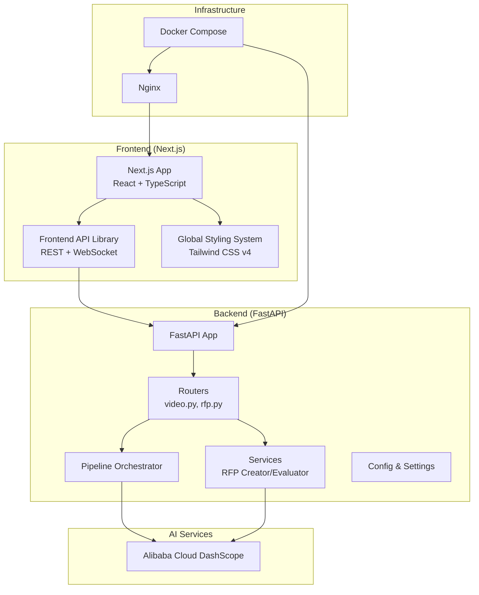
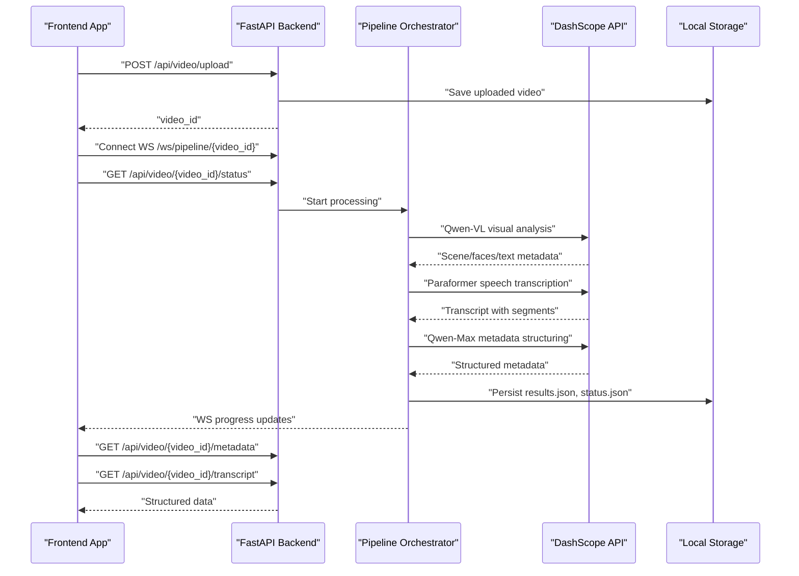
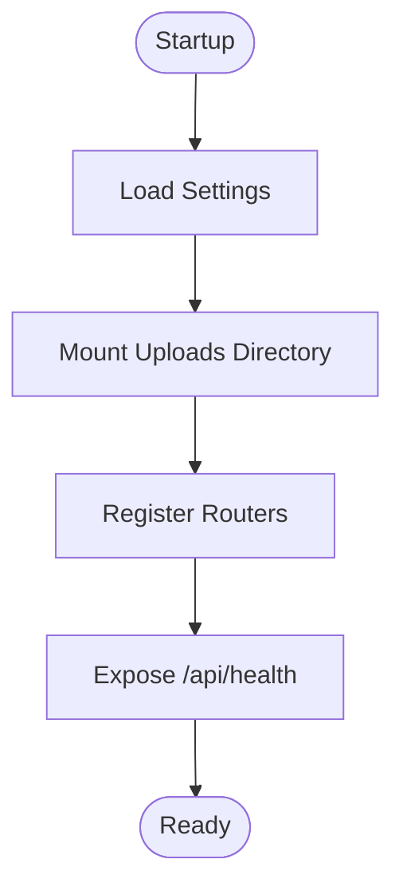
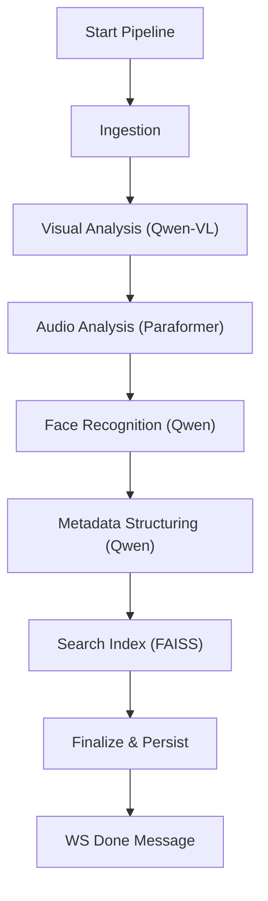
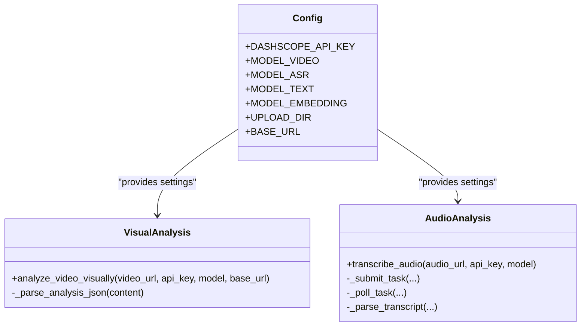
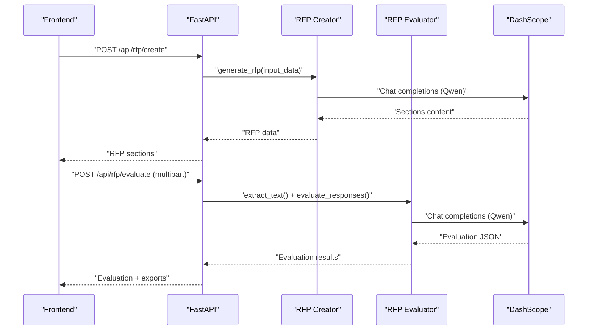
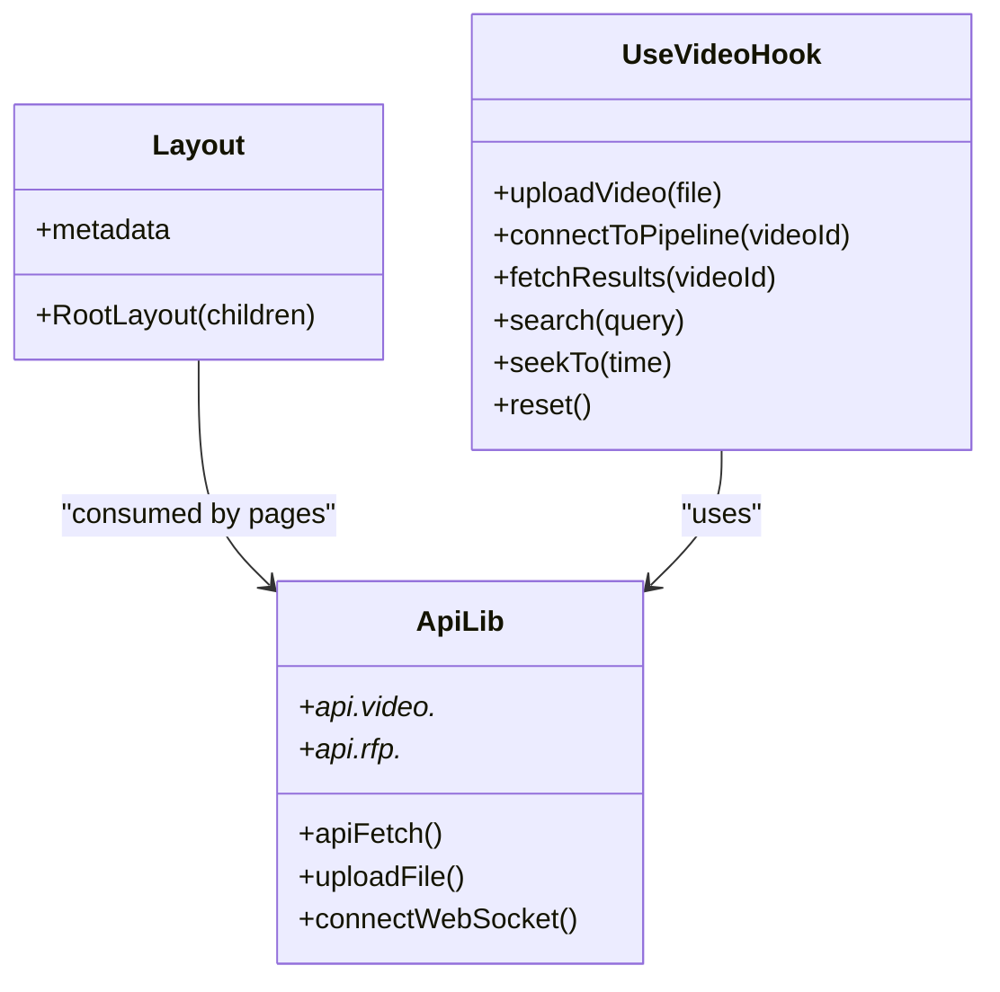
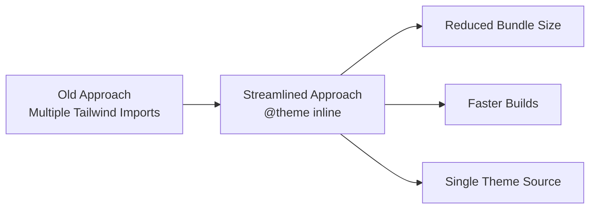
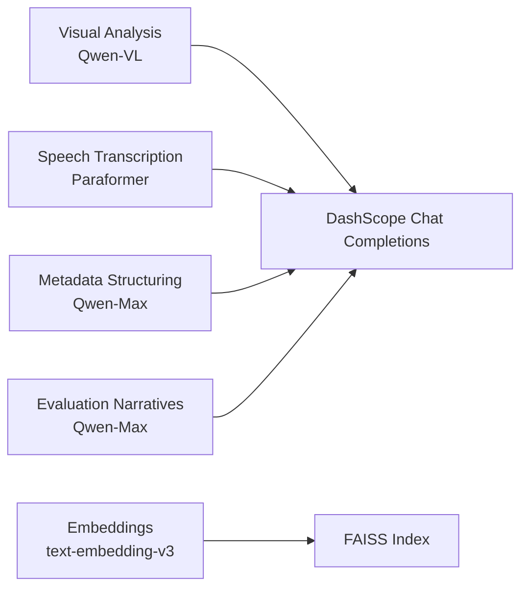
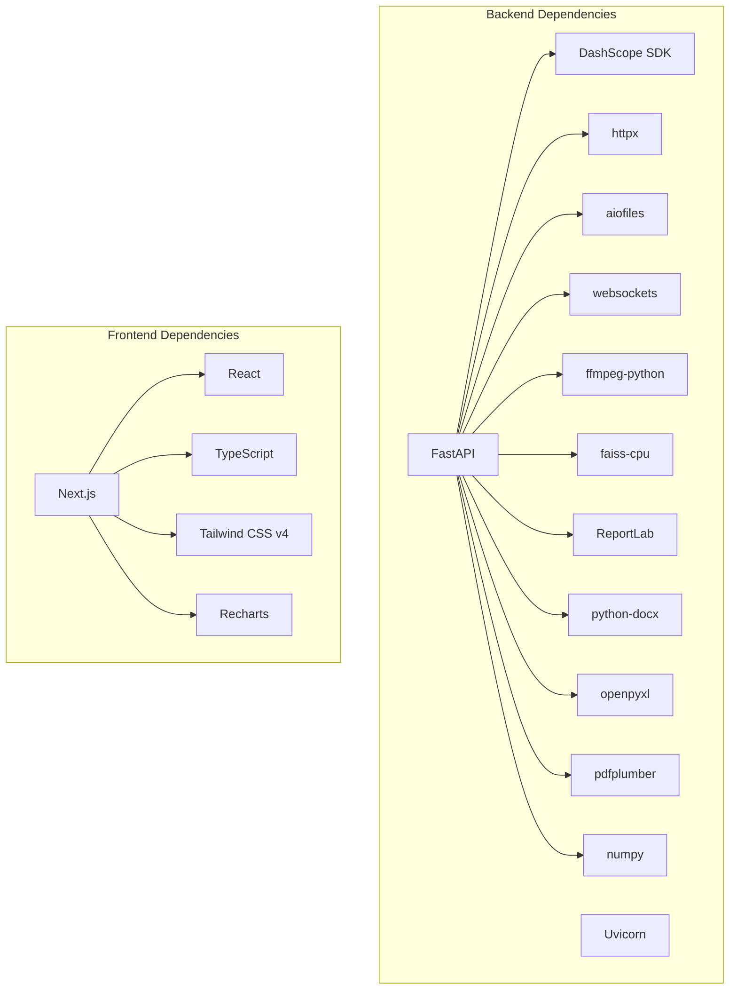

# Technology Stack

<cite>
**Referenced Files in This Document**
- [backend/requirements.txt](file://backend/requirements.txt)
- [backend/main.py](file://backend/main.py)
- [backend/config.py](file://backend/config.py)
- [backend/docker-compose.yml](file://docker-compose.yml)
- [backend/pipeline/orchestrator.py](file://backend/pipeline/orchestrator.py)
- [backend/pipeline/visual_analysis.py](file://backend/pipeline/visual_analysis.py)
- [backend/pipeline/audio_analysis.py](file://backend/pipeline/audio_analysis.py)
- [backend/services/rfp_creator.py](file://backend/services/rfp_creator.py)
- [backend/services/rfp_evaluator.py](file://backend/services/rfp_evaluator.py)
- [frontend/package.json](file://frontend/package.json)
- [frontend/src/lib/api.ts](file://frontend/src/lib/api.ts)
- [frontend/src/lib/useVideoProcessing.ts](file://frontend/src/lib/useVideoProcessing.ts)
- [frontend/src/app/layout.tsx](file://frontend/src/app/layout.tsx)
- [frontend/src/app/globals.css](file://frontend/src/app/globals.css)
- [frontend/postcss.config.mjs](file://frontend/postcss.config.mjs)
- [frontend/next.config.ts](file://frontend/next.config.ts)
</cite>

## Update Summary
**Changes Made**
- Updated Frontend Styling System section to reflect the global styling system restructuring in globals.css
- Removed references to redundant Tailwind CSS imports and consolidated theme configurations
- Added information about Tailwind CSS v4 migration and `@theme inline` syntax
- Updated performance considerations to include build optimization benefits

## Table of Contents
1. [Introduction](#introduction)
2. [Project Structure](#project-structure)
3. [Core Components](#core-components)
4. [Architecture Overview](#architecture-overview)
5. [Detailed Component Analysis](#detailed-component-analysis)
6. [Dependency Analysis](#dependency-analysis)
7. [Performance Considerations](#performance-considerations)
8. [Troubleshooting Guide](#troubleshooting-guide)
9. [Conclusion](#conclusion)

## Introduction
This document details the technology stack powering the Dubai Media platform. It covers the backend built with FastAPI and Python AI libraries, the frontend powered by Next.js and React with TypeScript, and the AI service integration with Alibaba Cloud DashScope. It also documents database/storage technologies, AI model usage, version compatibility, and upgrade considerations, along with the rationale behind technology choices for AI-powered media processing, real-time communication, and scalable deployment.

## Project Structure
The project follows a clear separation of concerns:
- Backend: FastAPI application with AI pipeline orchestration, RFP creation and evaluation services, and API endpoints.
- Frontend: Next.js application with React and TypeScript, providing real-time video processing UI and RFP tools.
- Infrastructure: Docker Compose for containerized deployment with Nginx serving static uploads.

**Diagram sources**
- [backend/main.py:1-44](file://backend/main.py#L1-L44)
- [backend/docker-compose.yml:1-43](file://docker-compose.yml#L1-L43)
- [frontend/src/lib/api.ts:1-245](file://frontend/src/lib/api.ts#L1-L245)
- [frontend/src/app/globals.css:1-43](file://frontend/src/app/globals.css#L1-L43)

**Section sources**
- [backend/main.py:1-44](file://backend/main.py#L1-L44)
- [backend/docker-compose.yml:1-43](file://docker-compose.yml#L1-L43)

## Core Components
- Backend framework: FastAPI 0.115.0 with Uvicorn 0.30.0, CORS middleware, and static file serving for uploads.
- AI pipeline orchestration: Sequential stages for ingestion, visual analysis (Qwen-VL), audio transcription (Paraformer), face recognition, metadata structuring, and search index building.
- AI services: DashScope integration for Qwen-VL, Paraformer, Qwen-Max, and text embeddings.
- RFP services: AI-powered RFP creation (DOCX/PDF exports) and vendor evaluation (Excel/PDF reports).
- Frontend: Next.js 16.2.9, React 19.2.4, TypeScript, Tailwind CSS v4 with streamlined global styling system, and Recharts for visualization.
- Storage: Local filesystem for uploaded videos and processed artifacts; FAISS CPU for vector search indexing.

**Section sources**
- [backend/requirements.txt:1-16](file://backend/requirements.txt#L1-L16)
- [backend/config.py:1-21](file://backend/config.py#L1-L21)
- [backend/pipeline/orchestrator.py:1-329](file://backend/pipeline/orchestrator.py#L1-L329)
- [backend/services/rfp_creator.py:1-639](file://backend/services/rfp_creator.py#L1-L639)
- [backend/services/rfp_evaluator.py:1-622](file://backend/services/rfp_evaluator.py#L1-L622)
- [frontend/package.json:1-29](file://frontend/package.json#L1-L29)
- [frontend/src/lib/api.ts:1-245](file://frontend/src/lib/api.ts#L1-L245)
- [frontend/src/app/globals.css:1-43](file://frontend/src/app/globals.css#L1-L43)

## Architecture Overview
The system integrates a frontend SPA with a FastAPI backend. The backend orchestrates AI-driven media processing and exposes REST endpoints and WebSocket streams for real-time progress updates. AI inference is performed via Alibaba Cloud DashScope APIs. Nginx serves static uploads and routes traffic to the backend.

**Diagram sources**
- [backend/pipeline/orchestrator.py:44-206](file://backend/pipeline/orchestrator.py#L44-L206)
- [backend/pipeline/visual_analysis.py:43-130](file://backend/pipeline/visual_analysis.py#L43-L130)
- [backend/pipeline/audio_analysis.py:22-59](file://backend/pipeline/audio_analysis.py#L22-L59)
- [frontend/src/lib/api.ts:179-182](file://frontend/src/lib/api.ts#L179-L182)
- [frontend/src/lib/useVideoProcessing.ts:215-276](file://frontend/src/lib/useVideoProcessing.ts#L215-L276)

## Detailed Component Analysis

### Backend: FastAPI Application
- Application lifecycle and middleware: CORS enabled, static uploads mounted, health endpoint exposed.
- Routing: Includes routers for video and RFP endpoints.
- Configuration: Centralized settings for DashScope credentials, model identifiers, upload directory, and base URL.

**Diagram sources**
- [backend/main.py:15-43](file://backend/main.py#L15-L43)
- [backend/config.py:4-20](file://backend/config.py#L4-L20)

**Section sources**
- [backend/main.py:1-44](file://backend/main.py#L1-L44)
- [backend/config.py:1-21](file://backend/config.py#L1-L21)

### Backend: Pipeline Orchestration
- Sequential stages with progress tracking and error handling.
- Real-time updates via WebSocket callback to frontend.
- Vector search index construction from scenes and transcripts.

**Diagram sources**
- [backend/pipeline/orchestrator.py:24-32](file://backend/pipeline/orchestrator.py#L24-L32)
- [backend/pipeline/orchestrator.py:44-206](file://backend/pipeline/orchestrator.py#L44-L206)

**Section sources**
- [backend/pipeline/orchestrator.py:1-329](file://backend/pipeline/orchestrator.py#L1-L329)

### Backend: AI Services Integration
- DashScope configuration and model selection for visual analysis, ASR, text generation, and embeddings.
- Robust retry/backoff logic and error handling for asynchronous API calls.
- Structured result parsing with fallbacks for malformed responses.

**Diagram sources**
- [backend/config.py:4-17](file://backend/config.py#L4-L17)
- [backend/pipeline/visual_analysis.py:43-130](file://backend/pipeline/visual_analysis.py#L43-L130)
- [backend/pipeline/audio_analysis.py:22-142](file://backend/pipeline/audio_analysis.py#L22-L142)

**Section sources**
- [backend/config.py:1-21](file://backend/config.py#L1-L21)
- [backend/pipeline/visual_analysis.py:1-176](file://backend/pipeline/visual_analysis.py#L1-L176)
- [backend/pipeline/audio_analysis.py:1-241](file://backend/pipeline/audio_analysis.py#L1-L241)

### Backend: RFP Creation and Evaluation Services
- RFP Creator: Generates multilingual RFP content using Qwen, exports DOCX and PDF.
- RFP Evaluator: Extracts text from vendor submissions, evaluates against criteria, and produces Excel/PDF reports with recommendations and follow-up questions.

**Diagram sources**
- [backend/services/rfp_creator.py:124-151](file://backend/services/rfp_creator.py#L124-L151)
- [backend/services/rfp_evaluator.py:230-295](file://backend/services/rfp_evaluator.py#L230-L295)

**Section sources**
- [backend/services/rfp_creator.py:1-639](file://backend/services/rfp_creator.py#L1-L639)
- [backend/services/rfp_evaluator.py:1-622](file://backend/services/rfp_evaluator.py#L1-L622)

### Frontend: Next.js Application
- Layout and fonts via Next/font; sidebar navigation; main content area.
- API library encapsulates REST calls and WebSocket connections with typed interfaces.
- Custom hook manages video upload, pipeline progress, metadata retrieval, and search.

**Diagram sources**
- [frontend/src/app/layout.tsx:1-41](file://frontend/src/app/layout.tsx#L1-L41)
- [frontend/src/lib/api.ts:1-245](file://frontend/src/lib/api.ts#L1-L245)
- [frontend/src/lib/useVideoProcessing.ts:122-420](file://frontend/src/lib/useVideoProcessing.ts#L122-L420)

**Section sources**
- [frontend/src/app/layout.tsx:1-41](file://frontend/src/app/layout.tsx#L1-L41)
- [frontend/src/lib/api.ts:1-245](file://frontend/src/lib/api.ts#L1-L245)
- [frontend/src/lib/useVideoProcessing.ts:1-421](file://frontend/src/lib/useVideoProcessing.ts#L1-L421)

### Frontend: Global Styling System
**Updated** The global styling system has been streamlined and optimized for better performance and maintainability.

The frontend now uses Tailwind CSS v4 with a consolidated styling approach:

- **Streamlined globals.css**: Reduced from 97 lines of redundant imports to a focused 43-line implementation
- **Tailwind v4 Migration**: Utilizes `@theme inline` syntax for theme configuration instead of separate Tailwind directives
- **Consolidated Theme Configuration**: All color tokens, typography variables, and design tokens are defined in a single `@theme inline` block
- **Optimized Build Performance**: Eliminated redundant CSS imports and reduced bundle size significantly
- **Maintained Design Tokens**: Preserved all primary color palette (primary-50 to primary-900) and typography variables

Key improvements:
- **Reduced Bundle Size**: ~97 lines of redundant imports removed
- **Improved Build Performance**: Faster compilation times with streamlined CSS processing
- **Enhanced Maintainability**: Single source of truth for theme configuration
- **Better Developer Experience**: Simplified styling system with fewer imports and clearer structure

**Diagram sources**
- [frontend/src/app/globals.css:1-43](file://frontend/src/app/globals.css#L1-L43)
- [frontend/postcss.config.mjs:1-8](file://frontend/postcss.config.mjs#L1-L8)

**Section sources**
- [frontend/src/app/globals.css:1-43](file://frontend/src/app/globals.css#L1-L43)
- [frontend/postcss.config.mjs:1-8](file://frontend/postcss.config.mjs#L1-L8)
- [frontend/package.json:18-26](file://frontend/package.json#L18-L26)

### Database and Storage Technologies
- Vector indexing: FAISS CPU used for semantic search over video segments and transcripts.
- File system storage: Uploaded videos and processed artifacts stored locally; served via Nginx static mount.
- No relational database is used in the current implementation.

**Section sources**
- [backend/requirements.txt:12-12](file://backend/requirements.txt#L12-L12)
- [backend/main.py:35-35](file://backend/main.py#L35-L35)
- [backend/docker-compose.yml:30-39](file://docker-compose.yml#L30-L39)

### AI Service Integration with Alibaba Cloud DashScope
Supported models and use cases:
- Qwen-VL (qwen-vl-max): Visual analysis of video frames for scenes, objects, landmarks, OCR, faces, and sensitive content.
- Paraformer (paraformer-v2): Automatic speech recognition with diarization for multilingual transcripts.
- Qwen-Max: Text generation for metadata structuring and evaluation narratives.
- Text Embedding (text-embedding-v3): Vector embeddings for FAISS search index.

**Diagram sources**
- [backend/config.py:7-10](file://backend/config.py#L7-L10)
- [backend/pipeline/visual_analysis.py:43-130](file://backend/pipeline/visual_analysis.py#L43-L130)
- [backend/pipeline/audio_analysis.py:22-59](file://backend/pipeline/audio_analysis.py#L22-L59)
- [backend/services/rfp_evaluator.py:133-295](file://backend/services/rfp_evaluator.py#L133-L295)

**Section sources**
- [backend/config.py:1-21](file://backend/config.py#L1-L21)
- [backend/pipeline/visual_analysis.py:1-176](file://backend/pipeline/visual_analysis.py#L1-L176)
- [backend/pipeline/audio_analysis.py:1-241](file://backend/pipeline/audio_analysis.py#L1-L241)
- [backend/services/rfp_evaluator.py:1-622](file://backend/services/rfp_evaluator.py#L1-L622)

## Dependency Analysis
- Backend dependencies include FastAPI, Uvicorn, DashScope SDK, FFmpeg Python wrapper, FAISS CPU, ReportLab, python-docx, OpenPyXL, pdfplumber, NumPy, aiofiles, httpx, and websockets.
- Frontend dependencies include Next.js, React, TypeScript, Tailwind CSS v4, and Recharts.
- Docker Compose defines three services: backend, frontend, and Nginx, with shared volumes for uploads.

**Diagram sources**
- [backend/requirements.txt:1-16](file://backend/requirements.txt#L1-L16)
- [frontend/package.json:11-27](file://frontend/package.json#L11-L27)

**Section sources**
- [backend/requirements.txt:1-16](file://backend/requirements.txt#L1-L16)
- [frontend/package.json:1-29](file://frontend/package.json#L1-L29)
- [backend/docker-compose.yml:1-43](file://docker-compose.yml#L1-L43)

## Performance Considerations
- Asynchronous processing: FastAPI and httpx enable concurrent requests and non-blocking IO.
- AI inference timeouts: Visual analysis uses extended timeouts; ASR uses polling with backoff.
- Token limits and truncation: RFP evaluator truncates inputs to fit model context windows.
- Real-time updates: WebSocket stream reduces polling overhead during long-running jobs.
- Scalability: Containerized deployment allows horizontal scaling; FAISS CPU supports local vector search.
- **Build Performance Optimization**: The streamlined global styling system removes 97 lines of redundant Tailwind CSS imports, significantly reducing bundle size and improving build times.

**Updated** The global styling system restructuring provides substantial performance improvements:
- **Reduced Bundle Size**: Elimination of redundant CSS imports cuts down on final bundle size
- **Faster Build Times**: Streamlined CSS processing reduces compilation overhead
- **Improved Memory Usage**: Consolidated theme configuration reduces runtime memory footprint
- **Better Cache Efficiency**: Single theme source improves caching effectiveness across the application

## Troubleshooting Guide
Common issues and resolutions:
- Missing DashScope API key: Ensure environment variables are set; otherwise, pipeline stages return empty results with error markers.
- ASR task failures: Verify audio accessibility via public URL and model availability; check task status polling logs.
- WebSocket disconnections: Fallback to REST status polling; inspect backend logs for connection errors.
- File upload errors: Confirm upload directory permissions and Nginx static mount configuration.
- Rate limiting: RFP evaluator implements exponential backoff for DashScope API; monitor retry logs.
- **Styling Issues**: With the new Tailwind v4 configuration, ensure all custom components use the updated theme tokens and design system variables.

**Updated** Styling troubleshooting considerations:
- **Theme Variable Conflicts**: Verify that custom components use the updated `@theme inline` variables
- **Build Errors**: Check for proper Tailwind v4 syntax compatibility in custom CSS
- **Component Styling**: Ensure components reference the consolidated theme tokens correctly

**Section sources**
- [backend/config.py:4-17](file://backend/config.py#L4-L17)
- [backend/pipeline/audio_analysis.py:115-142](file://backend/pipeline/audio_analysis.py#L115-L142)
- [backend/services/rfp_evaluator.py:67-104](file://backend/services/rfp_evaluator.py#L67-L104)
- [frontend/src/lib/useVideoProcessing.ts:263-276](file://frontend/src/lib/useVideoProcessing.ts#L263-L276)
- [frontend/src/app/globals.css:8-23](file://frontend/src/app/globals.css#L8-L23)

## Conclusion
The Dubai Media platform leverages a modern, scalable stack combining FastAPI for robust backend services, Next.js for a responsive frontend, and Alibaba Cloud DashScope for powerful AI capabilities. The architecture emphasizes real-time feedback, modular pipeline orchestration, and efficient media processing workflows, enabling AI-driven media archives, automated RFP generation, and intelligent vendor evaluation.

**Recent Enhancement**: The global styling system restructuring demonstrates the platform's commitment to continuous optimization, with the streamlined Tailwind CSS v4 implementation providing measurable performance improvements while maintaining design flexibility and developer productivity.