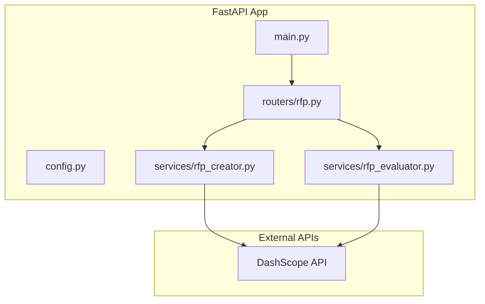
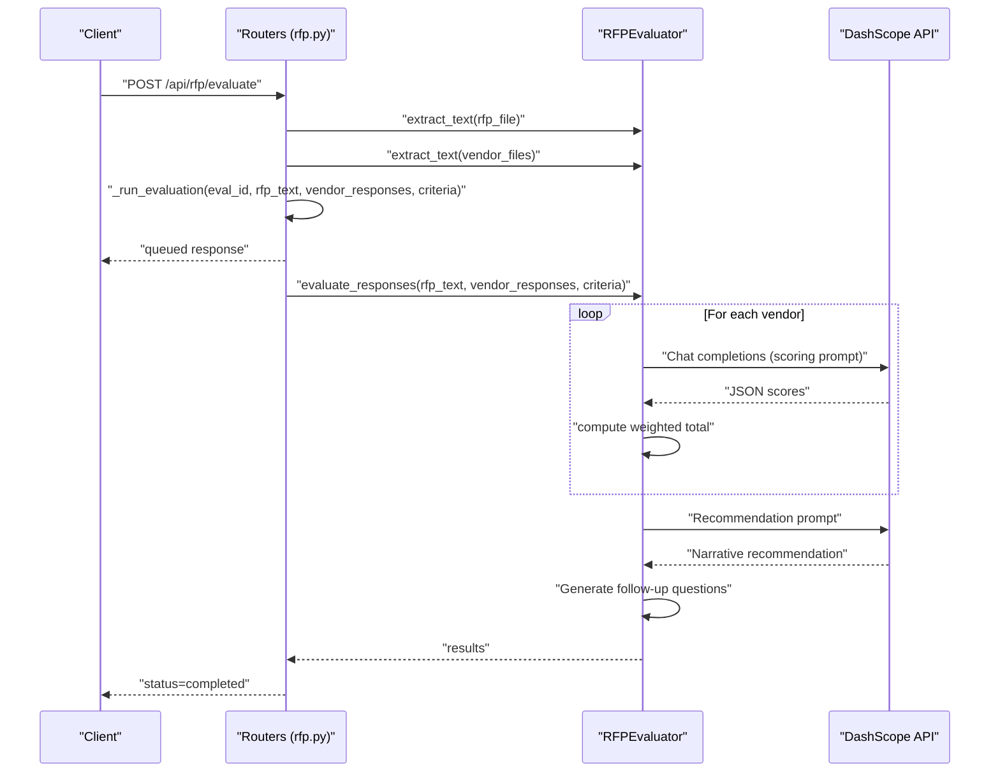
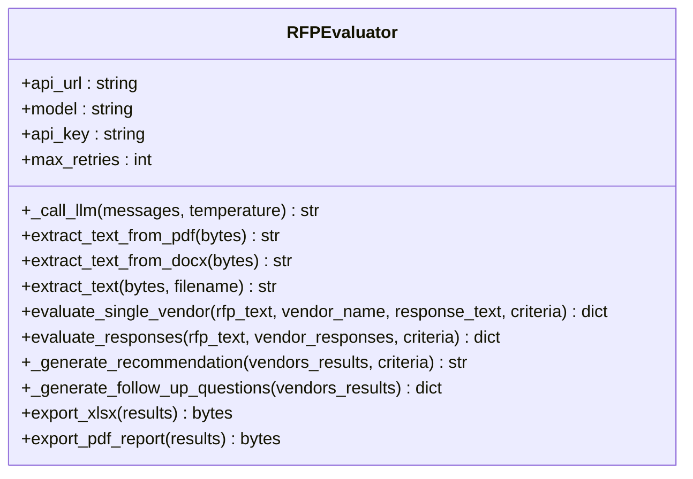
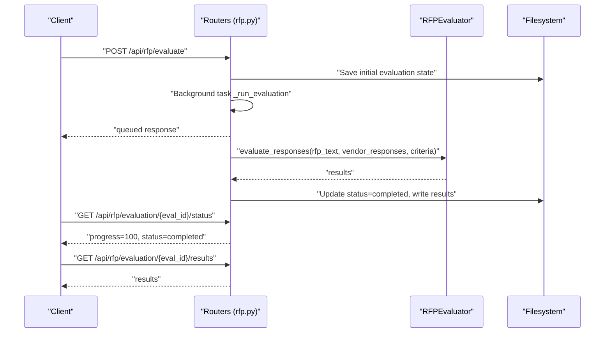
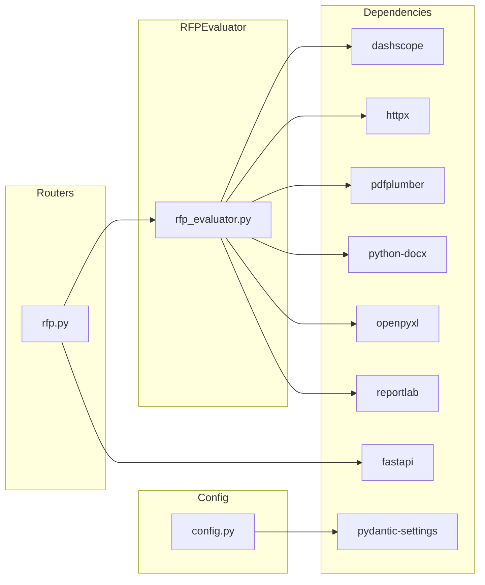

# Backend Evaluation Service

<cite>
**Referenced Files in This Document**
- [main.py](file://backend/main.py)
- [config.py](file://backend/config.py)
- [rfp.py](file://backend/routers/rfp.py)
- [rfp_evaluator.py](file://backend/services/rfp_evaluator.py)
- [rfp_creator.py](file://backend/services/rfp_creator.py)
- [requirements.txt](file://backend/requirements.txt)
- [README.md](file://README.md)
</cite>

## Table of Contents
1. [Introduction](#introduction)
2. [Project Structure](#project-structure)
3. [Core Components](#core-components)
4. [Architecture Overview](#architecture-overview)
5. [Detailed Component Analysis](#detailed-component-analysis)
6. [Dependency Analysis](#dependency-analysis)
7. [Performance Considerations](#performance-considerations)
8. [Troubleshooting Guide](#troubleshooting-guide)
9. [Conclusion](#conclusion)
10. [Appendices](#appendices)

## Introduction
This document describes the backend RFPEvaluator service that powers AI-driven vendor evaluation for Requests for Proposals (RFPs). It integrates Alibaba Cloud’s DashScope API via the Qwen model family to analyze vendor responses against evaluation criteria, compute weighted scores, and produce narrative recommendations and exportable reports. The service supports asynchronous LLM calls with retry logic, robust text extraction from PDF and DOCX files, and exports in XLSX and PDF formats.

## Project Structure
The backend is a FastAPI application with two primary services:
- RFP Creator: Generates RFP documents using Qwen via DashScope.
- RFP Evaluator: Evaluates vendor proposals against criteria, computes weighted totals, and produces recommendations and exports.

Key runtime components:
- Application entrypoint and routing
- Configuration management
- Routers for RFP endpoints
- Services for RFP creation and evaluation
- Dependencies pinned in requirements

**Diagram sources**
- [main.py:1-44](file://backend/main.py#L1-L44)
- [config.py:1-21](file://backend/config.py#L1-L21)
- [rfp.py:1-385](file://backend/routers/rfp.py#L1-L385)
- [rfp_creator.py:1-639](file://backend/services/rfp_creator.py#L1-L639)
- [rfp_evaluator.py:1-622](file://backend/services/rfp_evaluator.py#L1-L622)

**Section sources**
- [main.py:1-44](file://backend/main.py#L1-L44)
- [config.py:1-21](file://backend/config.py#L1-L21)
- [rfp.py:1-385](file://backend/routers/rfp.py#L1-L385)
- [rfp_creator.py:1-639](file://backend/services/rfp_creator.py#L1-L639)
- [rfp_evaluator.py:1-622](file://backend/services/rfp_evaluator.py#L1-L622)
- [requirements.txt:1-16](file://backend/requirements.txt#L1-L16)
- [README.md:193-233](file://README.md#L193-L233)

## Core Components
- RFPEvaluator: Orchestrates vendor evaluation, asynchronous LLM calls, text extraction, scoring, and export.
- Routers (rfp.py): Exposes endpoints for creating RFPs, evaluating vendor responses, retrieving status/results, and exporting reports.
- Config (config.py): Centralized settings for DashScope credentials, model identifiers, and base URLs.
- RFP Creator (rfp_creator.py): Generates RFP documents using Qwen via DashScope and exports to DOCX/PDF.

Key capabilities:
- Asynchronous LLM invocation with exponential backoff and retry on rate limit and transient failures.
- Text extraction from PDF and DOCX using dedicated parsers.
- Weighted scoring computation and normalization to a 0–100 scale.
- Narrative recommendation generation and follow-up question suggestions.
- Export to XLSX comparison matrix and PDF evaluation report.

**Section sources**
- [rfp_evaluator.py:39-622](file://backend/services/rfp_evaluator.py#L39-L622)
- [rfp.py:1-385](file://backend/routers/rfp.py#L1-L385)
- [config.py:4-21](file://backend/config.py#L4-L21)
- [rfp_creator.py:67-639](file://backend/services/rfp_creator.py#L67-L639)

## Architecture Overview
The evaluation workflow is asynchronous and file-centric:
- Clients upload an RFP document and vendor proposals.
- The server extracts text from all documents.
- Each vendor response is scored asynchronously against criteria.
- Weighted totals are computed and normalized.
- Recommendations and follow-up questions are generated.
- Results are exported to XLSX and PDF.

**Diagram sources**
- [rfp.py:243-311](file://backend/routers/rfp.py#L243-L311)
- [rfp_evaluator.py:230-295](file://backend/services/rfp_evaluator.py#L230-L295)
- [rfp_evaluator.py:48-104](file://backend/services/rfp_evaluator.py#L48-L104)

## Detailed Component Analysis

### RFPEvaluator Service
Responsibilities:
- Asynchronous LLM calls with retry/backoff.
- Text extraction from PDF/DOCX/plain text.
- Vendor evaluation prompt composition and JSON parsing.
- Weighted scoring and normalization.
- Recommendation and follow-up question generation.
- XLSX and PDF export.

Asynchronous LLM invocation:
- Uses httpx.AsyncClient with a 120s timeout.
- Retries on non-200 responses with exponential backoff.
- On 429 rate limit, waits with exponential backoff before retry.
- Raises a final error if all retries fail.

Text extraction:
- PDF: Uses pdfplumber to iterate pages and concatenate text.
- DOCX: Uses python-docx to extract non-empty paragraphs.
- Fallback: Decodes bytes as UTF-8 with replacement for unknown encodings.

Scoring and weighting:
- Truncates RFP and vendor response excerpts to fit model context.
- Prompts the model to output strict JSON with fields: scores, strengths, gaps, risks, mandatory_compliance.
- Parses JSON safely, handling markdown code blocks and partial JSON.
- Computes weighted total by matching criterion names to weights and normalizes to 0–100 scale.

Recommendation and follow-up:
- Builds a narrative recommendation summarizing vendor scores and risks.
- Generates follow-up questions from gaps and risks, with defaults if none present.

Exports:
- XLSX: Comparison matrix sheet with color-coded scores, detailed scores sheet, and recommendation/follow-up sheet.
- PDF: Cover page, executive summary, comparison table, per-vendor scorecards, and footer.

**Diagram sources**
- [rfp_evaluator.py:39-622](file://backend/services/rfp_evaluator.py#L39-L622)

**Section sources**
- [rfp_evaluator.py:39-622](file://backend/services/rfp_evaluator.py#L39-L622)

### Routers (rfp.py)
Endpoints:
- POST /api/rfp/create: Generates an RFP using the RFP Creator service and persists it.
- POST /api/rfp/regenerate-section: Updates a specific section of an existing RFP.
- GET /api/rfp/{id}/export/docx and /api/rfp/{id}/export/pdf: Downloads RFP as DOCX/PDF.
- POST /api/rfp/evaluate: Starts asynchronous vendor evaluation.
- GET /api/rfp/evaluation/{eval_id}/status: Tracks evaluation progress.
- GET /api/rfp/evaluation/{eval_id}/results: Retrieves completed results.
- GET /api/rfp/evaluation/{eval_id}/export/xlsx and /api/rfp/evaluation/{eval_id}/export/pdf: Downloads evaluation exports.

Background processing:
- Stores initial evaluation state and updates progress/status upon completion or failure.
- Validates vendor names count matches uploaded files and enforces a minimum of two vendor responses.

**Diagram sources**
- [rfp.py:243-311](file://backend/routers/rfp.py#L243-L311)
- [rfp.py:219-238](file://backend/routers/rfp.py#L219-L238)

**Section sources**
- [rfp.py:1-385](file://backend/routers/rfp.py#L1-L385)

### Configuration (config.py)
Settings:
- DASHSCOPE_API_KEY: Required for DashScope authentication.
- DASHSCOPE_BASE_URL: Base URL for DashScope compatible-mode chat completions.
- MODEL_TEXT: Qwen model used for text tasks (RFP generation and evaluation).
- UPLOAD_DIR: Directory for storing RFPs and evaluations as JSON.
- BASE_URL: Used for constructing downloadable URLs.

Environment loading:
- Reads from .env at the project root with UTF-8 encoding.

**Section sources**
- [config.py:4-21](file://backend/config.py#L4-L21)

### RFP Creator (rfp_creator.py)
Purpose:
- Generates comprehensive RFP documents with 10 sections.
- Supports bilingual generation (English/Arabic) and tone customization.
- Exports to DOCX and PDF with professional formatting.

LLM integration:
- Similar retry/backoff pattern to evaluator for robust API calls.
- Uses a system prompt tailored to RFP writing for Dubai Media.

Export formatting:
- DOCX: Title page, table of contents, sections, bilingual AR content, and footer.
- PDF: Title page, table of contents, sections, and specialized tables for criteria and timeline.

**Section sources**
- [rfp_creator.py:67-639](file://backend/services/rfp_creator.py#L67-L639)

## Dependency Analysis
External libraries and their roles:
- dashscope: Calls Qwen models for text generation and chat completions.
- httpx: Async HTTP client for DashScope API requests.
- pdfplumber: Extracts text from PDFs.
- python-docx: Extracts text from DOCX files.
- openpyxl: Writes XLSX comparison matrix and detailed sheets.
- reportlab: Generates PDF reports with custom styles and tables.
- fastapi: Web framework hosting the API.
- pydantic-settings: Loads environment variables into typed settings.

**Diagram sources**
- [requirements.txt:1-16](file://backend/requirements.txt#L1-L16)
- [rfp_evaluator.py:1-31](file://backend/services/rfp_evaluator.py#L1-L31)
- [rfp.py:1-17](file://backend/routers/rfp.py#L1-L17)
- [config.py:1-21](file://backend/config.py#L1-L21)

**Section sources**
- [requirements.txt:1-16](file://backend/requirements.txt#L1-L16)
- [rfp_evaluator.py:1-31](file://backend/services/rfp_evaluator.py#L1-L31)
- [rfp.py:1-17](file://backend/routers/rfp.py#L1-L17)
- [config.py:1-21](file://backend/config.py#L1-L21)

## Performance Considerations
- Asynchronous LLM calls: Using httpx.AsyncClient reduces blocking and improves throughput during evaluation.
- Retry/backoff: Exponential backoff mitigates rate limits and transient network issues.
- Prompt truncation: Limits RFP and response lengths to fit model context windows.
- Export generation: XLSX and PDF builds are memory-intensive; consider streaming for very large datasets.
- File I/O: JSON persistence for evaluation state is simple but not scalable; consider a database for production.

[No sources needed since this section provides general guidance]

## Troubleshooting Guide
Common issues and resolutions:
- Missing API key:
  - Symptom: ValueError indicating DASHSCOPE_API_KEY is not configured.
  - Resolution: Set DASHSCOPE_API_KEY in .env and restart the service.
- Rate limiting:
  - Symptom: 429 responses with exponential backoff logs.
  - Resolution: Reduce concurrent evaluations or adjust model usage patterns.
- Timeout errors:
  - Symptom: httpx.TimeoutException logs.
  - Resolution: Increase timeouts or reduce payload sizes; ensure network stability.
- JSON parsing failures:
  - Symptom: Logs indicating failed JSON parse; fallback evaluation used.
  - Resolution: Verify model output format; ensure system/user prompts remain unchanged.
- Export failures:
  - Symptom: 500 errors on XLSX/PDF export endpoints.
  - Resolution: Confirm evaluation is completed and results are present; check filesystem permissions.

Operational checks:
- Health endpoint: GET /api/health returns service status.
- Status endpoint: GET /api/rfp/evaluation/{eval_id}/status indicates progress and error details.
- Results endpoint: GET /api/rfp/evaluation/{eval_id}/results returns evaluation results when ready.

**Section sources**
- [rfp_evaluator.py:48-104](file://backend/services/rfp_evaluator.py#L48-L104)
- [rfp.py:314-346](file://backend/routers/rfp.py#L314-L346)

## Conclusion
The RFPEvaluator service provides a robust, asynchronous evaluation pipeline powered by Qwen via DashScope. It supports multi-file vendor evaluation, weighted scoring, narrative recommendations, and exportable reports. The design emphasizes reliability through retry/backoff, resilient text extraction, and structured output parsing. For production, consider adding authentication, persistent storage, and rate-limiting controls.

[No sources needed since this section summarizes without analyzing specific files]

## Appendices

### Evaluation Workflow Details
- Input: RFP document and vendor proposal files (PDF/DOCX), vendor names, and evaluation criteria.
- Processing:
  - Extract text from all files.
  - For each vendor: prompt model to score each criterion, compute weighted total, collect strengths/gaps/risks, and mandatory compliance checks.
  - Generate recommendation and follow-up questions.
- Output: Evaluation results, XLSX comparison matrix, and PDF report.

**Section sources**
- [rfp_evaluator.py:133-295](file://backend/services/rfp_evaluator.py#L133-L295)
- [rfp.py:243-311](file://backend/routers/rfp.py#L243-L311)

### Export Specifications

#### XLSX Export
- Sheets:
  - Comparison Matrix: Criterion, Weight (%), Vendor columns with color-coded scores (green/yellow/red), and a total row.
  - Detailed Scores: Vendor name, Criterion, Score, Justification.
  - Recommendation: AI recommendation text and vendor-specific follow-up questions.
- Formatting:
  - Headers styled with orange fill and white bold text.
  - Score cells aligned center; totals bold.
  - Column widths optimized for readability.

**Section sources**
- [rfp_evaluator.py:351-472](file://backend/services/rfp_evaluator.py#L351-L472)

#### PDF Export
- Content:
  - Cover page with title and vendor list.
  - Executive summary with recommendation.
  - Score comparison table with headers and totals.
  - Per-vendor scorecards with strengths, gaps, and risks.
  - Footer note stating AI-generated nature of results.
- Styling:
  - Custom fonts and colors; consistent paragraph styles; tables with grid and alternating row backgrounds.

**Section sources**
- [rfp_evaluator.py:474-621](file://backend/services/rfp_evaluator.py#L474-L621)

### Example Prompt Structures
- Scoring prompt template:
  - Includes truncated RFP excerpt, vendor response, and criteria JSON.
  - Requires strict JSON output with scores, strengths, gaps, risks, and mandatory_compliance entries.
- Recommendation prompt template:
  - Summarizes vendor weighted totals and criteria evaluated.
  - Requests a professional narrative with recommendation rationale, risks, and next steps.

**Section sources**
- [rfp_evaluator.py:147-178](file://backend/services/rfp_evaluator.py#L147-L178)
- [rfp_evaluator.py:305-318](file://backend/services/rfp_evaluator.py#L305-L318)

### API Endpoints Reference
- POST /api/rfp/evaluate: Start evaluation with RFP and vendor files.
- GET /api/rfp/evaluation/{eval_id}/status: Track progress and errors.
- GET /api/rfp/evaluation/{eval_id}/results: Retrieve results when completed.
- GET /api/rfp/evaluation/{eval_id}/export/xlsx: Download XLSX.
- GET /api/rfp/evaluation/{eval_id}/export/pdf: Download PDF.

**Section sources**
- [rfp.py:243-384](file://backend/routers/rfp.py#L243-L384)