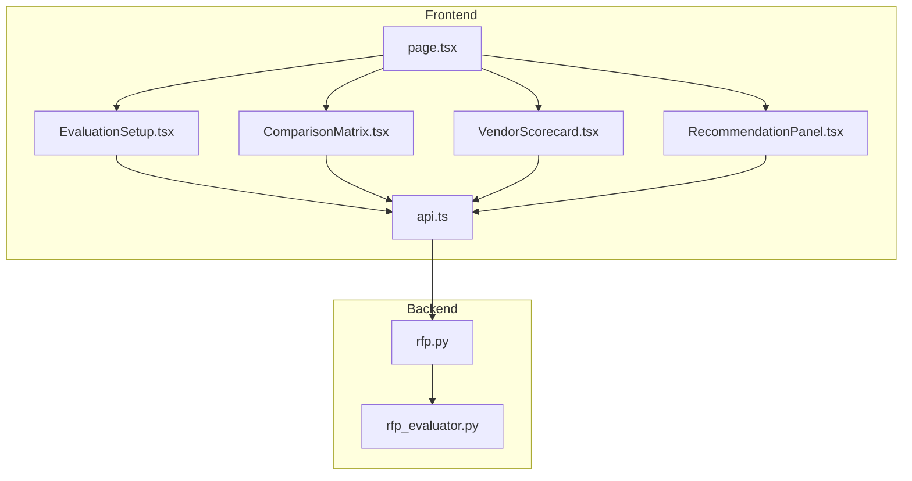
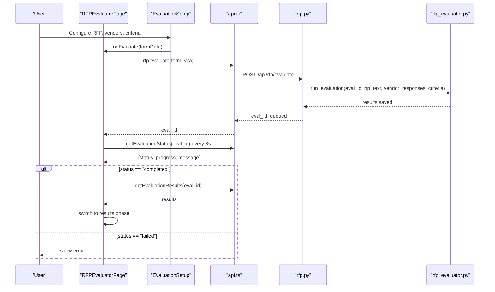
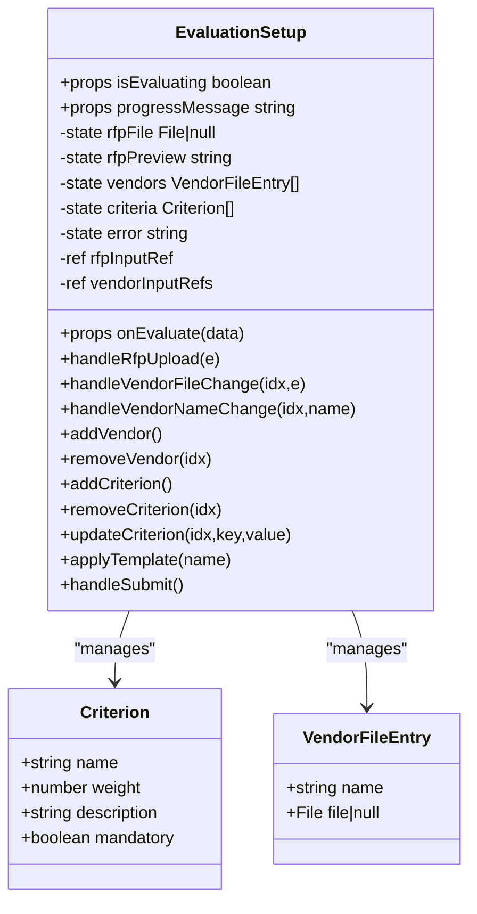
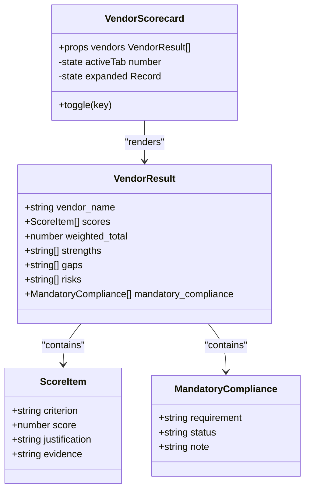
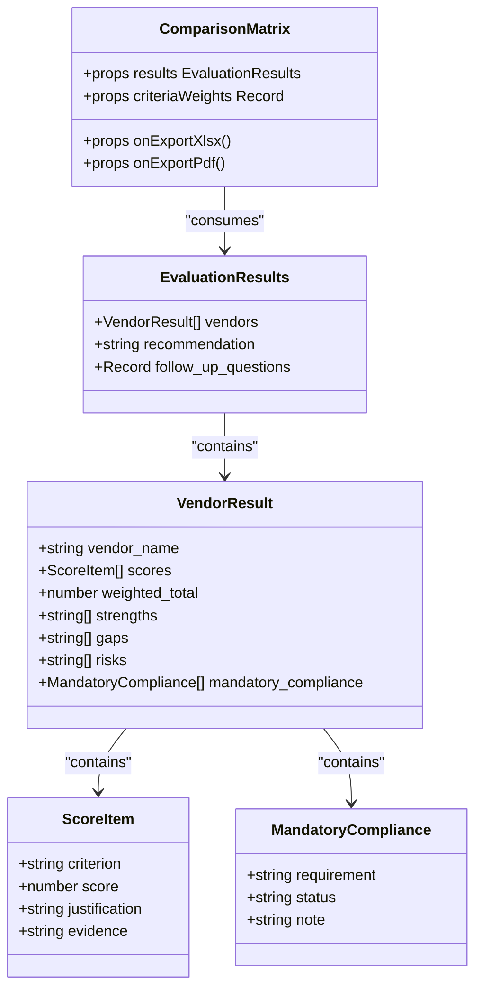
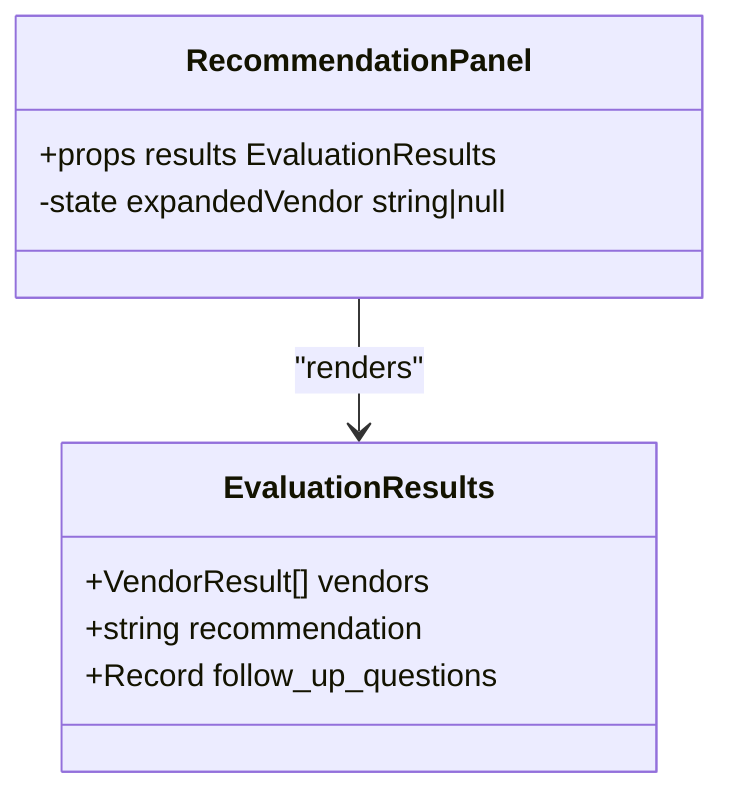
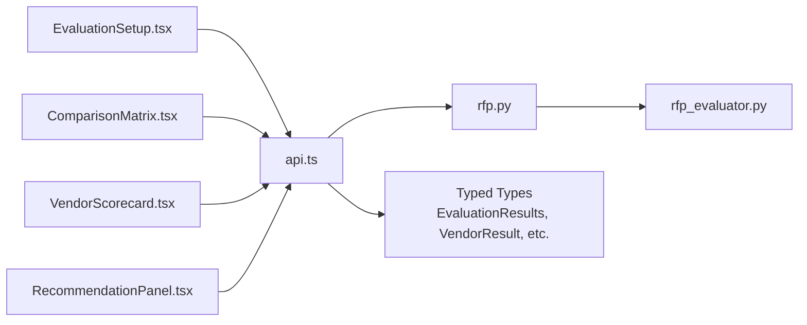
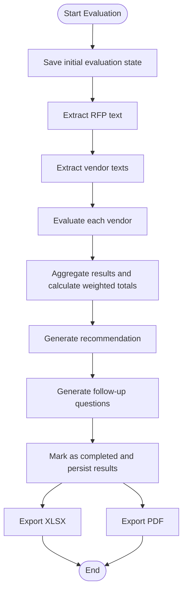

# Frontend Evaluation Components

<cite>
**Referenced Files in This Document**
- [EvaluationSetup.tsx](file://frontend/src/components/evaluator/EvaluationSetup.tsx)
- [VendorScorecard.tsx](file://frontend/src/components/evaluator/VendorScorecard.tsx)
- [ComparisonMatrix.tsx](file://frontend/src/components/evaluator/ComparisonMatrix.tsx)
- [RecommendationPanel.tsx](file://frontend/src/components/evaluator/RecommendationPanel.tsx)
- [api.ts](file://frontend/src/lib/api.ts)
- [page.tsx](file://frontend/src/app/rfp-evaluator/page.tsx)
- [rfp_evaluator.py](file://backend/services/rfp_evaluator.py)
- [rfp.py](file://backend/routers/rfp.py)
</cite>

## Table of Contents
1. [Introduction](#introduction)
2. [Project Structure](#project-structure)
3. [Core Components](#core-components)
4. [Architecture Overview](#architecture-overview)
5. [Detailed Component Analysis](#detailed-component-analysis)
6. [Dependency Analysis](#dependency-analysis)
7. [Performance Considerations](#performance-considerations)
8. [Troubleshooting Guide](#troubleshooting-guide)
9. [Conclusion](#conclusion)
10. [Appendices](#appendices)

## Introduction
This document provides comprehensive documentation for the frontend evaluation components used in the RFP Evaluator application. It covers the EvaluationSetup component for configuring evaluation criteria and vendor responses, the VendorScorecard component for displaying individual vendor evaluation results with score visualization and detailed analysis, the ComparisonMatrix component for side-by-side vendor comparisons with color-coded scoring and weighted totals, and the RecommendationPanel component for presenting AI-generated recommendations and follow-up questions. The guide explains component props, state management, data binding patterns, user interaction flows, integration with backend evaluation services, real-time updates, and export functionality. It also includes usage examples, customization options, and troubleshooting guidance for component rendering issues.

## Project Structure
The evaluation components reside in the frontend under the evaluator directory and are orchestrated by the RFP Evaluator page. They integrate with the backend evaluation service via typed API helpers.

**Diagram sources**
- [page.tsx:133-174](file://frontend/src/app/rfp-evaluator/page.tsx#L133-L174)
- [EvaluationSetup.tsx:61-429](file://frontend/src/components/evaluator/EvaluationSetup.tsx#L61-L429)
- [ComparisonMatrix.tsx:42-318](file://frontend/src/components/evaluator/ComparisonMatrix.tsx#L42-L318)
- [VendorScorecard.tsx:70-241](file://frontend/src/components/evaluator/VendorScorecard.tsx#L70-L241)
- [RecommendationPanel.tsx:17-145](file://frontend/src/components/evaluator/RecommendationPanel.tsx#L17-L145)
- [api.ts:164-244](file://frontend/src/lib/api.ts#L164-L244)
- [rfp.py:243-384](file://backend/routers/rfp.py#L243-L384)
- [rfp_evaluator.py:39-622](file://backend/services/rfp_evaluator.py#L39-L622)

**Section sources**
- [page.tsx:18-177](file://frontend/src/app/rfp-evaluator/page.tsx#L18-L177)
- [api.ts:1-245](file://frontend/src/lib/api.ts#L1-L245)
- [rfp.py:1-385](file://backend/routers/rfp.py#L1-L385)
- [rfp_evaluator.py:1-622](file://backend/services/rfp_evaluator.py#L1-L622)

## Core Components
This section summarizes the primary evaluation components and their responsibilities.

- EvaluationSetup: Configures evaluation criteria, uploads RFP and vendor documents, validates inputs, and triggers backend evaluation.
- ComparisonMatrix: Displays side-by-side vendor comparisons with color-coded scores, weighted totals, radar charts, and mandatory compliance checks; provides export buttons.
- VendorScorecard: Renders individual vendor scorecards with radial progress, strengths/gaps/risks summaries, criterion details with expandable justifications/evidence, and tabbed navigation.
- RecommendationPanel: Presents AI-generated recommendation narrative, risk comparison summary, and suggested follow-up questions per vendor.

**Section sources**
- [EvaluationSetup.tsx:14-429](file://frontend/src/components/evaluator/EvaluationSetup.tsx#L14-L429)
- [ComparisonMatrix.tsx:21-318](file://frontend/src/components/evaluator/ComparisonMatrix.tsx#L21-L318)
- [VendorScorecard.tsx:14-241](file://frontend/src/components/evaluator/VendorScorecard.tsx#L14-L241)
- [RecommendationPanel.tsx:13-145](file://frontend/src/components/evaluator/RecommendationPanel.tsx#L13-L145)

## Architecture Overview
The evaluation workflow integrates frontend components with backend services through typed API calls and polling for asynchronous results.

**Diagram sources**
- [page.tsx:33-98](file://frontend/src/app/rfp-evaluator/page.tsx#L33-L98)
- [api.ts:209-239](file://frontend/src/lib/api.ts#L209-L239)
- [rfp.py:243-346](file://backend/routers/rfp.py#L243-L346)
- [rfp_evaluator.py:219-295](file://backend/services/rfp_evaluator.py#L219-L295)

## Detailed Component Analysis

### EvaluationSetup Component
Responsibilities:
- Upload and preview the original RFP document.
- Manage multiple vendor entries with name and file selection.
- Define and edit evaluation criteria with weights, descriptions, and mandatory flags.
- Apply preset templates for quick setup.
- Validate form inputs and trigger evaluation submission.
- Display progress during evaluation and handle errors.

Props:
- onEvaluate: Function receiving { rfpFile, vendors[], criteria[] } and returning Promise<void>.
- isEvaluating: Boolean flag indicating evaluation state.
- progressMessage: String message shown during evaluation.

State Management:
- Local state for RFP file, preview text, vendor entries, criteria list, and error message.
- Refs for input elements to programmatically trigger file dialogs.

Data Binding Patterns:
- Controlled inputs for vendor names and criterion fields.
- Range sliders for criterion weights with immediate updates.
- Conditional rendering based on total weight validation.

User Interaction Flows:
- Clicking upload areas opens hidden file inputs.
- Adding/removing vendors dynamically adjusts the vendor list.
- Applying templates replaces criteria with predefined sets.
- Submit button validates inputs and invokes onEvaluate.

Integration Details:
- Submits FormData containing rfp_file, vendor_files, vendor_names, and criteria.
- Uses api.rfp.evaluate to start evaluation and polls status until completion.

**Section sources**
- [EvaluationSetup.tsx:26-429](file://frontend/src/components/evaluator/EvaluationSetup.tsx#L26-L429)
- [page.tsx:33-98](file://frontend/src/app/rfp-evaluator/page.tsx#L33-L98)
- [api.ts:209-239](file://frontend/src/lib/api.ts#L209-L239)

#### EvaluationSetup Class Diagram

**Diagram sources**
- [EvaluationSetup.tsx:14-429](file://frontend/src/components/evaluator/EvaluationSetup.tsx#L14-L429)

### VendorScorecard Component
Responsibilities:
- Render vendor tabs with weighted totals.
- Display radial progress representing overall score.
- Show strengths, gaps, and risks summaries.
- Present detailed criterion scores with collapsible justifications and evidence.
- Provide color-coded score badges and expand/collapse behavior.

Props:
- vendors: Array of VendorResult objects.

State Management:
- Active tab index for vendor switching.
- Expanded state for criterion details.

Data Binding Patterns:
- Tabbed interface binds to vendor list.
- Radial progress ring computes stroke dashoffset based on score.
- Color classes selected by score thresholds.

User Interaction Flows:
- Switch tabs to view different vendor scorecards.
- Toggle criterion details to reveal justification and evidence.

Integration Details:
- Consumes VendorResult data structure from backend evaluation results.

**Section sources**
- [VendorScorecard.tsx:14-241](file://frontend/src/components/evaluator/VendorScorecard.tsx#L14-L241)
- [api.ts:124-132](file://frontend/src/lib/api.ts#L124-L132)

#### VendorScorecard Class Diagram

**Diagram sources**
- [VendorScorecard.tsx:70-241](file://frontend/src/components/evaluator/VendorScorecard.tsx#L70-L241)
- [api.ts:111-132](file://frontend/src/lib/api.ts#L111-L132)

### ComparisonMatrix Component
Responsibilities:
- Display top-line weighted totals per vendor.
- Render a score comparison matrix with color-coded criterion scores.
- Show mandatory compliance rows with pass/fail indicators.
- Visualize vendor profiles using a radar chart.
- Provide export buttons for XLSX and PDF reports.

Props:
- results: EvaluationResults object.
- criteriaWeights: Record mapping criterion names to weights.
- onExportXlsx: Function to trigger XLSX download.
- onExportPdf: Function to trigger PDF download.

State Management:
- None; pure functional component.

Data Binding Patterns:
- Grid layout for totals cards.
- Table rows for criteria and vendors with dynamic weights.
- Radar chart data built from vendor scores.

User Interaction Flows:
- Click export buttons to download reports.
- View compliance statuses with tooltips.

Integration Details:
- Uses EvaluationResults and criteriaWeights to render matrices and charts.
- Calls onExportXlsx/onExportPdf callbacks bound to API helpers.

**Section sources**
- [ComparisonMatrix.tsx:21-318](file://frontend/src/components/evaluator/ComparisonMatrix.tsx#L21-L318)
- [api.ts:134-138](file://frontend/src/lib/api.ts#L134-L138)

#### ComparisonMatrix Class Diagram

**Diagram sources**
- [ComparisonMatrix.tsx:42-318](file://frontend/src/components/evaluator/ComparisonMatrix.tsx#L42-L318)
- [api.ts:134-138](file://frontend/src/lib/api.ts#L134-L138)

### RecommendationPanel Component
Responsibilities:
- Display AI-generated recommendation narrative with gradient card styling.
- Show risk comparison summary per vendor.
- Present suggested follow-up questions with expandable lists.

Props:
- results: EvaluationResults object.

State Management:
- Expanded vendor state for follow-up questions.

Data Binding Patterns:
- Paragraph splitting for recommendation rendering.
- Grid layout for risk summaries.
- Accordion-style toggles for questions.

User Interaction Flows:
- Expand/collapse vendor follow-up questions.

Integration Details:
- Consumes EvaluationResults for recommendation and follow-up questions.

**Section sources**
- [RecommendationPanel.tsx:13-145](file://frontend/src/components/evaluator/RecommendationPanel.tsx#L13-L145)
- [api.ts:134-138](file://frontend/src/lib/api.ts#L134-L138)

#### RecommendationPanel Class Diagram

**Diagram sources**
- [RecommendationPanel.tsx:17-145](file://frontend/src/components/evaluator/RecommendationPanel.tsx#L17-L145)
- [api.ts:134-138](file://frontend/src/lib/api.ts#L134-L138)

## Dependency Analysis
The frontend components depend on shared types and API helpers, while the backend provides evaluation orchestration and exports.

**Diagram sources**
- [EvaluationSetup.tsx:1-12](file://frontend/src/components/evaluator/EvaluationSetup.tsx#L1-L12)
- [ComparisonMatrix.tsx:1-18](file://frontend/src/components/evaluator/ComparisonMatrix.tsx#L1-L18)
- [VendorScorecard.tsx:1-11](file://frontend/src/components/evaluator/VendorScorecard.tsx#L1-L11)
- [RecommendationPanel.tsx:1-11](file://frontend/src/components/evaluator/RecommendationPanel.tsx#L1-L11)
- [api.ts:111-138](file://frontend/src/lib/api.ts#L111-L138)
- [rfp.py:243-384](file://backend/routers/rfp.py#L243-L384)
- [rfp_evaluator.py:39-622](file://backend/services/rfp_evaluator.py#L39-L622)

**Section sources**
- [api.ts:111-138](file://frontend/src/lib/api.ts#L111-L138)
- [rfp.py:243-384](file://backend/routers/rfp.py#L243-L384)
- [rfp_evaluator.py:39-622](file://backend/services/rfp_evaluator.py#L39-L622)

## Performance Considerations
- Evaluation polling interval: The frontend polls every 3 seconds; adjust interval based on backend latency and user expectations.
- Large vendor lists: Consider virtualization for long criterion lists in scorecards.
- Export generation: Backend generates XLSX/PDF; ensure adequate server resources for concurrent exports.
- Image-heavy PDFs: If vendor responses include images, optimize file sizes to reduce processing time.
- Network resilience: Implement retry logic for API calls and handle transient failures gracefully.

[No sources needed since this section provides general guidance]

## Troubleshooting Guide
Common issues and resolutions:

- Evaluation does not start:
  - Verify that RFP and at least two vendor files are uploaded.
  - Ensure criteria weights sum to 100%.
  - Confirm that each vendor has a name and file attached.
  - Check network connectivity and API base URL configuration.

- Polling errors:
  - Inspect error messages displayed on the setup screen.
  - Verify backend service availability and logs.
  - Ensure CORS and proxy configurations are correct.

- Results not displayed:
  - Confirm evaluation status is "completed".
  - Check that evaluation results are present in the backend storage.
  - Validate that the evaluation ID is correct.

- Export failures:
  - Ensure evaluation has completed before exporting.
  - Verify backend export endpoints are reachable.
  - Check browser download permissions and pop-up blockers.

- Rendering anomalies:
  - Clear browser cache and reload the page.
  - Verify that required dependencies (React, Heroicons, Recharts) are installed.
  - Check for console errors indicating missing assets or modules.

**Section sources**
- [page.tsx:127-131](file://frontend/src/app/rfp-evaluator/page.tsx#L127-L131)
- [rfp.py:314-346](file://backend/routers/rfp.py#L314-L346)

## Conclusion
The evaluation components provide a cohesive, user-friendly interface for configuring vendor evaluations, visualizing comparative results, and consuming AI-generated insights. The frontend components are tightly integrated with backend services through typed APIs and polling mechanisms, enabling robust real-time updates and export capabilities. Proper configuration of evaluation criteria, vendor inputs, and backend connectivity ensures reliable operation and accurate results.

[No sources needed since this section summarizes without analyzing specific files]

## Appendices

### Backend Evaluation Workflow
The backend orchestrates evaluation, scoring, and reporting generation.

**Diagram sources**
- [rfp.py:219-346](file://backend/routers/rfp.py#L219-L346)
- [rfp_evaluator.py:230-295](file://backend/services/rfp_evaluator.py#L230-L295)

### Usage Examples and Customization Options
- Customizing evaluation criteria:
  - Use preset templates as a starting point and modify weights and descriptions.
  - Add or remove criteria as needed; ensure total weight equals 100%.

- Vendor management:
  - Add multiple vendors to compare side-by-side.
  - Replace vendor files at any time before starting evaluation.

- Export options:
  - Download XLSX for detailed spreadsheets.
  - Download PDF for executive summaries and formatted reports.

- Styling and branding:
  - Adjust color schemes and icons to align with organizational themes.
  - Extend the UI with additional metrics or visualizations as required.

[No sources needed since this section provides general guidance]