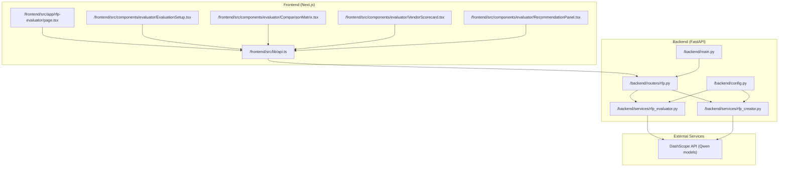
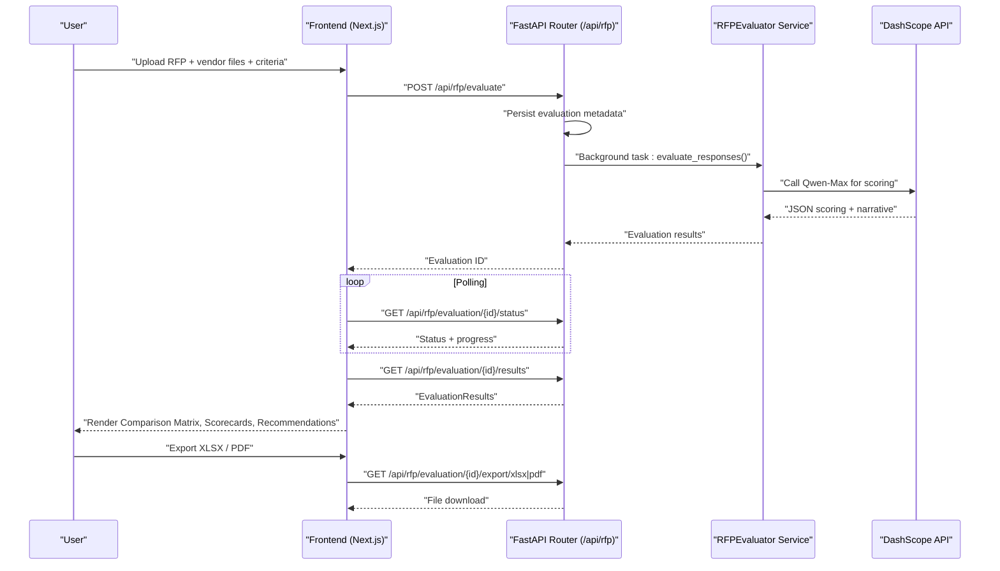
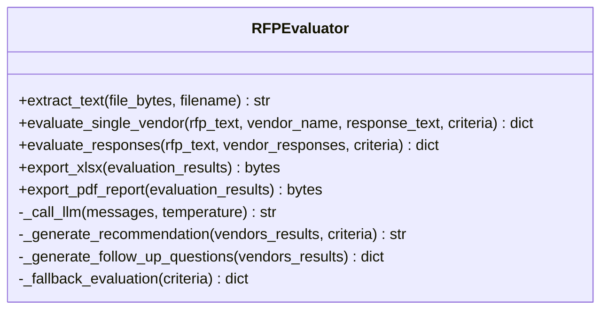
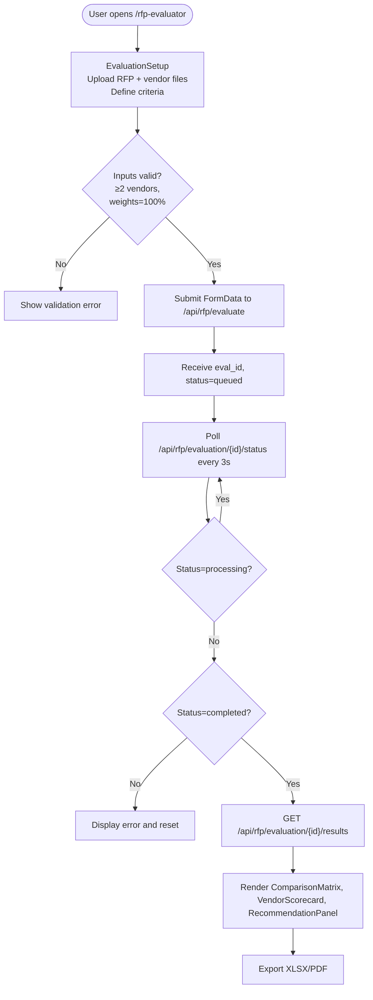
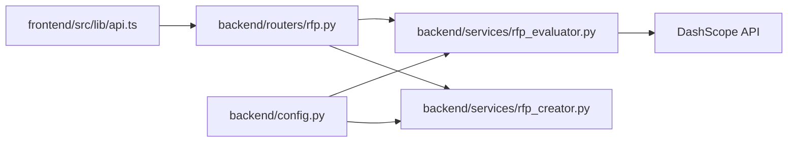

# Vendor Evaluation System

<cite>
**Referenced Files in This Document**
- [backend/main.py](file://backend/main.py)
- [backend/config.py](file://backend/config.py)
- [backend/routers/rfp.py](file://backend/routers/rfp.py)
- [backend/services/rfp_evaluator.py](file://backend/services/rfp_evaluator.py)
- [backend/services/rfp_creator.py](file://backend/services/rfp_creator.py)
- [frontend/src/app/rfp-evaluator/page.tsx](file://frontend/src/app/rfp-evaluator/page.tsx)
- [frontend/src/components/evaluator/EvaluationSetup.tsx](file://frontend/src/components/evaluator/EvaluationSetup.tsx)
- [frontend/src/components/evaluator/ComparisonMatrix.tsx](file://frontend/src/components/evaluator/ComparisonMatrix.tsx)
- [frontend/src/components/evaluator/VendorScorecard.tsx](file://frontend/src/components/evaluator/VendorScorecard.tsx)
- [frontend/src/components/evaluator/RecommendationPanel.tsx](file://frontend/src/components/evaluator/RecommendationPanel.tsx)
- [frontend/src/lib/api.ts](file://frontend/src/lib/api.ts)
- [README.md](file://README.md)
</cite>

## Table of Contents
1. [Introduction](#introduction)
2. [Project Structure](#project-structure)
3. [Core Components](#core-components)
4. [Architecture Overview](#architecture-overview)
5. [Detailed Component Analysis](#detailed-component-analysis)
6. [Dependency Analysis](#dependency-analysis)
7. [Performance Considerations](#performance-considerations)
8. [Troubleshooting Guide](#troubleshooting-guide)
9. [Conclusion](#conclusion)
10. [Appendices](#appendices)

## Introduction
This document explains the AI-powered vendor evaluation system designed for Dubai Media Incorporated. It demonstrates how vendor proposals are analyzed using Qwen-Max models to score and compare responses against RFP criteria. The system provides weighted scoring algorithms, compliance checking mechanisms, narrative recommendation generation, and export capabilities for XLSX and PDF. The frontend offers intuitive components for evaluation setup, vendor scorecards, comparison matrices, and recommendation panels. The evaluation workflow spans proposal upload, asynchronous AI processing, result presentation, and export functionality.

## Project Structure
The system is organized into a FastAPI backend and a Next.js frontend. The backend exposes REST endpoints for evaluation, stores intermediate results, and integrates with Alibaba Cloud DashScope via Qwen models. The frontend provides interactive UI components for configuring evaluations, visualizing results, and exporting outcomes.

**Diagram sources**
- [backend/main.py:1-44](file://backend/main.py#L1-L44)
- [backend/routers/rfp.py:1-385](file://backend/routers/rfp.py#L1-L385)
- [backend/services/rfp_evaluator.py:1-622](file://backend/services/rfp_evaluator.py#L1-L622)
- [backend/services/rfp_creator.py:1-639](file://backend/services/rfp_creator.py#L1-L639)
- [frontend/src/app/rfp-evaluator/page.tsx:1-178](file://frontend/src/app/rfp-evaluator/page.tsx#L1-L178)
- [frontend/src/lib/api.ts:1-245](file://frontend/src/lib/api.ts#L1-L245)

**Section sources**
- [README.md:17-41](file://README.md#L17-L41)
- [backend/main.py:1-44](file://backend/main.py#L1-L44)
- [backend/routers/rfp.py:1-385](file://backend/routers/rfp.py#L1-L385)

## Core Components
- Evaluation workflow orchestration: Frontend triggers evaluation, backend queues and runs AI analysis, and returns results via polling.
- AI evaluation engine: Uses Qwen-Max to analyze vendor responses against RFP criteria, compute weighted scores, and generate narrative recommendations.
- Export subsystem: Produces XLSX comparison matrices and PDF evaluation reports.
- Frontend evaluation UI: Provides setup, progress, results, and export controls.

Key implementation references:
- Evaluation flow and endpoints: [backend/routers/rfp.py:243-384](file://backend/routers/rfp.py#L243-L384)
- AI evaluation service: [backend/services/rfp_evaluator.py:39-622](file://backend/services/rfp_evaluator.py#L39-L622)
- Frontend evaluation page: [frontend/src/app/rfp-evaluator/page.tsx:18-177](file://frontend/src/app/rfp-evaluator/page.tsx#L18-L177)
- Frontend evaluation setup: [frontend/src/components/evaluator/EvaluationSetup.tsx:61-428](file://frontend/src/components/evaluator/EvaluationSetup.tsx#L61-L428)

**Section sources**
- [backend/routers/rfp.py:243-384](file://backend/routers/rfp.py#L243-L384)
- [backend/services/rfp_evaluator.py:39-622](file://backend/services/rfp_evaluator.py#L39-L622)
- [frontend/src/app/rfp-evaluator/page.tsx:18-177](file://frontend/src/app/rfp-evaluator/page.tsx#L18-L177)
- [frontend/src/components/evaluator/EvaluationSetup.tsx:61-428](file://frontend/src/components/evaluator/EvaluationSetup.tsx#L61-L428)

## Architecture Overview
The system follows a client-server architecture with asynchronous processing:
- Frontend collects RFP and vendor documents, evaluation criteria, and initiates evaluation.
- Backend extracts text from uploaded files, persists evaluation metadata, and starts background AI evaluation.
- AI evaluation uses Qwen-Max to score each criterion, compute weighted totals, and generate recommendations.
- Frontend polls status until completion, then renders results and enables exports.

**Diagram sources**
- [backend/routers/rfp.py:243-384](file://backend/routers/rfp.py#L243-L384)
- [backend/services/rfp_evaluator.py:133-295](file://backend/services/rfp_evaluator.py#L133-L295)
- [frontend/src/app/rfp-evaluator/page.tsx:33-98](file://frontend/src/app/rfp-evaluator/page.tsx#L33-L98)
- [frontend/src/lib/api.ts:209-239](file://frontend/src/lib/api.ts#L209-L239)

## Detailed Component Analysis

### Backend Application and Routing
- Application bootstrap and CORS: [backend/main.py:20-35](file://backend/main.py#L20-L35)
- Routers registration: [backend/main.py:37-38](file://backend/main.py#L37-L38)
- RFP endpoints: Creation, regeneration, evaluation, status, results, and exports: [backend/routers/rfp.py:97-384](file://backend/routers/rfp.py#L97-L384)
- Configuration settings for DashScope and models: [backend/config.py:4-20](file://backend/config.py#L4-L20)

**Section sources**
- [backend/main.py:20-38](file://backend/main.py#L20-L38)
- [backend/routers/rfp.py:97-384](file://backend/routers/rfp.py#L97-L384)
- [backend/config.py:4-20](file://backend/config.py#L4-L20)

### AI Evaluation Engine (RFPEvaluator)
Responsibilities:
- Text extraction from PDF/DOCX: [backend/services/rfp_evaluator.py:106-132](file://backend/services/rfp_evaluator.py#L106-L132)
- Single vendor evaluation prompt and JSON parsing: [backend/services/rfp_evaluator.py:133-210](file://backend/services/rfp_evaluator.py#L133-L210)
- Weighted scoring computation: [backend/services/rfp_evaluator.py:230-295](file://backend/services/rfp_evaluator.py#L230-L295)
- Narrative recommendation generation: [backend/services/rfp_evaluator.py:297-333](file://backend/services/rfp_evaluator.py#L297-L333)
- Follow-up questions generation: [backend/services/rfp_evaluator.py:335-349](file://backend/services/rfp_evaluator.py#L335-L349)
- Export to XLSX: [backend/services/rfp_evaluator.py:351-472](file://backend/services/rfp_evaluator.py#L351-L472)
- Export to PDF: [backend/services/rfp_evaluator.py:474-621](file://backend/services/rfp_evaluator.py#L474-L621)

**Diagram sources**
- [backend/services/rfp_evaluator.py:39-622](file://backend/services/rfp_evaluator.py#L39-L622)

**Section sources**
- [backend/services/rfp_evaluator.py:39-622](file://backend/services/rfp_evaluator.py#L39-L622)

### Frontend Evaluation Workflow
- Evaluation page orchestrates upload, polling, and rendering: [frontend/src/app/rfp-evaluator/page.tsx:18-177](file://frontend/src/app/rfp-evaluator/page.tsx#L18-L177)
- Evaluation setup validates inputs, computes total weights, and submits form: [frontend/src/components/evaluator/EvaluationSetup.tsx:61-428](file://frontend/src/components/evaluator/EvaluationSetup.tsx#L61-L428)
- API client wraps typed requests and downloads: [frontend/src/lib/api.ts:209-239](file://frontend/src/lib/api.ts#L209-L239)

**Diagram sources**
- [frontend/src/app/rfp-evaluator/page.tsx:33-98](file://frontend/src/app/rfp-evaluator/page.tsx#L33-L98)
- [frontend/src/components/evaluator/EvaluationSetup.tsx:156-189](file://frontend/src/components/evaluator/EvaluationSetup.tsx#L156-L189)
- [frontend/src/lib/api.ts:221-239](file://frontend/src/lib/api.ts#L221-L239)

**Section sources**
- [frontend/src/app/rfp-evaluator/page.tsx:18-177](file://frontend/src/app/rfp-evaluator/page.tsx#L18-L177)
- [frontend/src/components/evaluator/EvaluationSetup.tsx:61-428](file://frontend/src/components/evaluator/EvaluationSetup.tsx#L61-L428)
- [frontend/src/lib/api.ts:209-239](file://frontend/src/lib/api.ts#L209-L239)

### Frontend Components

#### EvaluationSetup
- Collects RFP file, vendor entries, and criteria with preset templates.
- Enforces total weight constraint and minimum vendor count.
- Emits validated data to the parent page.

Key references:
- Validation and submission: [frontend/src/components/evaluator/EvaluationSetup.tsx:156-189](file://frontend/src/components/evaluator/EvaluationSetup.tsx#L156-L189)
- Preset templates and criterion editing: [frontend/src/components/evaluator/EvaluationSetup.tsx:36-59](file://frontend/src/components/evaluator/EvaluationSetup.tsx#L36-L59)

**Section sources**
- [frontend/src/components/evaluator/EvaluationSetup.tsx:61-428](file://frontend/src/components/evaluator/EvaluationSetup.tsx#L61-L428)

#### ComparisonMatrix
- Renders weighted totals, score comparison matrix, radar chart, and mandatory compliance table.
- Provides export buttons for XLSX and PDF.

Key references:
- Export handlers and matrix rendering: [frontend/src/components/evaluator/ComparisonMatrix.tsx:42-317](file://frontend/src/components/evaluator/ComparisonMatrix.tsx#L42-L317)

**Section sources**
- [frontend/src/components/evaluator/ComparisonMatrix.tsx:42-317](file://frontend/src/components/evaluator/ComparisonMatrix.tsx#L42-L317)

#### VendorScorecard
- Displays radial overall score, strengths/gaps/risks, and detailed criterion breakdown with expandable justifications.

Key references:
- Tabbed vendor cards and criterion details: [frontend/src/components/evaluator/VendorScorecard.tsx:70-240](file://frontend/src/components/evaluator/VendorScorecard.tsx#L70-L240)

**Section sources**
- [frontend/src/components/evaluator/VendorScorecard.tsx:70-240](file://frontend/src/components/evaluator/VendorScorecard.tsx#L70-L240)

#### RecommendationPanel
- Shows AI-generated recommendation paragraphs and risk comparison.
- Lists suggested follow-up questions per vendor.

Key references:
- Recommendation and follow-up rendering: [frontend/src/components/evaluator/RecommendationPanel.tsx:17-144](file://frontend/src/components/evaluator/RecommendationPanel.tsx#L17-L144)

**Section sources**
- [frontend/src/components/evaluator/RecommendationPanel.tsx:17-144](file://frontend/src/components/evaluator/RecommendationPanel.tsx#L17-L144)

## Dependency Analysis
- Frontend depends on typed API wrappers for evaluation endpoints.
- Backend routes depend on RFPEvaluator service and DashScope API.
- Both services rely on DashScope base URL and model settings from configuration.

**Diagram sources**
- [frontend/src/lib/api.ts:209-239](file://frontend/src/lib/api.ts#L209-L239)
- [backend/routers/rfp.py:16-17](file://backend/routers/rfp.py#L16-L17)
- [backend/services/rfp_evaluator.py:42-46](file://backend/services/rfp_evaluator.py#L42-L46)
- [backend/config.py:5-12](file://backend/config.py#L5-L12)

**Section sources**
- [frontend/src/lib/api.ts:209-239](file://frontend/src/lib/api.ts#L209-L239)
- [backend/routers/rfp.py:16-17](file://backend/routers/rfp.py#L16-L17)
- [backend/services/rfp_evaluator.py:42-46](file://backend/services/rfp_evaluator.py#L42-L46)
- [backend/config.py:5-12](file://backend/config.py#L5-L12)

## Performance Considerations
- Asynchronous evaluation: The backend queues evaluation tasks and returns immediately, allowing the frontend to poll status efficiently.
- Rate limiting and retries: The evaluator implements exponential backoff for DashScope API calls to handle rate limits gracefully.
- Prompt truncation: Long RFP and vendor texts are truncated to fit within model context windows.
- Export generation: XLSX and PDF generation occur server-side and are streamed to clients to minimize memory overhead.

[No sources needed since this section provides general guidance]

## Troubleshooting Guide
Common issues and resolutions:
- Missing API key: Ensure the DashScope API key is configured in the environment. The evaluator raises a clear error if the key is missing.
  - Reference: [backend/services/rfp_evaluator.py:48-53](file://backend/services/rfp_evaluator.py#L48-L53)
- Evaluation not completed: Verify the evaluation status endpoint indicates completion before requesting results.
  - Reference: [backend/routers/rfp.py:332-346](file://backend/routers/rfp.py#L332-L346)
- Export failures: Confirm the evaluation has completed and results are present before attempting XLSX/PDF exports.
  - Reference: [backend/routers/rfp.py:349-384](file://backend/routers/rfp.py#L349-L384)
- Validation errors in frontend: Ensure at least two vendors, non-empty criteria, and total weights equal 100%.
  - Reference: [frontend/src/components/evaluator/EvaluationSetup.tsx:156-189](file://frontend/src/components/evaluator/EvaluationSetup.tsx#L156-L189)
- Rate limit handling: The evaluator retries with exponential backoff on 429 responses; monitor logs for rate-limit warnings.
  - Reference: [backend/services/rfp_evaluator.py:74-80](file://backend/services/rfp_evaluator.py#L74-L80)

**Section sources**
- [backend/services/rfp_evaluator.py:48-53](file://backend/services/rfp_evaluator.py#L48-L53)
- [backend/routers/rfp.py:332-346](file://backend/routers/rfp.py#L332-L346)
- [backend/routers/rfp.py:349-384](file://backend/routers/rfp.py#L349-L384)
- [frontend/src/components/evaluator/EvaluationSetup.tsx:156-189](file://frontend/src/components/evaluator/EvaluationSetup.tsx#L156-L189)
- [backend/services/rfp_evaluator.py:74-80](file://backend/services/rfp_evaluator.py#L74-L80)

## Conclusion
The vendor evaluation system integrates Qwen-Max-powered AI with a robust backend and a user-friendly frontend to automate vendor proposal scoring, compliance checks, and recommendation generation. The workflow supports asynchronous processing, transparent progress tracking, and exportable artifacts for decision-making. By validating inputs, handling API rate limits, and providing clear UI feedback, the system delivers reliable and scalable evaluation capabilities.

[No sources needed since this section summarizes without analyzing specific files]

## Appendices

### Evaluation Workflow from Proposal Upload to Final Scoring and Export
- Upload RFP and vendor proposals (PDF/DOCX) along with evaluation criteria.
- Backend extracts text and queues evaluation.
- AI evaluates each vendor against criteria, computes weighted totals, and generates recommendations.
- Frontend polls status, displays results, and allows XLSX/PDF exports.

References:
- Upload and queue: [backend/routers/rfp.py:243-311](file://backend/routers/rfp.py#L243-L311)
- Status polling: [frontend/src/app/rfp-evaluator/page.tsx:69-93](file://frontend/src/app/rfp-evaluator/page.tsx#L69-L93)
- Results rendering: [frontend/src/app/rfp-evaluator/page.tsx:156-174](file://frontend/src/app/rfp-evaluator/page.tsx#L156-L174)
- Exports: [frontend/src/components/evaluator/ComparisonMatrix.tsx:82-89](file://frontend/src/components/evaluator/ComparisonMatrix.tsx#L82-L89)

**Section sources**
- [backend/routers/rfp.py:243-311](file://backend/routers/rfp.py#L243-L311)
- [frontend/src/app/rfp-evaluator/page.tsx:69-93](file://frontend/src/app/rfp-evaluator/page.tsx#L69-L93)
- [frontend/src/app/rfp-evaluator/page.tsx:156-174](file://frontend/src/app/rfp-evaluator/page.tsx#L156-L174)
- [frontend/src/components/evaluator/ComparisonMatrix.tsx:82-89](file://frontend/src/components/evaluator/ComparisonMatrix.tsx#L82-L89)

### Weighted Scoring Algorithms and Compliance Checking
- Weighted total calculation: Each criterion’s score is multiplied by its weight and normalized to a 0–100 scale.
  - Reference: [backend/services/rfp_evaluator.py:254-271](file://backend/services/rfp_evaluator.py#L254-L271)
- Compliance checking: Mandatory requirements are captured with pass/fail status and notes.
  - Reference: [backend/services/rfp_evaluator.py:171-177](file://backend/services/rfp_evaluator.py#L171-L177)
- Frontend compliance table: Displays pass/fail icons per vendor.
  - Reference: [frontend/src/components/evaluator/ComparisonMatrix.tsx:239-308](file://frontend/src/components/evaluator/ComparisonMatrix.tsx#L239-L308)

**Section sources**
- [backend/services/rfp_evaluator.py:254-271](file://backend/services/rfp_evaluator.py#L254-L271)
- [backend/services/rfp_evaluator.py:171-177](file://backend/services/rfp_evaluator.py#L171-L177)
- [frontend/src/components/evaluator/ComparisonMatrix.tsx:239-308](file://frontend/src/components/evaluator/ComparisonMatrix.tsx#L239-L308)

### Narrative Recommendation Generation
- AI constructs a narrative recommendation based on vendor weighted totals and criteria.
- Fallback recommendation if AI generation fails.
  - Reference: [backend/services/rfp_evaluator.py:297-333](file://backend/services/rfp_evaluator.py#L297-L333)

**Section sources**
- [backend/services/rfp_evaluator.py:297-333](file://backend/services/rfp_evaluator.py#L297-L333)

### XLSX and PDF Export Capabilities
- XLSX export: Comparison matrix, detailed scores, and recommendation with follow-up questions.
  - Reference: [backend/services/rfp_evaluator.py:351-472](file://backend/services/rfp_evaluator.py#L351-L472)
- PDF export: Cover page, executive summary, comparison table, per-vendor scorecards, and footer.
  - Reference: [backend/services/rfp_evaluator.py:474-621](file://backend/services/rfp_evaluator.py#L474-L621)
- Frontend export triggers: [frontend/src/components/evaluator/ComparisonMatrix.tsx:82-89](file://frontend/src/components/evaluator/ComparisonMatrix.tsx#L82-L89)

**Section sources**
- [backend/services/rfp_evaluator.py:351-472](file://backend/services/rfp_evaluator.py#L351-L472)
- [backend/services/rfp_evaluator.py:474-621](file://backend/services/rfp_evaluator.py#L474-L621)
- [frontend/src/components/evaluator/ComparisonMatrix.tsx:82-89](file://frontend/src/components/evaluator/ComparisonMatrix.tsx#L82-L89)

### Example Evaluation Scenarios and Scoring Methodologies
- Scenario 1: Media & Broadcasting RFP
  - Criteria template includes technical capability, industry experience, cost effectiveness, timeline, innovation, and compliance.
  - Reference: [frontend/src/components/evaluator/EvaluationSetup.tsx:36-59](file://frontend/src/components/evaluator/EvaluationSetup.tsx#L36-L59)
- Scenario 2: Technology RFP
  - Criteria template focuses on technical architecture, security, cost, team experience, and support.
  - Reference: [frontend/src/components/evaluator/EvaluationSetup.tsx:45-51](file://frontend/src/components/evaluator/EvaluationSetup.tsx#L45-L51)
- Scenario 3: General RFP
  - Balanced template emphasizing capability, cost, timeline, team, and innovation.
  - Reference: [frontend/src/components/evaluator/EvaluationSetup.tsx:52-58](file://frontend/src/components/evaluator/EvaluationSetup.tsx#L52-L58)

**Section sources**
- [frontend/src/components/evaluator/EvaluationSetup.tsx:36-59](file://frontend/src/components/evaluator/EvaluationSetup.tsx#L36-L59)
- [frontend/src/components/evaluator/EvaluationSetup.tsx:45-51](file://frontend/src/components/evaluator/EvaluationSetup.tsx#L45-L51)
- [frontend/src/components/evaluator/EvaluationSetup.tsx:52-58](file://frontend/src/components/evaluator/EvaluationSetup.tsx#L52-L58)